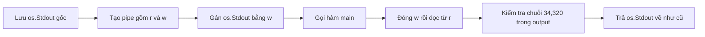

# 🧾 Test cho dự án thu nhập: "bắt" stdout bằng os.Pipe và chốt con số $34,320

> Nguồn: `019-Writing-a-test-for-our-weekly-income-project.txt` · [Udemy](https://ua.udemy.com/course/working-with-concurrency-in-go-golang/learn/lecture/32078610)

Trước khi bước sang bài toán phức tạp hơn nữa, chúng ta hãy dành chút thời gian viết test cho chương trình tính thu nhập 52 tuần. Bài này khá ngắn và thú vị: chương trình của chúng ta in kết quả ra màn hình, nên mình sẽ chỉ cho các bạn cách **tạm "chặn" `os.Stdout`** để hứng lấy output mà kiểm tra. *Mẹo này rất đáng nằm lòng, các bạn ghi lại nhé.*

### 🎯 Test điều gì?

Nhớ lại bài trước: chương trình dự phóng thu nhập có kết quả ổn định là **$34,320** khi chạy đúng. Vì vậy, bài test của chúng ta chỉ cần kiểm tra một điều duy nhất: output có chứa chuỗi `$34,320` hay không.

Mình tạo file `main_test.go` với package `main`, rồi viết một hàm test. Tên hàm này có một chi tiết đáng lưu ý:

* Không thể đặt tên là `TestMain` — đây là hàm đặc biệt mà chính package `testing` sử dụng, các bạn có thể đã biết điều này.
* Vì vậy mình đặt tên là `Test_Main`, nhận một tham số `t` kiểu `*testing.T`.

### 📥 Chặn stdout bằng os.Pipe

Ý tưởng rất đơn giản: trước khi gọi `main()`, mình lưu lại `os.Stdout` gốc, thay nó bằng đầu ghi của một pipe, rồi sau khi `main()` chạy xong thì đọc dữ liệu từ đầu đọc của pipe.

1. Lưu bản gốc: `standardOut := os.Stdout`.
2. Tạo pipe: `r, w, _ := os.Pipe()` — mình bỏ qua tham số thứ ba vì không cần.
3. Gán `os.Stdout = w` để mọi thứ in ra đều chui vào pipe.
4. Gọi thẳng `main()` — chú ý không chạy nó như goroutine, vì bản thân `main` đã là một goroutine riêng.
5. Đóng đầu ghi `w.Close()`, rồi đọc dữ liệu từ `r` bằng `io.ReadAll`, chuyển kết quả sang `string`.
6. Trả `os.Stdout` về giá trị ban đầu.



### 🧪 Kiểm tra kết quả

Sau khi đã có output dạng chuỗi, mình trả `os.Stdout` về chỗ cũ, rồi viết phép kiểm tra:

* Nếu output **không chứa** chuỗi `$34,320` thì báo lỗi `t.Error("wrong balance returned")`.

Toàn bộ hàm test gói gọn như sau:

```go
func Test_Main(t *testing.T) {
	standardOut := os.Stdout
	r, w, _ := os.Pipe()
	os.Stdout = w

	main()

	w.Close()
	out, _ := io.ReadAll(r)
	output := string(out)
	os.Stdout = standardOut

	if !strings.Contains(output, "$34,320") {
		t.Error("wrong balance returned")
	}
}
```

### ▶️ Chạy test — hai lần, hai kiểu

Mình chạy theo hai cách để các bạn thấy sự khác biệt:

* `go test .` — lần này "hên" nên ra đúng kết quả.
* `go test -race .` — kiểm tra kèm race detector.

Kết quả: **cả hai đều pass**. Điều này hợp lý, vì code của chúng ta đã được bảo vệ bằng mutex từ bài trước, nên không còn race condition nữa. *Đây chính là phần thưởng cho việc sửa lỗi đúng cách: test không chỉ đúng khi chạy thường, mà còn sạch khi bật `-race`.*

Vậy là chương trình tính thu nhập đã có test đàng hoàng. Giờ thì đến lúc gặp "nhân vật chính" của section này: bài toán **Producer/Consumer** — và lần này sẽ là một quán pizza 🍕 với đủ thứ rắc rối thú vị. Hẹn gặp lại các bạn ở bài sau! 🚀
