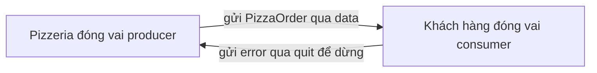

# 🍕 Producer/Consumer: lần đầu chạm vào Channels với bài toán quán pizza

> Nguồn: `020-ProducerConsumer---Using-Channels-for-the-first-time.txt` · [Udemy](https://ua.udemy.com/course/working-with-concurrency-in-go-golang/learn/lecture/32032426)

Giờ là lúc chúng ta chuyển sang một bài toán "nặng đô" hơn hẳn — đúng kiểu bài mà mình vẫn giao cho sinh viên năm nhất tự giải khi học về lập trình song song. Nó có tên là **Producer Consumer Problem (bài toán người sản xuất — người tiêu thụ)**, và cũng là dịp đầu tiên các bạn gặp **channels** trong khóa học này. *Đừng lo nếu có chỗ thấy lạ, mình sẽ đi chậm và giải thích từng bước.*

### 🍕 Bài toán quán pizza

Trang Wikipedia mô tả bài toán này như sau: trong lĩnh vực máy tính, **producer consumer problem**, còn gọi là **bounded buffer problem (bài toán bộ đệm có giới hạn)**, là một họ bài toán được **Dijkstra mô tả từ năm 1965** — tức là nó đã "sống" lâu lắm rồi. Link bài viết này mình sẽ để trong phần tài nguyên của khóa học, các bạn đọc thêm khi rảnh nhé.

Phiên bản của mình được đặt trong bối cảnh một **quán pizza**:

* **Pizzeria** — những người làm ra pizza, chính là **producer**.
* **Khách hàng** — một hoặc nhiều người, đặt hàng đều đặn theo chu kỳ, chính là **consumer**.
* Khách đặt hàng, đơn được chuyển tới quán, quán cố gắng làm ra chiếc pizza. Có thể có trục trặc: ai đó nghỉ việc, hết nguyên liệu... nhưng dù sao họ vẫn cố làm.
* Mục tiêu của chúng ta: viết lời giải cho bài toán producer/consumer.

Nghe mô tả thì đơn giản, nhưng khi bắt tay vào code các bạn sẽ thấy nó thú vị và phức tạp hơn nhiều.

---

### ⚙️ Kế hoạch cho main function

Mình tạo project mới tên `producer_consumer` với `go mod init`, thêm `main.go`, và bắt đầu bằng các comment phác thảo. Đây là cách mình hay làm để "vẽ" ra luồng chạy trước khi viết code:

1. **Seed random number generator** — nếu không seed, chương trình sẽ cho kết quả giống hệt nhau mỗi lần chạy.
2. **In thông báo chương trình bắt đầu.**
3. **Tạo producer** — mô tả bằng một cấu trúc dữ liệu nào đó.
4. **Chạy producer ở nền** — tức là chạy nó như một goroutine riêng.
5. **Tạo và chạy consumer** — sẽ có nhiều khách chứ một khách thì "chán" lắm 😄. Mỗi lần khách đặt một chiếc pizza, yêu cầu sẽ được gửi tới producer và chúng ta xem kết quả trả về.
6. **In thông báo kết thúc chương trình.**

Rõ ràng chỉ với sáu comment này, chúng ta đã có một bức tranh toàn cảnh về những gì `main` sẽ làm.

---

### 📦 Producer, PizzaOrder và lần đầu gặp `chan`

Mình khai báo hằng số `numberOfPizzas = 10` cho đơn giản trước, cùng ba biến đếm: `pizzasMade` (đã làm được), `pizzasFailed` (làm thất bại), và `total` (tổng số lượt thử). Sau đó là hai kiểu dữ liệu quan trọng:

* **`PizzaOrder`** — mô tả một đơn pizza, gồm: `pizzaNumber` (đơn thứ mấy), `message` (thông báo kết quả), và `success` (thành công hay không).
* **`Producer`** — chỉ có hai trường, nhưng cả hai đều là channel: `data` kiểu `chan PizzaOrder`, và `quit` kiểu `chan chan error`.

```go
type Producer struct {
	data chan PizzaOrder
	quit chan chan error
}

type PizzaOrder struct {
	pizzaNumber int
	message     string
	success     bool
}

const numberOfPizzas = 10
var pizzasMade, pizzasFailed, total int
```

Channel là thứ các bạn chưa từng thấy, và đây là lần giới thiệu đầu tiên nên mình nói ngay: **channel là phương tiện để một goroutine chia sẻ dữ liệu, thông tin với một goroutine khác**. Tức là các goroutine có thể **nói chuyện** với nhau.

Tại sao điều này quan trọng? Vì khi đã dùng từ khóa `go` để bắn một goroutine ra nền, với những công cụ hiện có (`WaitGroup`, `Mutex`) chúng ta **không thể nói chuyện với nó** — chỉ có thể chờ nó chạy xong mà thôi. Channel mở ra khả năng giao tiếp thật sự, nên nó mạnh hơn hẳn hai người bạn kia.

Còn `quit` — kiểu `chan chan error`, một **channel chứa channel** — nghe hơi lạ đúng không? *Các bạn chưa cần hiểu ngay đâu, đừng hoảng. Cứ theo dõi tiếp, khi mình đi sâu vào channel ở phần sau thì mọi thứ sẽ sáng tỏ.*



---

### 🚰 Channel mạnh hơn Mutex và WaitGroup ở đâu?

Cùng nhìn lại ba công cụ chúng ta đã và sắp dùng để thấy rõ vai trò của từng thứ:

| Tiêu chí | `sync.Mutex` | `sync.WaitGroup` | Channel |
|---|---|---|---|
| Mục đích | Bảo vệ tài nguyên dùng chung | Chờ goroutine hoàn thành | Trao đổi dữ liệu giữa các goroutine |
| Có "nói chuyện" được không | Không | Không | Có |
| Vai trò trong Go | Công cụ khóa | Công cụ đồng bộ | Cách ưu tiên để xử lý concurrency |

Channels thực sự mạnh hơn hẳn, nhưng đừng quên "quy tắc vàng" mà mình sẽ nhắc lại nhiều lần: **đã tạo channel thì khi dùng xong phải đóng nó lại**. Chính channel chứa channel `quit` mà mình vừa khai báo là một cách để làm việc đó.

### 🎯 Tự kiểm tra nhanh

**Câu 1:** Producer Consumer Problem còn được gọi là gì, và do ai mô tả?

<details>
<summary><b>Xem đáp án</b></summary>

**Đáp án:** Bounded buffer problem (bài toán bộ đệm có giới hạn), được Dijkstra mô tả từ năm 1965.

Giải thích: Đây là một họ bài toán kinh điển đã tồn tại rất lâu trong khoa học máy tính.

Tham chiếu: Mục Bài toán quán pizza.

</details>

**Câu 2:** Trong dự án pizzeria, ai là producer và ai là consumer?

<details>
<summary><b>Xem đáp án</b></summary>

**Đáp án:** Pizzeria là producer, khách hàng đặt pizza là consumer.

Giải thích: Quán làm ra pizza, khách đặt hàng theo chu kỳ và nhận kết quả.

Tham chiếu: Mục Bài toán quán pizza.

</details>

**Câu 3:** Vì sao phải seed random number generator?

<details>
<summary><b>Xem đáp án</b></summary>

**Đáp án:** Vì nếu không seed, chương trình sẽ cho cùng một kết quả mỗi lần chạy.

Giải thích: Seed chỉ tốn một dòng code nhưng giúp kết quả khác nhau giữa các lần chạy.

Tham chiếu: Mục Kế hoạch cho main function.

</details>

**Câu 4:** Channel cho phép làm điều gì mà `WaitGroup` không làm được?

<details>
<summary><b>Xem đáp án</b></summary>

**Đáp án:** Cho phép các goroutine trao đổi dữ liệu, "nói chuyện" với nhau.

Giải thích: Sau khi dùng `go`, ta không thể giao tiếp với goroutine bằng `WaitGroup` — chỉ chờ được mà thôi.

Tham chiếu: Mục Producer, PizzaOrder và chan.

</details>

**Câu 5:** Trường `quit` của `Producer` có kiểu gì và dùng để làm gì?

<details>
<summary><b>Xem đáp án</b></summary>

**Đáp án:** Kiểu `chan chan error` — một channel chứa channel; dùng để đóng channel khi xong việc.

Giải thích: Đã tạo channel thì khi dùng xong phải đóng, và `quit` là cách đóng thuận tiện.

Tham chiếu: Mục Channel mạnh hơn Mutex và WaitGroup.

</details>

Chúng ta đã có "bộ khung" của quán pizza: hai kiểu dữ liệu, một hằng số và ba biến đếm. Bài sau, mình sẽ bắt đầu viết code thật — seed random, tô màu terminal và dựng hàm `pizzeria` đầu tiên. Hẹn gặp lại! 🚀

## Nguồn tham khảo

- [Wikipedia — Producer–consumer problem](https://en.wikipedia.org/wiki/Producer%E2%80%93consumer_problem)
