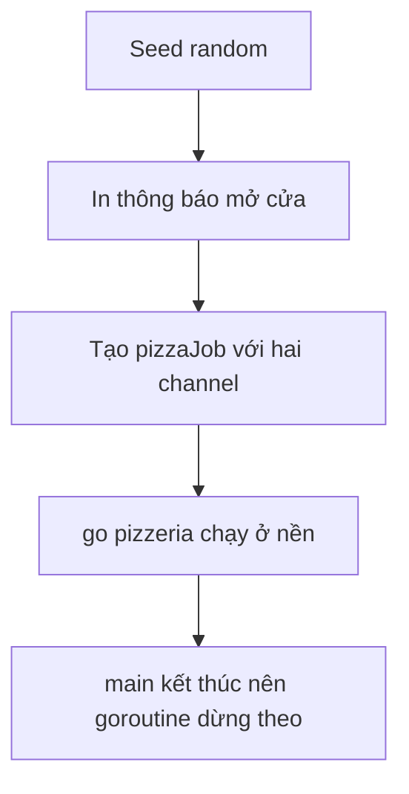

# 🏪 Dựng quán pizza: seed random, tô màu terminal và chạy producer ở nền

> Nguồn: `021-Getting-started-with-the-Producer---the-pizzeria-function.txt` · [Udemy](https://ua.udemy.com/course/working-with-concurrency-in-go-golang/learn/lecture/32095966)

Chúng ta đã có "bộ khung" của quán pizza: vài comment, một hằng số, ba biến đếm và hai kiểu dữ liệu. Giờ là lúc làm cho nó chạy được. Mình cảnh báo trước là sẽ mất một chút thời gian, có khá nhiều việc phải làm — nhưng không có gì quá phức tạp đâu, *các bạn cứ bình tĩnh đi từng bước một*.

### 🎲 Seed random và tô màu terminal

Việc đầu tiên, đúng như comment đã ghi: **seed random number generator**. Mình dùng package `rand` có sẵn trong thư viện chuẩn, kết hợp với `time.Now().UnixNano()`:

```go
rand.Seed(time.Now().UnixNano())
```

Nhờ dòng này, mỗi lần chạy chương trình sẽ cho bộ số ngẫu nhiên khác nhau, thay vì lặp lại y hệt.

Tiếp theo là in thông báo khởi động. Mình muốn output dễ nhìn hơn một chút nên sẽ thêm màu sắc. Có rất nhiều cách làm việc này với ứng dụng console trong Go, nhưng mình chọn **`github.com/fatih/color`** — thư viện được rất nhiều người dùng, trong đó có mình. Ưu điểm lớn: nó hoạt động trên **Windows, Mac lẫn Linux**.

Cài đặt bằng:

```bash
go get github.com/fatih/color
```

Sau đó in thông báo bằng `color.Cyan(...)` — cứ gọi tên package rồi chọn màu mình muốn. Mình in dòng "The pizzeria is open for business!", rồi nhân bản dòng đó và thay nội dung bằng một loạt dấu gạch ngang để tạo hiệu ứng gạch chân. Việc này chẳng liên quan gì đến chức năng, nhưng giúp màn hình dễ đọc hơn khi mọi thứ bắt đầu chạy ồn ào.

---

### 🏗️ Tạo producer và chạy nó ở nền

Nhớ lại kiểu `Producer` với hai trường `data` và `quit` chứ? Mình tạo một biến `pizzaJob` làm con trỏ tới `Producer`, rồi nạp hai channel bằng từ khóa `make` — giống như cách tạo map:

```go
pizzaJob := &Producer{
	data: make(chan PizzaOrder),
	quit: make(chan chan error),
}
go pizzeria(pizzaJob)
```

* `data` là kênh chuyên chở `PizzaOrder` — nơi producer sẽ nhận đơn hàng.
* `quit` là kênh chuyên chở `chan error` — dùng để báo "hết việc rồi, dừng lại đi".
* Dòng `go pizzeria(pizzaJob)` bắn hàm `pizzeria` ra chạy nền, song song với `main`.

Mình khai báo hàm `pizzeria` nhận một tham số `pizzaMaker` kiểu con trỏ `*Producer`. Ban đầu nó để trống, vì chúng ta sẽ lấp dần từng phần.

---

### 🔐 Method close và "quy tắc vàng" của channel

Tại sao lại cần channel chứa channel `quit`? Câu trả lời là để có một cách **đóng channel** đàng hoàng khi kết thúc. Mình viết một method gắn với kiểu `Producer`, dùng con trỏ làm receiver để mọi biến kiểu `Producer` đều dùng được:

```go
func (p *Producer) close() error {
	ch := make(chan error)
	p.quit <- ch
	return <-ch
}
```

Cách hoạt động: tạo một channel kiểu `error`, gửi nó vào `p.quit`, rồi chờ nhận lại kết quả. Nếu đóng thành công thì giá trị nhận về là `nil`; nếu có trục trặc thì đó là một `error` thật sự.

Nhân đây, mình nhắc lại **quy tắc vàng**: **một khi đã tạo channel, khi dùng xong các bạn phải đóng nó.** Method `close` này chính là phương tiện để làm điều đó một cách gọn gàng.

---

### 🔁 Bên trong pizzeria sẽ có gì?

Mình phác thảo logic cho hàm `pizzeria` chạy nền:

* Đầu tiên, giữ một biến đếm xem **đang làm đến chiếc pizza thứ mấy**.
* Sau đó chạy **vòng lặp vô tận**, chỉ dừng khi nhận được tín hiệu từ channel `quit`.
* Trong mỗi vòng, thử làm một chiếc pizza; sau đó nhận kết quả trả về và quyết định xem đã làm xong chưa, có lỗi gì không, hay đã đến lúc dừng.

Để đưa ra quyết định dựa trên thông tin nhận từ channel, chúng ta sẽ dùng một cấu trúc rất quan trọng có tên **`select`** — thứ mà mình sẽ nói kỹ ở các bài sau.



---

### ▶️ Chạy thử: mới chỉ có dòng chào mở cửa

Mình chạy `go run .` và... chỉ thấy mỗi thông báo mở cửa. Thực ra chương trình đã làm nhiều hơn thế:

1. Seed random number generator.
2. In thông báo.
3. Tạo producer với hai channel.
4. Bắn goroutine `pizzeria` chạy nền song song với `main`.

Nhưng `main` chạy hết việc của nó rồi kết thúc, và **khi chương trình dừng, mọi goroutine đang chạy nền cũng "chết" theo** — kể cả vòng lặp vô tận bên trong `pizzeria`. Đó là lý do chúng ta thấy chương trình kết thúc ngay lập tức.

Đừng lo, mọi thứ vẫn đúng như thiết kế. Bài sau, chúng ta sẽ làm cho quán pizza này "có việc để làm" — bắt tay vào việc nhào bột và nướng bánh. Hẹn gặp lại các bạn! 🚀
