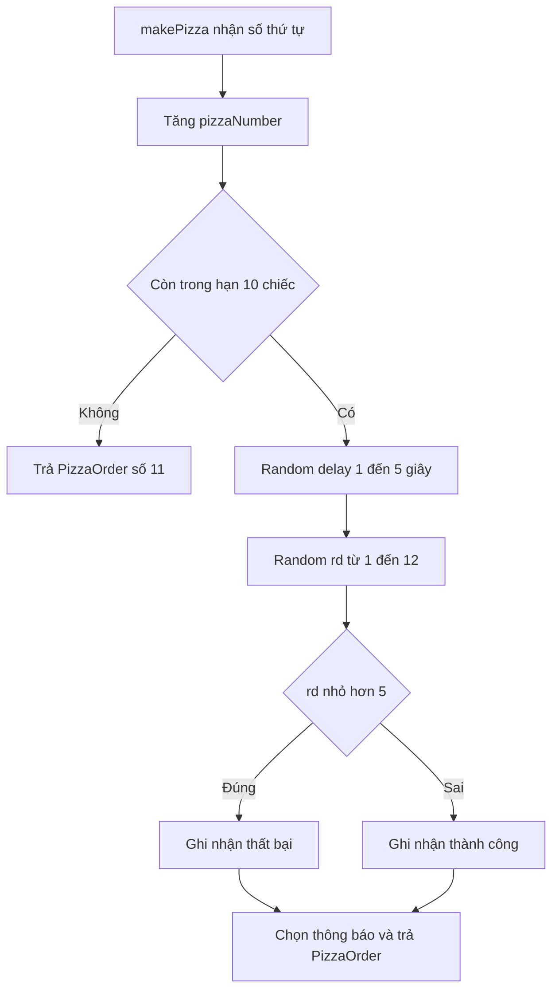

# 👨‍🍳 Viết hàm makePizza: xác suất thất bại và ba biến đếm

> Nguồn: `022-Making-a-pizza-the-makePizza-function.txt` · [Udemy](https://ua.udemy.com/course/working-with-concurrency-in-go-golang/learn/lecture/32097488)

Quán pizza của chúng ta mới chỉ có vòng lặp rỗng và vài comment. Giờ hãy bắt tay vào phần thú vị nhất: **làm ra một chiếc pizza**. Trong bài này mình sẽ viết hàm `makePizza` — trái tim của người producer — với đầy đủ xác suất thành công, thất bại và các thông báo tương ứng. *Các bạn cứ gõ theo, mình tin là không có gì khó hiểu đâu.*

### 🧮 Đếm đơn hàng và giới hạn 10 chiếc

Trong `pizzeria`, mình thêm biến `i = 0` để theo dõi xem đang làm đến chiếc pizza thứ mấy. Bên trong vòng lặp, mình gọi một hàm chưa tồn tại `makePizza(i)` và hứng kết quả vào biến `currentPizza` — cách làm "gọi hàm trước, viết hàm sau" mà mình vẫn hay dùng, các bạn đã quen rồi.

Hàm `makePizza` nhận tham số `pizzaNumber` kiểu `int` và trả về **con trỏ tới `PizzaOrder`**. Việc đầu tiên bao giờ cũng là tăng số thứ tự lên một:

* Lần gọi đầu tiên, `i` bằng 0, sau khi tăng sẽ thành đơn số 1.
* Nếu `pizzaNumber <= numberOfPizzas` (tức 10) thì tiếp tục làm bánh.
* Nếu vượt quá 10, nghĩa là đã hết ca — ta xử lý riêng ở cuối hàm.

---

### ⏱️ Delay ngẫu nhiên 1-5 giây

Mình không muốn mọi thứ diễn ra với tốc độ ánh sáng (dù dùng máy cũ 7 năm tuổi như mình thì cũng vẫn rất nhanh 😄), nên cần một độ trễ. Mình lấy số ngẫu nhiên từ package `rand` — package đã được seed trong `main`:

```go
delay := rand.Intn(5) + 1
```

Tại sao lại **cộng thêm 1**? Vì `rand.Intn(5)` có thể trả về 0, mà mình muốn chờ **ít nhất 1 giây**. Sau đó, trước khi làm bánh, mình in ra thông báo đã nhận đơn: "Received order #1", "Received order #2", v.v.

---

### 🎲 rd từ 1 đến 12: rủi ro nằm ở đâu?

Giờ là phần hay nhất: mô phỏng việc làm bánh có thể thành công hoặc thất bại. Mình giả định **trong đa số trường hợp là thành công**, nhưng cứ khoảng **1/3 khả năng là có trục trặc**. Cách làm: sinh số ngẫu nhiên từ 1 đến 12, cộng thẳng vào kết quả `rand.Intn(12) + 1`, rồi dùng nó để quyết định:

```go
rd := rand.Intn(12) + 1
msg := ""
success := false
if rd < 5 {
	pizzasFailed++
} else {
	pizzasMade++
}
total++
```

Lưu ý cách đếm của mình: nếu `rd < 5` (tức 1, 2, 3, 4) thì tăng `pizzasFailed`; ngược lại tăng `pizzasMade`. Còn `total` thì **luôn tăng một lần** cho mỗi lượt thử — dù kết quả thế nào.

Tiếp đó mình mới in thông báo "Making pizza #..." kèm số giây sẽ chờ, và gọi `time.Sleep(time.Duration(delay) * time.Second)` để... giả vờ nướng bánh. Độ trễ này chỉ để màn hình không trôi quá nhanh mà thôi.

| Giá trị `rd` | Kết quả | Chuyện gì xảy ra |
|---|---|---|
| 1 – 2 | Thất bại | Hết nguyên liệu |
| 3 – 4 | Thất bại | Đầu bếp nghỉ việc giữa chừng |
| 5 – 12 | Thành công | Pizza xong, sẵn sàng giao |



---

### 💬 Soạn thông báo theo từng tình huống

Đã biết thành công hay chưa, giờ mình "diễn giải" lý do thành những câu chuyện cho vui:

```go
if rd <= 2 {
	msg = fmt.Sprintf("*** We ran out of ingredients for pizza #%d!", pizzaNumber)
} else if rd <= 4 {
	msg = fmt.Sprintf("*** The cook quit while making pizza #%d!", pizzaNumber)
} else {
	success = true
	msg = fmt.Sprintf("Pizza order #%d is ready!", pizzaNumber)
}
```

Ba tình huống cụ thể:

* `rd` bằng 1 hoặc 2 → **hết nguyên liệu** (kèm ba dấu sao `***` cho ra vẻ "lỗi").
* `rd` bằng 3 hoặc 4 → **đầu bếp nghỉ việc** giữa lúc đang làm.
* Các trường hợp còn lại → làm xong ngon lành, và nhớ bật `success = true`.

---

### 📦 Đóng gói PizzaOrder và nhánh "hết ca"

Bước cuối của `makePizza`: đóng gói mọi thứ vào một `PizzaOrder` rồi trả về con trỏ:

```go
p := PizzaOrder{
	pizzaNumber: pizzaNumber,
	message:     msg,
	success:     success,
}
return &p
```

Còn nhánh `else` khi `pizzaNumber > 10` thì mình... **không cần viết `else`** cũng được, nhưng vì hàm phải trả về gì đó, mình trả một `PizzaOrder` gần như rỗng — chỉ điền mỗi `pizzaNumber` (lúc này chắc chắn bằng 11, vì vượt quá hằng số 10). Những trường khác không quan trọng nữa, vì ngày làm việc đã kết thúc.

```go
return &PizzaOrder{pizzaNumber: pizzaNumber}
```

Vậy là hàm `makePizza` đã hoàn chỉnh: có độ trễ, có đếm thống kê, có ba kịch bản, và trả về kết quả đầy đủ. Bài sau, chúng ta sẽ quay lại vòng lặp `pizzeria` để xử lý những chiếc `PizzaOrder` này — và cuối cùng sẽ được dùng đến `select`. Hẹn gặp lại! 🚀
