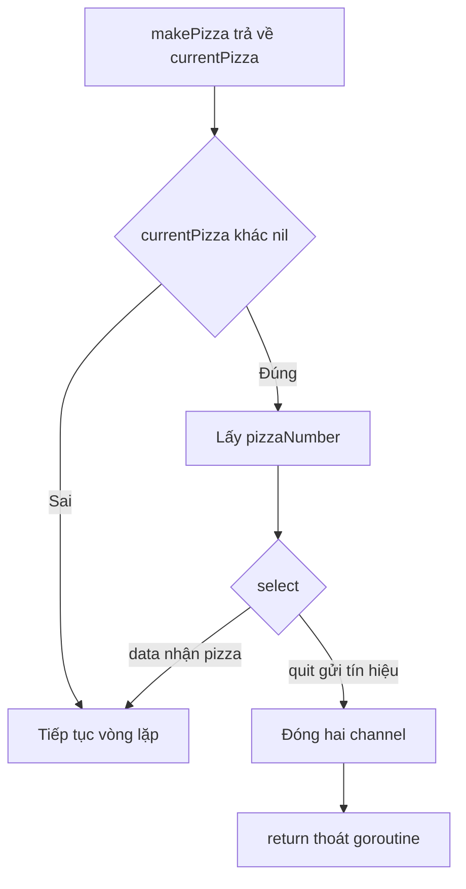
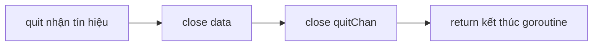

# 🔀 Hoàn thiện Producer: gặp gỡ select và lời tạm biệt gọn gàng

> Nguồn: `023-Finishing-up-the-Producer-code.txt` · [Udemy](https://ua.udemy.com/course/working-with-concurrency-in-go-golang/learn/lecture/32097512)

Hàm `makePizza` đã xong, giờ hãy quay lại với vòng lặp của `pizzeria` — nơi mình đã gọi `makePizza(i)` và nhận về một `currentPizza`. Việc còn thiếu là **lắng nghe hai channel** của producer để quyết định làm gì tiếp theo. Và đây cũng là lúc chúng ta chính thức gặp **`select`** — thứ được xem là trái tim của bài toán này. *Các bạn để ý nhé, phần này rất đáng nhớ.*

### 🧾 Nhận lại kết quả từ makePizza

Mình đã thêm khá nhiều comment vào code để khi các bạn tải source về thì dễ theo dõi. Quay lại `pizzeria`: sau khi gọi `makePizza`, mình kiểm tra xem có nhận được gì không:

* `if currentPizza != nil` — chỉ xử lý khi có kết quả trả về.
* Lấy số thứ tự: `i = currentPizza.pizzaNumber`.

Vì sao phải lấy lại số từ kết quả? Lần đầu thì mình biết chắc `i` là 0 và đơn sẽ là số 1, nhưng **những lần sau thì không thể biết trước** — vì hàm đang được gọi từ goroutine chạy nền, có thể có goroutine khác đang chạy song song. Lấy con số từ `currentPizza` là cách an toàn nhất.

---

### 🔀 Gặp gỡ select — "switch" dành riêng cho channel

Đây rồi, phần chính của cả bài. Mình sẽ dùng `select` để quyết định hành động dựa trên thông tin nhận được từ channel:

```go
if currentPizza != nil {
	i = currentPizza.pizzaNumber
	select {
	case pizzaMaker.data <- currentPizza:
	case quitChan := <-pizzaMaker.quit:
		close(pizzaMaker.data)
		close(quitChan)
		return
	}
}
```

Hai case có nhiệm vụ rất khác nhau:

* `case pizzaMaker.data <- currentPizza:` — **gửi** chiếc pizza vừa làm vào channel `data`. Đại ý: quán vừa thử làm một chiếc pizza, chưa chắc thành công hay không, nhưng cứ chuyển kết quả đi để consumer xử lý.
* `case quitChan := <-pizzaMaker.quit:` — nhận tín hiệu dừng từ channel `quit`. Đây là lệnh "đóng cửa quán".

Một chi tiết quan trọng: **`select` chỉ hữu ích với channel**, không dùng được cho việc gì khác. Nhưng nhìn thì nó rất giống `switch` mà các bạn đã quen:

| Tiêu chí | `select` | `switch` |
|---|---|---|
| Áp dụng cho | Chỉ channel | Mọi giá trị, điều kiện |
| Mỗi case là | Thao tác gửi hoặc nhận trên channel | So sánh giá trị |
| Cách chạy | Chờ đến khi một case sẵn sàng | Chạy nhánh khớp ngay |



---

### 🚪 Case quit: đóng channel và thoát goroutine

Khi nhận tín hiệu từ `quit`, mình làm hai việc theo đúng "quy tắc vàng":

1. `close(pizzaMaker.data)` — đóng channel nhận đơn.
2. `close(quitChan)` — đóng channel vừa nhận tín hiệu.

Rồi gọi `return` để thoát. Nghe đơn giản, nhưng lệnh `return` này thực hiện một pha "vượt ba tầng": nó đưa chúng ta ra khỏi `select`, rồi ra khỏi `if`, rồi ra khỏi vòng lặp `for` — tức là **kết thúc hẳn goroutine `pizzeria`**, để nó ra đi trong yên bình.



*Đóng channel là việc rất dễ, nhưng cũng rất dễ quên — quên rồi thì rắc rối về sau. Mong các bạn ghi nhớ quy tắc vàng này.*

---

### ▶️ Chạy thử: vẫn chưa có gì xảy ra!

Mình chạy `go run .` sau tất cả những gì đã viết... và vẫn chỉ thấy dòng thông báo mở cửa. Không có gì đáng ngạc nhiên cả:

* Producer đã được tạo và chạy nền.
* Hàm `makePizza` đã sẵn sàng.
* Nhưng **chưa có đơn hàng nào được đặt** — consumer chưa gửi gì vào channel `data`.

Nói cách khác, quán đã mở cửa, đầu bếp đã đứng bếp, nhưng chưa có khách nào bước vào. Bước tiếp theo ai cũng đoán được: **tạo và chạy consumer** — chính là việc chúng ta sẽ làm trong bài sau.

### 🎯 Tự kiểm tra nhanh

**Câu 1:** `select` khác `switch` ở điểm quan trọng nào?

<details>
<summary><b>Xem đáp án</b></summary>

**Đáp án:** `select` chỉ dùng được với channel, còn `switch` dùng cho giá trị/điều kiện thông thường.

Giải thích: Về hình thức, `select` trông rất giống `switch` với các `case`.

Tham chiếu: Mục Gặp gỡ select.

</details>

**Câu 2:** Case `pizzaMaker.data <- currentPizza` thực hiện điều gì?

<details>
<summary><b>Xem đáp án</b></summary>

**Đáp án:** Gửi chiếc pizza vừa làm vào channel `data`.

Giải thích: Đây là hoạt động gửi dữ liệu của producer; kết quả thành công hay không thì consumer sẽ tự kiểm tra.

Tham chiếu: Mục Gặp gỡ select.

</details>

**Câu 3:** Khi nhận tín hiệu từ `quit`, hai channel nào được đóng?

<details>
<summary><b>Xem đáp án</b></summary>

**Đáp án:** `pizzaMaker.data` và `quitChan`.

Giải thích: Đóng cả hai channel theo "quy tắc vàng" trước khi thoát goroutine.

Tham chiếu: Mục Case quit.

</details>

**Câu 4:** Lệnh `return` trong case quit có tác dụng gì?

<details>
<summary><b>Xem đáp án</b></summary>

**Đáp án:** Thoát khỏi `select`, `if` và vòng lặp `for`, kết thúc hẳn goroutine `pizzeria`.

Giải thích: Goroutine đang lồng ba lớp cấu trúc, `return` là cách thoát sạch sẽ.

Tham chiếu: Mục Case quit.

</details>

**Câu 5:** Vì sao chạy chương trình vẫn không thấy gì xảy ra?

<details>
<summary><b>Xem đáp án</b></summary>

**Đáp án:** Vì chưa có consumer nào đặt hàng, tức chưa có đơn nào được gửi vào channel.

Giải thích: Producer đã sẵn sàng nhưng đang chờ đơn hàng.

Tham chiếu: Mục Chạy thử.

</details>

Producer đã hoàn tất. Bài sau, chúng ta sẽ viết consumer để "đặt pizza", gửi đơn tới quán và in ra kết quả thành công (xanh) hay thất bại (đỏ) — lúc đó quán mới thật sự đông khách. Hẹn gặp lại các bạn! 🚀
