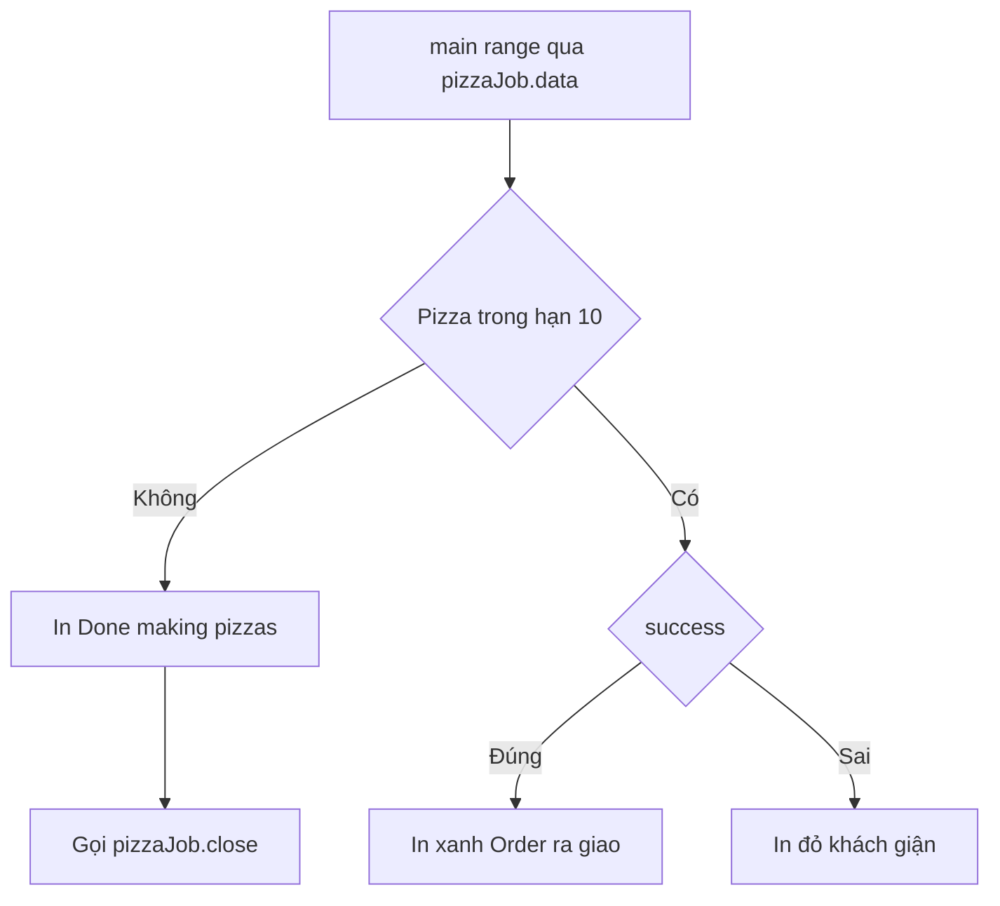

# 🛎️ Consumer vào việc: đặt pizza và nhận kết quả theo cách "xanh đỏ"

> Nguồn: `024-Creating-and-running-the-consumer-ordering-a-pizza.txt` · [Udemy](https://ua.udemy.com/course/working-with-concurrency-in-go-golang/learn/lecture/32098094)

Producer đã sẵn sàng, quán đã mở cửa — giờ là lúc tạo ra **consumer**, tức những vị khách sẽ đặt pizza. Mình biết phần channel có thể hơi "xoắn não" nếu các bạn lần đầu làm việc với nó, nên bài này mình sẽ vừa viết code vừa nhắc lại thật kỹ để các bạn nắm chắc luồng đi. *Cứ từ từ, đọc chậm từng dòng một, các bạn sẽ thấy nó logic hơn vẻ ngoài của nó.*

### 🔁 Ôn lại pizzeria một lượt

Hàm `pizzeria` được gọi từ `main` và chạy nền. Bên trong nó:

* Khởi tạo biến `i = 0` để theo dõi đơn hàng đang làm.
* Chạy vòng lặp vô tận cho đến khi channel `quit` nhận được tín hiệu.
* Gọi `makePizza(i)` để nhận về `currentPizza` — một con trỏ `*PizzaOrder` chứa số đơn, thông báo và trạng thái thành công.
* Kiểm tra `currentPizza != nil` trước khi dùng — mình là kiểu người "thắt cả lưng lẫn dây", lúc nào cũng kiểm tra cho chắc, dù gần như không thể có chuyện nó `nil`.
* Cập nhật `i` bằng `currentPizza.pizzaNumber`.
* Cuối cùng là `select`: gửi pizza vào channel `data`, hoặc nhận tín hiệu từ `quit` rồi đóng cả hai channel và `return`.

Phần `select` ấy chính là **linh hồn của bài tập** này — mọi thứ xoay quanh việc quyết định dựa trên thông tin từ channel.

---

### 🛎️ Consumer: range qua channel data

Giờ mình tạo và chạy consumer. Cách làm không hề khó: dùng vòng lặp `for ... range` để duyệt qua mọi thứ được gửi tới `pizzaJob.data`. Điểm hay là **khi channel còn dữ liệu, vòng lặp cứ chạy; khi channel đóng, vòng lặp kết thúc**.

```go
for i := range pizzaJob.data {
	if i.pizzaNumber <= numberOfPizzas {
		if i.success {
			color.Green(i.message)
			color.Green("Order #%d is out for delivery!", i.pizzaNumber)
		} else {
			color.Red(i.message)
			color.Red("The customer is really mad!")
		}
	} else {
		color.Cyan("Done making pizzas...")
		err := pizzaJob.close()
		if err != nil {
			color.Red("*** Error closing channel!", err)
		}
	}
}
```

Trong mỗi vòng lặp, `i` chính là một `PizzaOrder`:

* Nếu `i.pizzaNumber <= numberOfPizzas` (10) — tức đây là một lượt thử làm bánh thật sự.
* Ngược lại, tức số 11 — nghĩa là hết ca, xử lý ở nhánh `else`.

---

### ✅ Thành công thì xanh, thất bại thì đỏ

Với mỗi chiếc pizza, mình kiểm tra `i.success`:

* **Thành công** → in màu **xanh lá**: in thông báo `i.message` từ producer, rồi in tiếp "Order #%d is out for delivery!" — đơn đã lên đường giao cho khách.
* **Thất bại** → in màu **đỏ**: in thông báo lỗi, kèm câu "The customer is really mad!" — khách giận thật rồi 😅.

Đó là lý do mình kéo thư viện `color` vào từ đầu: output có màu sẽ giúp các bạn nhìn là biết ngay chiếc nào thành công, chiếc nào hỏng.



---

### 🧹 Kết thúc ngày: đóng channel và kiểm tra lỗi

Khi nhận được `PizzaOrder` số 11, chương trình in "Done making pizzas..." bằng màu xanh lơ, rồi gọi:

```go
err := pizzaJob.close()
```

Nhớ lại bài trước: method `close` này do chính chúng ta viết, nó gửi một channel `error` vào `quit` để producer biết mà dọn dẹp. Sau đó mình kiểm tra `err != nil` và in cảnh báo đỏ nếu có lỗi. *Thú thật, mình không nghĩ trường hợp lỗi này xảy ra được, nhưng cứ kiểm tra cho an toàn — thói quen tốt mà.*

---

### 👀 Kết quả chạy: lộn xộn là chuyện bình thường

Chạy `go run .` và quan sát kỹ, các bạn sẽ thấy một điều rất thú vị:

* Đơn số 1 được nhận, đơn số 1 xong và lên đường giao.
* Nhưng đơn số 2 được nhận **trước khi** đơn số 1 làm xong.
* Rồi đơn số 3 được nhận trong khi pizza số 2 vẫn đang làm dở.
* Cuối cùng mới thấy "done making pizzas".

Các đơn hàng **không được xử lý theo thứ tự tuần tự**. Điều này hoàn toàn bình thường và là điều chúng ta phải chấp nhận: consumer chạy nền, producer cũng chạy nền, nhiều chiếc pizza được làm cùng lúc. Chính vì vậy mình mới nhấn mạnh: **đừng bao giờ phụ thuộc vào thứ tự kết quả khi làm việc với goroutine**.

Còn đúng một việc nhỏ nữa: in dòng thông báo kết thúc. Chúng ta sẽ làm nốt trong bài sau cho trọn vẹn. Hẹn gặp lại! 🚀

### 🎯 Tự kiểm tra nhanh

**Câu 1:** Consumer đọc dữ liệu từ channel nào?

<details>
<summary><b>Xem đáp án</b></summary>

**Đáp án:** `pizzaJob.data` — thông qua vòng lặp `for i := range pizzaJob.data`.

Giải thích: Vòng lặp range nhận từng `PizzaOrder` mà producer gửi vào channel.

Tham chiếu: Mục Consumer range qua channel data.

</details>

**Câu 2:** Khi `i.success` bằng `false` thì in ra gì?

<details>
<summary><b>Xem đáp án</b></summary>

**Đáp án:** Thông báo lỗi bằng màu đỏ, kèm câu "The customer is really mad!".

Giải thích: Đỏ là quy ước cho thất bại trong output của chương trình.

Tham chiếu: Mục Thành công thì xanh, thất bại thì đỏ.

</details>

**Câu 3:** Khi nhận `PizzaOrder` số 11 thì chương trình làm gì?

<details>
<summary><b>Xem đáp án</b></summary>

**Đáp án:** In "Done making pizzas..." rồi gọi `pizzaJob.close()` và kiểm tra lỗi.

Giải thích: Số 11 nghĩa là vượt quá 10 chiếc, tức hết ca làm việc.

Tham chiếu: Mục Kết thúc ngày.

</details>

**Câu 4:** Vì sao các đơn pizza không được xử lý theo thứ tự?

<details>
<summary><b>Xem đáp án</b></summary>

**Đáp án:** Vì producer và consumer đều chạy nền, nhiều goroutine cùng làm việc song song.

Giải thích: Thứ tự hoàn thành không xác định — đó là bản chất của concurrency.

Tham chiếu: Mục Kết quả chạy.

</details>

**Câu 5:** Vì sao vẫn nên kiểm tra `err != nil` sau khi đóng channel?

<details>
<summary><b>Xem đáp án</b></summary>

**Đáp án:** Vì đó là thói quen an toàn, dù tình huống lỗi khó xảy ra.

Giải thích: Xử lý lỗi đầy đủ giúp chương trình bền vững hơn.

Tham chiếu: Mục Kết thúc ngày.

</details>
