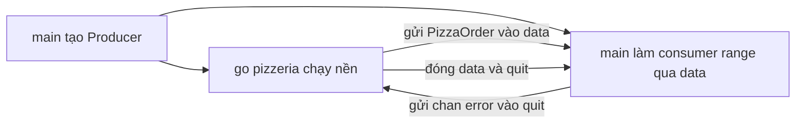

# 🎉 Tổng kết dự án Pizza: chốt sổ ngày làm việc và nhìn lại hành trình

> Nguồn: `025-Finishing-up-our-ProducerConsumer-project.txt` · [Udemy](https://ua.udemy.com/course/working-with-concurrency-in-go-golang/learn/lecture/32098408)

Chúng ta đã đi đến những dòng cuối cùng của dự án Producer/Consumer. Việc còn lại chỉ là in thông báo kết thúc, tổng kết "ngày làm việc" của quán pizza và nhìn lại xem mình đã học được những gì. *Thật ra chương trình đã chạy trọn vẹn rồi, phần này chỉ là "khúc dạo kết" cho đẹp thôi.* Mình nói đùa vậy chứ dòng thông báo cuối cũng có một điểm đáng nói về concurrency đấy.

### 🏁 Dòng thông báo kết thúc

Mình in "Done for the day." bằng `color.Cyan`, kèm một dòng gạch ngang để phân cách. Về mặt concurrency, phần này chẳng có gì phức tạp — ngoại trừ một điều mình khá chắc chắn:

> **Đoạn code này chắc chắn sẽ không chạy cho đến khi producer làm xong và consumer tiêu thụ xong.**

Các bạn có thể tin điều đó mà không cần làm gì thêm, vì `main` đang "ngồi" trong vòng lặp range qua channel cho đến khi mọi thứ kết thúc.

### 📊 Bảng tổng kết và xếp hạng ngày làm việc

Tiếp theo là in ra thành tích của quán:

```go
color.Cyan("Done for the day.")
color.Cyan("-----------------------------------")
color.Cyan(fmt.Sprintf("We made %d pizzas, but failed to make %d, with %d attempts in total.", pizzasMade, pizzasFailed, total))
```

Ba con số được lấy từ ba biến đếm mà chúng ta đã theo dõi từ đầu dự án: `pizzasMade`, `pizzasFailed`, `total`.

Rồi mình thêm một chút "bình luận xã hội" bằng `switch` — trông hao hao `select` nhưng **không phải** `select` đâu nhé:

```go
switch {
case pizzasFailed > 9:
	color.Red("It was an awful day...")
case pizzasFailed >= 6:
	color.Red("It was not a very good day...")
case pizzasFailed >= 4:
	color.Yellow("It was an okay day...")
case pizzasFailed >= 2:
	color.Yellow("It was a pretty good day!")
default:
	color.Green("It was a great day!")
}
```

Các ngưỡng đánh giá lần lượt:

* Thất bại **hơn 9** → "It was an awful day..." (đỏ).
* Từ **6** trở lên → "It was not a very good day..." (đỏ).
* Từ **4** trở lên → "It was an okay day..." (vàng).
* Từ **2** trở lên → "It was a pretty good day!" (vàng).
* Còn lại → "It was a great day!" (xanh).

Nhớ lại quy tắc: **`select` chỉ dành riêng cho channel**, nên ở đây so sánh các con số thì phải dùng `switch` như bao chương trình Go bình thường.

### 🎉 Nhìn lại: giải bài toán chỉ bằng channel

Chạy lại chương trình, mình nhận được dòng tổng kết: "We made five pizzas, but failed to make five, with ten attempts in total." Tỷ lệ thành công 50% mà quán vẫn thấy ổn — mình phải thừa nhận các tiêu chuẩn ở đây hơi thấp 😄. Các bạn cứ chạy vài lần, mỗi lần sẽ ra một kết quả khác.



Điều mình muốn các bạn nhớ nhất của cả dự án này: **chúng ta vừa giải xong bài toán Producer/Consumer với các goroutine chạy song song mà không hề dùng tới `WaitGroup` hay `sync.Mutex`.** Tất nhiên, các bạn hoàn toàn có thể giải bài toán này bằng `WaitGroup` và `Mutex` — có rất nhiều cách khác nhau. Nhưng channel là công cụ mà Go muốn chúng ta thành thạo, nên mình khuyến khích các bạn dành thời gian thật sự đọc lại code:

* Cái gì đang gửi dữ liệu vào channel?
* Mình lấy dữ liệu ra từ channel ở đâu?
* Khi nào channel được đóng, và điều gì xảy ra sau đó?

*Học kỹ đoạn code này sẽ làm cho phần còn lại của khóa học nhẹ nhàng hơn rất nhiều — mình hứa đấy.*

### 🎯 Tự kiểm tra nhanh

**Câu 1:** Vì sao mình chắc chắn dòng "Done for the day" chỉ in sau khi mọi việc hoàn tất?

<details>
<summary><b>Xem đáp án</b></summary>

**Đáp án:** Vì `main` phải chờ vòng lặp range qua channel kết thúc mới đi tiếp.

Giải thích: Consumer nằm trong `main`, chạy cho tới khi channel bị đóng.

Tham chiếu: Mục Dòng thông báo kết thúc.

</details>

**Câu 2:** Vì sao dùng `switch` thay vì `select` để xếp hạng ngày làm việc?

<details>
<summary><b>Xem đáp án</b></summary>

**Đáp án:** Vì `select` chỉ dùng cho channel, còn đây là so sánh các con số.

Giải thích: `switch` phù hợp cho các điều kiện giá trị thông thường.

Tham chiếu: Mục Bảng tổng kết.

</details>

**Câu 3:** Với 5 pizza thành công và 5 thất bại trên 10 lượt, chương trình xếp hạng thế nào?

<details>
<summary><b>Xem đáp án</b></summary>

**Đáp án:** "It was an okay day..." — vì số thất bại là 5, rơi vào ngưỡng từ 4 trở lên.

Giải thích: Các case được kiểm tra theo thứ tự từ trên xuống.

Tham chiếu: Mục Bảng tổng kết.

</details>

**Câu 4:** Dự án này có dùng `WaitGroup` hay `sync.Mutex` không?

<details>
<summary><b>Xem đáp án</b></summary>

**Đáp án:** Không — chỉ dùng channel, dù có thể giải bằng nhiều cách khác nhau.

Giải thích: Channel là cách xử lý concurrency được Go ưu tiên.

Tham chiếu: Mục Nhìn lại.

</details>

**Câu 5:** Cần nắm chắc điều gì để học phần còn lại của khóa dễ dàng hơn?

<details>
<summary><b>Xem đáp án</b></summary>

**Đáp án:** Luồng gửi/nhận dữ liệu qua channel — ai gửi vào, ai lấy ra, khi nào đóng.

Giải thích: Hiểu rõ dòng chảy dữ liệu là chìa khóa của concurrency trong Go.

Tham chiếu: Mục Nhìn lại.

</details>

Chúc mừng các bạn đã hoàn thành dự án pizzeria đầu tiên! Từ đây, chúng ta sẽ bước sang những bài toán kinh điển khác của khoa học máy tính — bắt đầu là **Dining Philosophers (bài toán triết gia ăn tối)**. Mình hứa đây sẽ là một bài rất thú vị, và chúng ta còn khá nhiều chặng đường phía trước. Hẹn gặp lại các bạn! 🚀
