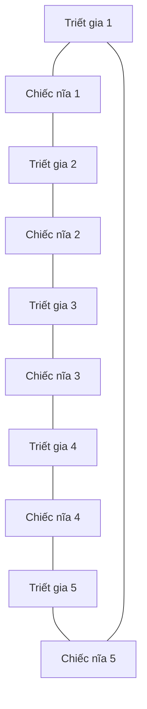

# 🍽️ Dining Philosophers: Bài toán kinh điển của Dijkstra mà mọi dân Go nên biết

> Nguồn: `026-What-well-cover-in-this-section.txt` · [Udemy](https://ua.udemy.com/course/working-with-concurrency-in-go-golang/learn/lecture/32032398)

Trong phần này, mình muốn hướng sự chú ý của các bạn sang một bài toán kinh điển khác của khoa học máy tính: **Dining Philosophers** (những triết gia dùng bữa). Trước khi gõ dòng code nào, mình sẽ kể các bạn nghe luật chơi và xem bàn tiệc được bày biện ra sao, để các bạn thấy vì sao đây là ví dụ tuyệt vời cho **concurrency** (lập trình đồng thời). *Phần này nhẹ nhàng thôi, cứ thong thả nhé.*

### 🎯 Một bài toán đã sống hơn nửa thế kỷ

* Giống như bài toán ở phần trước, bài này cũng do **Dijkstra** giới thiệu vào năm **1965** — các bạn thấy đấy, nó đã tồn tại rất lâu rồi và được giải bằng đủ mọi cách khác nhau.
* Đây là một ví dụ xuất sắc cho kiểu bài toán mà **concurrency là lời giải phù hợp**.
* Mình nói thẳng: đây là bài toán được dàn dựng khá **khiên cưỡng** (contrived), nhưng chính vì vậy nó làm nổi bật những cái bẫy của lập trình đồng thời.

### 🍝 Luật chơi: năm triết gia, một bàn tròn, năm chiếc nĩa

1. Năm triết gia sống chung một nhà, **luôn ăn cùng nhau, cùng một chiếc bàn và ngồi đúng vị trí cố định**.
2. Họ luôn ăn một loại spaghetti đặc biệt — món này **bắt buộc phải có hai chiếc nĩa** mới ăn được. Nĩa dày cỡ nào không quan trọng, mấu chốt là phải có đủ hai chiếc.
3. Hai chiếc nĩa được đặt cạnh mỗi chiếc đĩa, nhưng cách bày biện khiến **không hai người ngồi cạnh nhau nào có thể ăn cùng một lúc**.
4. Bàn có năm chiếc đĩa, mỗi đĩa hai chiếc nĩa — nhưng **cả bàn chỉ có đúng năm chiếc nĩa**. *Chỉ cần dư ra một chiếc nữa thôi thì mọi chuyện đã chẳng có gì đáng bàn, nhưng chúng ta không có.*

Nhìn vào vòng tròn này, các bạn thấy ngay: người muốn ăn phải lấy cả hai chiếc nĩa, mà một trong hai chiếc đang **dùng chung với người hàng xóm**. Thế nên câu hỏi trung tâm của bài toán là:

**Làm sao viết một chương trình đảm bảo không triết gia nào bị đói (starve) mãi mãi?**

### 🧩 Phần này chúng ta sẽ giải bằng gì?

* Lần này chúng ta **không dùng channel** nhé — mình để dành channel cho một bài toán khác ở phía sau.
* Thay vào đó, mình sẽ giải bằng package `sync`, cụ thể là **`sync.WaitGroup`** và **`sync.Mutex`**.

*Đừng lo nếu hai cái tên này còn mờ mịt — chúng sẽ xuất hiện ngay trong bài tới, và chỉ vài lần gõ là các bạn quen tay thôi.*

### 🎯 Tự kiểm tra nhanh

**Câu 1:** Dining Philosophers do ai giới thiệu và vào năm nào?

<b>Xem đáp án</b>

**Đáp án:** Do **Dijkstra** giới thiệu vào năm **1965**.

Giải thích: Đây là bài toán "có tuổi" và đã được giải theo nhiều cách khác nhau.

Tham chiếu: Mục Một bài toán đã sống hơn nửa thế kỷ.

**Câu 2:** Vì sao món spaghetti đặc biệt khiến bài toán trở nên khó?

<b>Xem đáp án</b>

**Đáp án:** Vì mỗi triết gia cần **đủ hai chiếc nĩa** mới ăn được, mà hai chiếc nĩa đó lại dùng chung với hai người hàng xóm.

Giải thích: Cả bàn chỉ có năm chiếc nĩa, nên không thể ai cũng có hai chiếc cùng lúc.

Tham chiếu: Mục Luật chơi.

**Câu 3:** Bàn tiệc có bao nhiêu triết gia, bao nhiêu chiếc nĩa và bao nhiêu chiếc đĩa?

<b>Xem đáp án</b>

**Đáp án:** **Năm triết gia, năm chiếc nĩa** (và năm chiếc đĩa, mỗi đĩa có hai chiếc nĩa bên cạnh).

Giải thích: Nếu có thêm một chiếc nĩa, bài toán đã không còn đáng bàn.

Tham chiếu: Mục Luật chơi.

**Câu 4:** Mục tiêu của chương trình cần viết là gì?

<b>Xem đáp án</b>

**Đáp án:** Đảm bảo **không triết gia nào bị đói (starve) mãi mãi**.

Giải thích: Đây là câu hỏi trung tâm của bài toán.

Tham chiếu: Mục Luật chơi.

**Câu 5:** Phần này dùng công cụ gì để giải, thay vì channel?

<b>Xem đáp án</b>

**Đáp án:** Package `sync`, cụ thể là `sync.WaitGroup` và `sync.Mutex`.

Giải thích: Channel được để dành cho một bài toán ở phía sau.

Tham chiếu: Mục Phần này chúng ta sẽ giải bằng gì.

Vậy là các bạn đã nắm được luật chơi rồi đấy. Ở bài tiếp theo, mình sẽ tạo project mới và bắt đầu viết những dòng code đầu tiên cho dining philosophers. Hẹn gặp lại! 🚀
