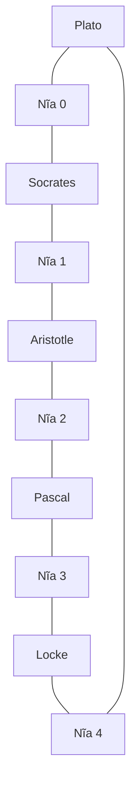

# 🛠️ Khởi động Dining Philosophers: Kiểu dữ liệu, bàn tiệc và những dòng code đầu tiên

> Nguồn: `027-Getting-started-with-the-problem.txt` · [Udemy](https://ua.udemy.com/course/working-with-concurrency-in-go-golang/learn/lecture/33849296)

Hôm nay mình và các bạn chính thức bắt tay dựng chương trình. Chúng ta sẽ đi từ con số không: tạo module, khai báo kiểu `philosopher`, xếp năm người vào bàn, tạo ổ khoá cho năm chiếc nĩa, rồi phác thảo hai hàm `dine` và `diningProblem`. *Các bạn cứ gõ theo mình, sai cũng không sao — cuối bài chúng ta sẽ chạy thử và gặp một lỗi rất... đáng yêu.*

### 📁 Tạo project và file `main.go`

1. Mở một folder mới trên desktop cho dự án.
2. Mở terminal và chạy `go mod init` để khởi tạo module — mình đặt tên project là **dining philosophers** (tên module viết liền, không dấu cách). Lệnh này sẽ tạo ra file `go.mod`.
3. Tạo file `main.go` với `package main` như thường lệ.

Một thói quen mình luôn khuyên các bạn: **viết lại đề bài vào comment ngay đầu file**. Với những bài kiểu dining philosophers, mỗi lần mở file nhìn thấy yêu cầu, mình không bị "lạc đường". Sau đó mình thêm vài comment phác thảo những việc cần làm và một hàm `main` tạm thời — không có nó thì chương trình không chạy được.

### 🧠 Kiểu `philosopher`: ba thông tin cho mỗi người

Mỗi triết gia cần được lưu ba thứ: **tên**, **chiếc nĩa bên trái** và **chiếc nĩa bên phải**. Chỉ dùng một slice string cho năm cái tên là không đủ, nên mình định nghĩa một struct:

```go
type philosopher struct {
	name      string
	leftFork  int
	rightFork int
}
```

Hai con số kia chính là **ID của nĩa**. Sau này, khi triết gia giữ một chiếc nĩa, con số đó sẽ là ổ khoá trên chiếc nĩa ấy — ai đang dùng thì không ai khác được dùng. Và ổ khoá đó, như các bạn đoán được rồi đấy, chính là một **mutex**.

Tiếp theo, mình khai báo danh sách tất cả triết gia — một slice của kiểu `philosopher`:

```go
var philosophers = []philosopher{
	{name: "Plato", leftFork: 4, rightFork: 0},
	{name: "Socrates", leftFork: 0, rightFork: 1},
	{name: "Aristotle", leftFork: 1, rightFork: 2},
	{name: "Pascal", leftFork: 2, rightFork: 3},
	{name: "Locke", leftFork: 3, rightFork: 4},
}
```

Ngồi quanh bàn tròn, **nĩa trái của người này chính là nĩa phải của người kia**:

* Plato: nĩa trái số **4** — cũng là nĩa phải của Locke; nĩa phải số **0** — cũng là nĩa trái của Socrates.
* Socrates: trái **0**, phải **1**; Aristotle: trái **1**, phải **2**; Pascal: trái **2**, phải **3**; Locke: trái **3**, phải **4**.

Đọc theo thứ tự, dãy nĩa là `4 0, 0 1, 1 2, 2 3, 3 4` — năm triết gia, năm chiếc nĩa, đúng vòng tròn mà chúng ta cần.



### ⏱️ Nhịp độ bữa ăn: bốn biến cấu hình

```go
var hunger = 3
var eatTime = 1 * time.Second
var thinkTime = 3 * time.Second
var sleepTime = 1 * time.Second
```

* `hunger = 3`: mỗi triết gia ăn đúng **ba lần** rồi kết thúc.
* `eatTime = 1 * time.Second`: mỗi lượt ăn mất một giây.
* `thinkTime = 3 * time.Second`: ăn xong thì... suy nghĩ. *Họ ăn rất nhanh nhưng nghĩ thì lâu — đúng chất triết gia các bạn nhỉ.*
* `sleepTime = 1 * time.Second`: một khoảng nghỉ chung, dùng khi cần in thông báo rồi tạm dừng một chút — mình cũng không muốn chữ chạy vụt qua màn hình với tốc độ ánh sáng.

### 🍽️ Hàm `dine`: hai WaitGroup và bàn tiệc năm chiếc nĩa

Trong `main`, mình in thông điệp chào mừng, in trạng thái ban đầu "The table is empty" (bàn đang trống), gọi `dine()`, và khi mọi thứ xong xuôi thì in lại dòng đó. Trước khi đi tiếp, mình chốt một quyết định: **không ai bắt đầu ăn cho đến khi tất cả mọi người đã ngồi vào bàn**.

Trong `dine`, mình cần **chờ** hai sự kiện: cả bàn ăn xong, và mọi người đã yên vị. Vậy nên có hai `sync.WaitGroup`:

| WaitGroup | Dùng để chờ điều gì | Khởi tạo |
|---|---|---|
| `wg` | Cả năm triết gia ăn xong | `wg.Add(len(philosophers))` |
| `seated` | Cả năm triết gia đã ngồi vào bàn | `seated.Add(len(philosophers))` |

Cả hai đều là **con trỏ** tới `sync.WaitGroup` — ví dụ `wg := &sync.WaitGroup{}`. Mình dùng `len(philosophers)` thay vì gõ số 5, để sau này có thêm bớt triết gia thì code vẫn đúng.

Tiếp theo, ta cần một "kho" chứa cả năm chiếc nĩa: một map đánh số từ 0, mỗi giá trị là một mutex.

```go
var forks = make(map[int]*sync.Mutex)
for i := 0; i < len(philosophers); i++ {
	forks[i] = &sync.Mutex{}
}
```

**Vì sao phải là con trỏ `*sync.Mutex`?** Vì một khi đã tạo mutex, các bạn **không bao giờ được copy nó** — nhưng dùng con trỏ thì hoàn toàn thoải mái. Đây là chi tiết nhỏ mà mình rất hay nhấn mạnh với sinh viên.

Giờ thì bắt đầu bữa tiệc: duyệt qua từng người và phóng ra một goroutine cho mỗi người.

```go
for i := 0; i < len(philosophers); i++ {
	go diningProblem(philosophers[i], wg, forks, seated)
}
wg.Wait()
```

Sau vòng lặp, chương trình sẽ **dừng ở `wg.Wait()`** cho tới khi tất cả goroutine báo xong. Lúc chạy, ta có sáu goroutine cùng sống: `main` và năm triết gia.

### 🔁 Chữ ký `diningProblem` và cú deadlock đầu tiên

Hàm goroutine nhận đúng **bốn tham số**: chính triết gia đó, `wg` cho bữa ăn, `forks` để biết mình cần khoá chiếc nĩa nào, và `seated` cho trạng thái ngồi vào bàn.

```go
func diningProblem(philosopher philosopher, wg *sync.WaitGroup,
	forks map[int]*sync.Mutex, seated *sync.WaitGroup) {
}
```

Lúc này trong hàm chưa có gì cả. Thử chạy `go run .` xem sao:

* Chương trình in ra tiêu đề và "The table is empty" — ổn.
* Rồi... **fatal error: all goroutines are asleep — deadlock!** (tất cả goroutine đều ngủ, khoá chết!)

Đây là lỗi đầu tiên nhưng cũng là bài học đáng nhớ: chưa có gì gọi `wg.Done()`, nên `wg.Wait()` cứ chờ mãi. Cách sửa nằm ngay trong tầm tay — thêm một dòng `defer` vào đầu hàm:

```go
func diningProblem(philosopher philosopher, wg *sync.WaitGroup,
	forks map[int]*sync.Mutex, seated *sync.WaitGroup) {
	defer wg.Done()
}
```

Chạy lại: năm goroutine lần lượt hoàn thành, bộ đếm `wg` về 0, chương trình in thông điệp kết thúc gọn gàng. Khởi đầu vậy là tốt rồi!

*Nếu các bạn thấy rối ở đoạn WaitGroup, cứ chạy lại chương trình vài lần rồi đọc code từ trên xuống — mọi thứ sẽ sáng dần ra.*

Bước tiếp theo là làm cho `diningProblem` thực sự... ăn uống. Hẹn các bạn ở bài sau! 🚀

## Nguồn tham khảo

- [pkg.go.dev — package sync](https://pkg.go.dev/sync)
- [Udemy — Getting started with the problem](https://ua.udemy.com/course/working-with-concurrency-in-go-golang/learn/lecture/33849296)
