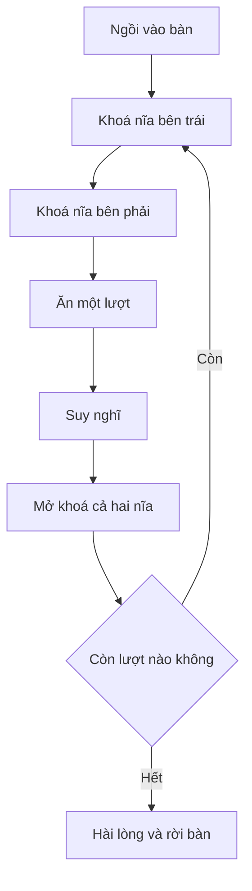

# ⚙️ Hiện thực logic diningProblem: Ăn, suy nghĩ và cú deadlock kinh điển

> Nguồn: `028-Implementing-the-diningProblem-logic.txt` · [Udemy](https://ua.udemy.com/course/working-with-concurrency-in-go-golang/learn/lecture/33849312)

Ở bài trước, năm goroutine của chúng ta chạy nhưng chẳng làm gì ngoài việc giảm `wg` rồi thoát. Hôm nay mình sẽ thổi hồn vào `diningProblem`: ngồi vào bàn, lấy nĩa, ăn, suy nghĩ. Và trên đường đi, các bạn sẽ tận mắt thấy vì sao dining philosophers nổi tiếng đến vậy. *Mình sẽ cố tình viết sai một chỗ để chứng minh một điều thú vị, nên đừng hoảng nếu thấy có gì đó "sai sai" nhé.*

### 🪑 Ai cũng phải có chỗ ngồi trước đã

Việc đầu tiên trong `diningProblem` là thông báo triết gia đã ngồi vào bàn, rồi giảm `seated` đi một để báo hiệu "người này đã yên vị":

```go
fmt.Printf("%s is seated at the table.\n", philosopher.name)
seated.Done()
```

Và vì đã quyết định **không ai ăn trước khi mọi người ngồi đủ**, mình chờ cả năm người sẵn sàng mới bước vào vòng lặp ăn uống:

```go
seated.Wait()
```

Khi chạy chương trình, dòng "... is seated at the table." sẽ xuất hiện đủ năm lần — thứ tự ngồi hoàn toàn do **Go scheduler** (bộ lập lịch goroutine của Go) quyết định. *Mẹo nhỏ: trước khi chia sẻ code, mình chú thích khá kỹ trong file để các bạn dễ theo dõi nếu gặp trục trặc.*

### 🍴 Vòng lặp bữa ăn — và một lỗi cố ý

Mỗi triết gia ăn ba lần, mình viết vòng lặp đếm ngược từ `hunger`:

```go
for i := hunger; i > 0; i-- {
	forks[philosopher.leftFork].Lock()
	forks[philosopher.rightFork].Lock()

	fmt.Printf("\t%s takes the left fork.\n", philosopher.name)
	fmt.Printf("\t%s takes the right fork.\n", philosopher.name)
	fmt.Printf("\t%s has both forks and is eating.\n", philosopher.name)
	time.Sleep(eatTime)

	fmt.Printf("\t%s is thinking.\n", philosopher.name)
	time.Sleep(thinkTime)

	forks[philosopher.leftFork].Unlock()
	forks[philosopher.rightFork].Unlock()

	fmt.Printf("\t%s put down the forks.\n", philosopher.name)
}
```

Đọc lần lượt nhé:

1. `forks[...].Lock()` — xin khoá nĩa trái; nếu ai đang giữ, **goroutine tự dừng chờ** tới khi nĩa được nhả ra. Có nĩa trái rồi mới xin tiếp nĩa phải.
2. In thông báo lấy nĩa (thụt đầu dòng bằng `\t` cho dễ đọc), ăn trong `eatTime`, nghĩ trong `thinkTime`.
3. `Unlock()` cả hai nĩa cho hàng xóm dùng, rồi in thông báo đặt nĩa xuống.

Điểm mấu chốt: **mình cố tình cho mọi người lấy nĩa trái trước rồi mới tới nĩa phải.** Nếu đã từng nghe về dining philosophers, bạn sẽ nhận ra ngay đây là cách làm sai — nhưng mình làm có chủ đích, xem tiếp sẽ rõ.



Hết vòng lặp, mỗi người in thêm hai dòng `is satisfied.` và `left the table.` — *không cần gọi `wg.Done()` ở đây vì `defer` ở đầu hàm đã lo rồi.* Chạy `go run .`, mọi thứ diễn ra khá đẹp: Aristotle, Socrates rồi Pascal lần lượt rời bàn, mọi người ăn uống đâu vào đấy và bàn tiệc trống trở lại.

### 🏃 Tăng tốc, `-race` và cú kẹt cứng

Để tiện thí nghiệm, mình set `eatTime`, `sleepTime`, `thinkTime` về `0 * time.Second` ngay trong `dine` — *khi không còn ở giai đoạn phát triển, mình sẽ comment mấy dòng đó lại*. Rồi chạy với cờ `-race`:

```bash
go run -race .
```

`-race` là công cụ phát hiện **data race** (đọc/ghi đồng thời vào cùng vùng nhớ) có sẵn của Go, và ở đây chúng ta có chia sẻ bộ nhớ giữa các goroutine nên rất đáng kiểm tra ([Data Race Detector](https://go.dev/doc/articles/race_detector)).

Kết quả: chương trình đứng hình. Aristotle, Pascal, Socrates rồi Plato — ai cũng lấy nĩa trái và chờ nĩa phải... mãi mãi.

Đây gọi là **logical race condition** (đua tranh logic). Có thể chạy chương trình 10 lần mà không gặp lại, và điều quan trọng nhất: **`-race` có chạy mãi cũng không bao giờ phát hiện ra lỗi này** — vì nó chỉ soi các truy cập bộ nhớ, không hiểu logic khoá sai của chúng ta. Đó chính là phần thú vị nhất khiến bài toán này đáng để giải.

| Tiêu chí | Data race | Logical race condition |
|---|---|---|
| Bản chất | Truy cập vùng nhớ chia sẻ không đồng bộ | Logic lấy khoá sai khiến các goroutine chờ nhau mãi |
| Cờ `-race` phát hiện? | Có | **Không** |
| Trong bài giảng | Kiểm tra bằng `go run -race .` | Ai cũng cầm nĩa trái, không ai lấy được nĩa phải |

### ✅ Cách sửa: luôn lấy chiếc nĩa có số nhỏ hơn trước

Bí quyết cực kỳ đơn giản: **luôn xin khoá chiếc nĩa được đánh số nhỏ hơn trước**. Nếu ai cũng theo đúng luật này, tình huống hai người khoá chéo nhau rồi chờ nhau sẽ không bao giờ xảy ra.

```go
if philosopher.leftFork > philosopher.rightFork {
	forks[philosopher.rightFork].Lock()
	forks[philosopher.leftFork].Lock()
} else {
	forks[philosopher.leftFork].Lock()
	forks[philosopher.rightFork].Lock()
}
```

Chỉ có **một** người rơi vào trường hợp `leftFork > rightFork`: Plato, với nĩa trái số 4 và nĩa phải số 0. Vậy nên Plato sẽ lấy nĩa phải trước, còn bốn người kia vẫn lấy nĩa trái trước — thế là đủ để phá vỡ vòng khoá chết.

Chạy lại `go run -race .`: chương trình vụt qua gần như tức thì, lượt ăn nào cũng trọn vẹn, không ai chờ ai. Đơn giản vậy mà hiệu quả!

Chương trình đã chạy trơn tru, nhưng mình còn một challenge nhỏ muốn giao cho các bạn: làm sao in ra thứ tự các triết gia kết thúc bữa ăn? Hẹn gặp lại ở bài sau! 🚀

## Nguồn tham khảo

- [Data Race Detector — The Go Programming Language](https://go.dev/doc/articles/race_detector)
- [pkg.go.dev — package sync](https://pkg.go.dev/sync)
- [Udemy — Implementing the diningProblem logic](https://ua.udemy.com/course/working-with-concurrency-in-go-golang/learn/lecture/33849312)
