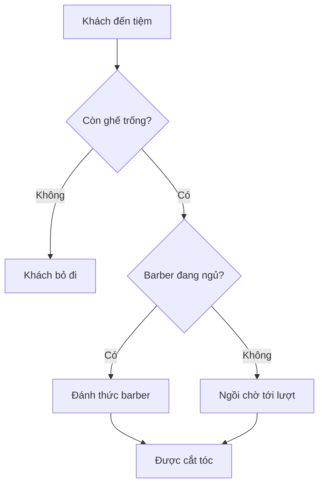

# 💈 Channels và Sleeping Barber: Mở màn section "nặng ký" nhất từ đầu khóa

> Nguồn: `032-What-well-cover-in-this-section.txt` · [Udemy](https://ua.udemy.com/course/working-with-concurrency-in-go-golang/learn/lecture/32112590)

Chào các bạn, mình lại tiếp tục đồng hành cùng các bạn trên hành trình concurrency đây. Section này chúng ta sẽ dành thật nhiều thời gian cho **channel** — cách chia sẻ bộ nhớ được Go ưu tiên — và chạm mặt một bài toán kinh điển của khoa học máy tính: **Sleeping Barber** (tiệm hớt tóc ngủ quên). Mình tin rằng đi hết section này, các bạn sẽ nắm chắc channel là gì, hoạt động ra sao và khi nào nên dùng chúng.

### 🎯 Channel — cách giao tiếp mà Go ưu tiên

Nếu các bạn còn nhớ ở phần introduction, mình đã nói triết lý của Go là: **"share memory by communicating, don't communicate by sharing memory"** — chia sẻ bộ nhớ bằng cách giao tiếp, chứ đừng giao tiếp bằng cách chia sẻ bộ nhớ. Điều này đạt được chủ yếu nhờ **channel**.

* Một khi đã bắn một goroutine ra chạy nền, các bạn thật sự không có cách nào giao tiếp trực tiếp với nó — ngoại trừ channel.
* Channel có thể ở dạng **buffered** (có bộ đệm): chứa được nhiều hơn một giá trị. Buffer kích thước 10 nghĩa là bỏ được 10 thứ vào trong.
* Hoặc ở dạng **unbuffered**: mỗi lần chỉ nhận đúng một thứ, và chúng ta sẽ có ví dụ ngay sau đây.

### ⚠️ Quy tắc vàng và kiểu dữ liệu của channel

Trước khi vào bài toán, mình muốn các bạn ghi nhớ hai điều:

1. **Mở channel rồi thì phải đóng.** Nếu không đóng, các bạn sẽ gặp **resource leak** (rò rỉ tài nguyên), và mọi thứ sẽ tệ dần theo thời gian.
2. Channel chỉ nhận **một kiểu dữ liệu hoặc interface nhất định**. Các bạn có thể có channel of `bool`, channel of `int`, hay channel của một struct tự định nghĩa — nhưng nói chung chỉ đúng một loại dữ liệu.

### 📜 Sleeping Barber — bài toán kinh điển từ năm 1965

Đây là bài toán do **Dijkstra đề xuất năm 1965**. Nó đã tồn tại rất lâu và đúng là một ví dụ "highly contrived" (gượng ép, nhân tạo) — nhưng classic vì một lý do rất rõ: nó buộc người giải phải nhìn vấn đề concurrency thật kỹ, rồi tìm ra lời giải hiệu quả nhất có thể.

Luật chơi của bài toán như sau:

1. Một barber (thợ cắt tóc) đến tiệm làm việc, tiệm có phòng chờ với **số ghế cố định**.
2. Nếu phòng chờ không có ai, barber **ngủ trưa**.
3. Khách đến: nếu **hết ghế** thì khách **bỏ đi**; nếu còn ghế mà barber đang ngủ thì khách **đánh thức barber** để được cắt tóc.
4. Nếu barber đang bận, khách **ngồi chờ** tới lượt mình.
5. Khi tiệm đóng cửa, **không nhận khách mới**, nhưng barber phải ở lại cắt cho hết những người đang chờ.

Mình có một hình minh họa cho các bạn dễ hình dung: tiệm có 4 ghế, phòng chờ trống trơn nên barber ngủ một giấc; một khách đến đánh thức barber dậy và được cắt tóc. Trong ngày, càng lúc càng đông; ai đến mà hết ghế thì đành ra về — trong đó có một người trông khá buồn vì rõ ràng là tóc đang cần cắt lắm. Cuối ngày, barber về nhà.

*Và không, mấy hình đó không phải mình vẽ đâu — người có năng khiếu thật sự mới vẽ được vậy.* 😄

### 🧩 Vì sao bài toán này đáng để làm?

Thoạt nhìn thì có vẻ đơn giản, nhưng chúng ta sẽ giải nó bằng **concurrency**. Để mọi thứ thú vị hơn, khi đi sâu vào section, mình sẽ còn **thêm nhiều hơn một barber** — và đó là lúc bài toán trở nên thật sự đáng giá.

* Đây là một bài tập tuyệt vời để dùng channel.
* Nếu các bạn làm theo, chú ý kỹ diễn biến và hiểu tường tận mọi thứ ở cuối section, các bạn sẽ có một nền tảng vững chắc về channel: chúng là gì, hoạt động thế nào và khi nào nên dùng.

### 🎯 Tự kiểm tra nhanh

**Câu 1:** Triết lý chia sẻ bộ nhớ của Go được phát biểu như thế nào?

<b>Xem đáp án</b>

**Đáp án:** "Share memory by communicating, don't communicate by sharing memory" — chia sẻ bộ nhớ bằng cách giao tiếp, đừng giao tiếp bằng cách chia sẻ bộ nhớ.

Giải thích: Channel là phương tiện chính để thực hiện triết lý này.

Tham chiếu: Mục Channel — cách giao tiếp mà Go ưu tiên.

**Câu 2:** Điều gì xảy ra nếu mở channel mà không đóng?

<b>Xem đáp án</b>

**Đáp án:** Xảy ra resource leak (rò rỉ tài nguyên) và mọi thứ sẽ tệ dần theo thời gian.

Giải thích: Đây là quy tắc vàng của channel mà mình sẽ còn nhắc đi nhắc lại.

Tham chiếu: Mục Quy tắc vàng và kiểu dữ liệu của channel.

**Câu 3:** Một buffered channel kích thước 10 chứa được bao nhiêu giá trị?

<b>Xem đáp án</b>

**Đáp án:** 10 giá trị.

Giải thích: Buffer size quyết định số thứ có thể bỏ vào channel.

Tham chiếu: Mục Channel — cách giao tiếp mà Go ưu tiên.

**Câu 4:** Sleeping Barber do ai đề xuất và vào năm nào?

<b>Xem đáp án</b>

**Đáp án:** Dijkstra, năm 1965.

Giải thích: Đây là bài toán kinh điển, được dùng lại trong khóa học để luyện channel.

Tham chiếu: Mục Sleeping Barber — bài toán kinh điển từ năm 1965.

**Câu 5:** Hết giờ mở cửa, barber có được về ngay không?

<b>Xem đáp án</b>

**Đáp án:** Không. Tiệm ngừng nhận khách mới, nhưng barber phải cắt cho hết những khách đang chờ rồi mới được về.

Giải thích: Đây là một trong những luật quan trọng của bài toán.

Tham chiếu: Mục Sleeping Barber — bài toán kinh điển từ năm 1965.

Đó là toàn bộ bức tranh của section này. Trong bài tiếp theo, chúng ta sẽ gõ code ngay: tạo channel bằng `make`, gửi và nhận dữ liệu qua lại giữa hai goroutine. Hẹn gặp các bạn ở đó! 🚀

## Nguồn tham khảo

- [Wikipedia — Sleeping barber problem](https://en.wikipedia.org/wiki/Sleeping_barber_problem)
