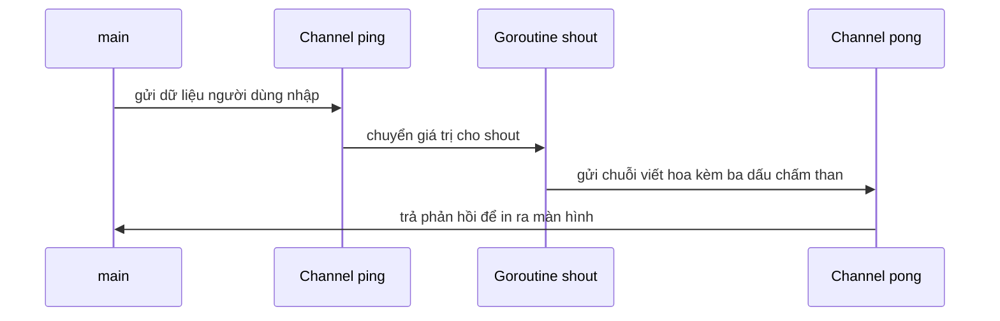

# 🔌 Introduction to Channels: Hai goroutine "nói chuyện" với nhau như thế nào?

> Nguồn: `033-Introduction-to-channels.txt` · [Udemy](https://ua.udemy.com/course/working-with-concurrency-in-go-golang/learn/lecture/32129684)

Hồi trước mình có giới thiệu sơ qua về channel và hứa sẽ nói kỹ hơn. Hôm nay là lúc giữ lời: chúng ta sẽ viết một chương trình nhỏ — gõ vào gì đó, chương trình "hét" lại bằng chữ in hoa — để thấy channel chính là cầu nối giữa các goroutine. Các bạn cứ gõ theo mình, sai cũng không sao nhé.

### ⌨️ Thí nghiệm đầu tiên: khi main "bỏ rơi" goroutine

Mình mở một cửa sổ mới trong Visual Studio Code, tạo thư mục **simple-channels** rồi khởi tạo module:

```bash
go mod init simple-channels
```

Trong `main.go` với `package main`, mình viết một hàm tên `shout` — chưa cần tham số, bên trong là vòng `for` chạy mãi mãi và in ra dòng `Executing loop`:

```go
func shout() {
	for {
		fmt.Println("Executing loop")
	}
}
```

Nếu gọi `shout()` như bình thường, chương trình in liên tục và không bao giờ thoát — đúng như dự đoán. Nhưng nếu thêm từ khóa `go` phía trước:

```go
go shout()
time.Sleep(10 * time.Second)
```

thì `shout` chạy nền, còn `main`... chẳng có cách nào nói chuyện với nó. Hết 10 giây, chương trình kết thúc và goroutine kia biến mất. **Channel sinh ra để giải quyết đúng vấn đề này.**

*Nhớ nhé: hàm `main` trong bất kỳ chương trình Go nào cũng chính là một goroutine.* Vì vậy channel là những "ống dẫn" cho phép đẩy dữ liệu tới hoặc lấy dữ liệu từ một goroutine khác.

### 🔄 Hai ống dẫn: ping và pong

Mình tạo hai channel, đặt tên là `ping` và `pong`. Cả hai đều là channel of string — chỉ nhận chuỗi mà thôi:

```go
ping := make(chan string)
pong := make(chan string)
```

Lúc này IDE báo lỗi vì chưa dùng đến, nhưng không sao. Việc tiếp theo là truyền hai channel này vào goroutine `shout` bằng `go shout(ping, pong)`. Bên trong `shout`, mình nhận giá trị từ `ping`, viết hoa toàn bộ bằng `strings.ToUpper` (thuộc package `strings` trong thư viện chuẩn), thêm ba dấu chấm than rồi gửi ngược lại qua `pong`:

```go
func shout(ping <-chan string, pong chan<- string) {
	for {
		sw := <-ping
		pong <- fmt.Sprintf("%s!!!", strings.ToUpper(sw))
	}
}
```

Để ý hai mũi tên nhỏ ở tham số — mình sẽ giải thích ngay ở mục cuối. Còn cú pháp thì cực kỳ dễ nhớ:

* `sw := <-ping` nghĩa là **chờ nhận** một giá trị từ `ping`, gán vào biến `sw`.
* `pong <- ...` nghĩa là **gửi** giá trị vào `pong`. Gần như cùng một cú pháp, chỉ khác hướng của mũi tên.

### 🖥️ Vòng lặp nhập liệu ở main

Phía `main`, mình in vài dòng hướng dẫn cho người dùng — gõ gì đó rồi nhấn Enter, gõ `q` để thoát — cùng một dấu nhắc nhỏ. Sau đó là vòng lặp đọc dữ liệu bằng `fmt.Scan`, bỏ qua hai giá trị trả về vì mình không cần chúng:

```go
var userInput string
_, _ = fmt.Scan(&userInput)

if strings.ToLower(userInput) == "q" {
	break
}

ping <- userInput
response := <-pong
fmt.Println("Response:", response)
```

Luồng hoạt động chỉ có vậy: gửi những gì người dùng vừa gõ vào `ping`, rồi **chờ** phản hồi ở `pong` và in ra. Kiểm tra `q` bằng `strings.ToLower` để chấp nhận cả chữ hoa lẫn chữ thường.

Chạy `go run .` và thử: mình gõ `Trevor` → nhận về `TREVOR!!!`; gõ `hello` (lỡ viết sai chính tả cũng chẳng sao) → `HELLO!!!`; gõ `q` → chương trình in thông báo "Closing channels" và thoát. Để ý quy tắc vàng quen thuộc: xong việc thì đóng cả hai channel bằng `close(ping)` và `close(pong)`. *Không đóng là rò rỉ tài nguyên, đừng quên nhé.*



### 🔒 Send-only và receive-only: chốt chặn an toàn

À, còn hai mũi tên ở phần tham số. Khi khai báo tham số cho hàm, các bạn có thể chỉ định rõ một channel là **send-only** (chỉ gửi) hay **receive-only** (chỉ nhận):

* `ping <-chan string` — receive-only, vì `shout` chỉ nhận từ `ping`.
* `pong chan<- string` — send-only, vì `shout` chỉ gửi vào `pong`.

Việc này **không bắt buộc**, nhưng nó ngăn các bạn vô tình gửi vào một channel mà mình định chỉ nhận — kiểu lỗi rất dễ xảy ra khi code phình to. Mình chạy lại chương trình và mọi thứ vẫn hoạt động trơn tru.

Vậy là cách dùng channel đơn giản nhất đã nằm trong tay các bạn: gửi trên channel này, nhận trên channel kia, và đóng chúng khi xong. Từ đây mình sẽ đi sang ví dụ phức tạp hơn một chút, rồi tiến tới dùng channel trong Sleeping Barber.

### 🎯 Tự kiểm tra nhanh

**Câu 1:** Vì sao `main` không thể giao tiếp trực tiếp với một goroutine đang chạy nền?

<details>
<summary><b>Xem đáp án</b></summary>

**Đáp án:** Vì sau khi bắn goroutine ra chạy nền, không có cách nào nói chuyện trực tiếp với nó ngoài channel.

Giải thích: Channel chính là cơ chế giao tiếp giữa các goroutine.

Tham chiếu: Mục Thí nghiệm đầu tiên.

</details>

**Câu 2:** Cú pháp `sw := <-ping` có ý nghĩa gì?

<details>
<summary><b>Xem đáp án</b></summary>

**Đáp án:** Chờ nhận một giá trị từ channel `ping` và gán vào biến `sw`.

Giải thích: Mũi tên hướng ra khỏi channel thể hiện thao tác nhận.

Tham chiếu: Mục Hai ống dẫn ping và pong.

</details>

**Câu 3:** Hàm `shout` biến đổi dữ liệu như thế nào trước khi gửi trả?

<details>
<summary><b>Xem đáp án</b></summary>

**Đáp án:** Chuyển toàn bộ chuỗi thành chữ in hoa bằng `strings.ToUpper` rồi thêm ba dấu chấm than.

Giải thích: Đây là lý do hàm có tên là "shout" — hét lại thật to.

Tham chiếu: Mục Hai ống dẫn ping và pong.

</details>

**Câu 4:** Vì sao phải đóng channel khi dùng xong?

<details>
<summary><b>Xem đáp án</b></summary>

**Đáp án:** Để tránh resource leak (rò rỉ tài nguyên) — quy tắc vàng của channel.

Giải thích: Trong ví dụ, `close(ping)` và `close(pong)` được gọi sau khi thoát vòng lặp.

Tham chiếu: Mục Vòng lặp nhập liệu ở main.

</details>

**Câu 5:** `ping <-chan string` và `pong chan<- string` khác nhau ở đâu?

<details>
<summary><b>Xem đáp án</b></summary>

**Đáp án:** `<-chan string` là receive-only (chỉ nhận), còn `chan<- string` là send-only (chỉ gửi).

Giải thích: Khai báo rõ chiều giúp tránh gửi nhầm vào channel chỉ để nhận, dù không bắt buộc.

Tham chiếu: Mục Send-only và receive-only.

</details>

Bài tiếp theo chúng ta sẽ gặp một "bẫy" kinh điển — deadlock khi gửi vào channel không ai nhận — và học `select`, công cụ giúp bạn "bắt sóng" nhiều channel cùng lúc. Hẹn gặp lại các bạn! 🚀

## Nguồn tham khảo

- [A Tour of Go — Channels](https://go.dev/tour/concurrency/2)
