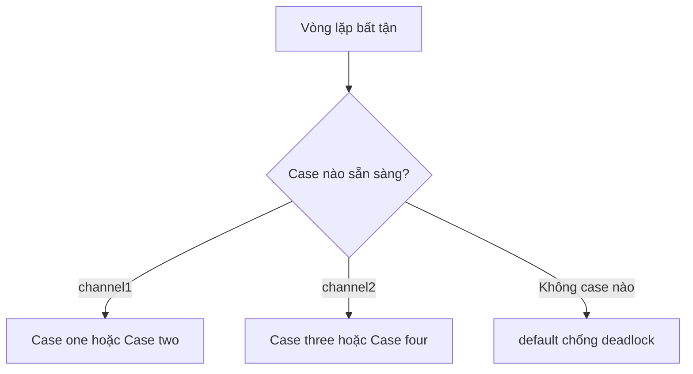

# 🎛️ Select Statement: Khi Go chọn case ngẫu nhiên và cái bẫy deadlock

> Nguồn: `034-The-select-statement.txt` · [Udemy](https://ua.udemy.com/course/working-with-concurrency-in-go-golang/learn/lecture/32160076)

Có vài điều mình quên nhắc ở bài trước nên hôm nay tranh thủ "đền" lại các bạn: chuyện gì xảy ra khi gửi vào channel mà không ai nhận, và tham số thứ hai khi nhận dữ liệu từ channel. Sau đó chúng ta sẽ làm quen với `select` — thứ mình hứa sẽ còn dùng dài dài, kể cả trong Sleeping Barber sắp tới.

### ⚠️ Deadlock: lỗi "tất cả goroutine đều đang ngủ"

Quay lại ví dụ simple-channels. Nếu mình comment dòng `go shout(...)` lại, goroutine `shout` sẽ không bao giờ được khởi động. Chương trình vẫn in prompt bình thường, mình gõ `Trevor` rồi nhấn Enter và... nhận ngay một lỗi:

```text
fatal error: all goroutines are asleep - deadlock!
```

Lý do rất dễ hiểu: dữ liệu được gửi vào `ping`, nhưng không còn ai lắng nghe channel đó nữa. Đây là cách Go "nói" khá hữu ích rằng bạn đang gửi vào một channel mà sẽ chẳng bao giờ có ai nhận. Bỏ comment dòng `go shout(...)` là mọi thứ trở lại bình thường.

### ✅ Tham số thứ hai khi nhận từ channel

Điều thứ hai mình muốn các bạn để ý: khi nhận giá trị từ channel, ngoài giá trị nhận được, các bạn có thể lấy thêm một tham số boolean:

```go
s, ok := <-ping
```

* `ok` bằng `true` nghĩa là giá trị vừa rồi **thật sự được gửi** vào channel.
* `ok` bằng `false` nghĩa là channel **đã đóng và rỗng**, nên giá trị nhận được chỉ là zero value.

Nhờ vậy, chỉ cần `if !ok` là biết channel đã đóng hay chưa. Mình sẽ dùng đúng chiêu này trong Sleeping Barber — chỉ vài bài nữa thôi đấy.

### 🎛️ Select: "switch dành riêng cho channel"

Mình mở project mới tên **channel-select**, khởi tạo `go mod init channel-select`, rồi tạo hai hàm sẽ đóng vai các server:

* `server1` nhận một channel, loop vô tận, mỗi vòng ngủ **6 giây** rồi gửi dòng `This is from server one.`.
* `server2` cũng tương tự nhưng chỉ ngủ **3 giây**, và gửi dòng `This is from server two.`.

Ở `main`, mình in tiêu đề "Select with channels" kèm dòng gạch dưới, tạo hai channel of string, chạy hai goroutine rồi đưa cả chương trình vào một vòng lặp bất tận chứa `select` với... **bốn case**:

```go
select {
case s1 := <-channel1:
	fmt.Println("Case one:", s1)
case s2 := <-channel1:
	fmt.Println("Case two:", s2)
case s3 := <-channel2:
	fmt.Println("Case three:", s3)
case s4 := <-channel2:
	fmt.Println("Case four:", s4)
}
```

Để ý nhé: case một và case hai cùng lắng nghe `channel1`, còn case ba và case bốn cùng lắng nghe `channel2` — chúng **functionally identical** (giống hệt nhau về chức năng), chỉ khác thông báo được in ra.

Và đây là kết quả thú vị. Sau một khoảng chờ, màn hình hiện `Case three`. Rồi lát sau, `Case four` cũng có thể xuất hiện — dù cả hai case này cùng lắng nghe `channel2` và về mặt chức năng là giống hệt nhau. Câu trả lời nằm ở chỗ: khi **nhiều case cùng khớp**, `select` sẽ **chọn ngẫu nhiên một case**. Đó là điểm mấu chốt của ví dụ "gượng ép" này, và cũng là tính chất cực kỳ hữu dụng trong nhiều tình huống thực tế.

Ví dụ này chạy mãi vì không có điều kiện thoát. Mình cũng chưa đóng channel nào — bởi đây là ví dụ minh họa thuần túy, không có tình huống nào thoát khỏi vòng lặp. Nếu muốn, các bạn hoàn toàn có thể thêm điều kiện "sau 30 giây thì thoát vòng lặp và đóng channel". Dừng chương trình bằng Ctrl+C là được.

### 🛡️ Default case: phao cứu sinh chống deadlock

Giống như `switch`, `select` cũng có thể có nhánh `default`. Nhánh này đặc biệt hữu ích để **tránh deadlock**: nếu không có channel nào sẵn sàng, `default` sẽ ngăn chương trình crash.

Đây cũng là chỗ lý tưởng để in một thông báo kiểu: "đáng lẽ phải có một goroutine đang chạy, nhưng chẳng có cái nào cả". IDE sẽ cảnh báo nếu `default` rỗng vì vòng lặp sẽ quay liên tục — trong tình huống này mình không cần nó nên comment lại cho đỡ ồn ào. *Nhưng đừng xem nhẹ `default`, nó cứu bạn khỏi khá nhiều cú crash đấy.*

| Tiêu chí | `select` | `switch` |
|---|---|---|
| Đối tượng áp dụng | Chỉ channel | Giá trị, điều kiện thông thường |
| Nhiều case cùng khớp | Chọn một case **ngẫu nhiên** | Chọn case khớp đầu tiên |
| `default` | Chạy khi không channel nào sẵn sàng, chống deadlock | Nhánh mặc định khi không case nào khớp |
| Mục đích chính | Phối hợp nhiều channel | Rẽ nhánh logic thông thường |



`select` thật sự rất hữu ích, tương đối dễ dùng, và mình sẽ còn dùng tiếp ngay trong section này. Còn bây giờ, hãy sang bài tiếp theo để xem buffered channel khác gì channel thường nhé.

### 🎯 Tự kiểm tra nhanh

**Câu 1:** Khi gửi vào channel mà không còn ai nhận, Go báo lỗi gì?

<details>
<summary><b>Xem đáp án</b></summary>

**Đáp án:** `fatal error: all goroutines are asleep - deadlock!`

Giải thích: Go phát hiện không còn goroutine nào có thể nhận dữ liệu và dừng chương trình.

Tham chiếu: Mục Deadlock — lỗi tất cả goroutine đều đang ngủ.

</details>

**Câu 2:** Tham số thứ hai `ok` khi nhận từ channel cho biết điều gì?

<details>
<summary><b>Xem đáp án</b></summary>

**Đáp án:** Giá trị nhận được là thật (`true`) hay chỉ là zero value vì channel đã đóng và rỗng (`false`).

Giải thích: Đây là cách kiểm tra channel còn mở hay không.

Tham chiếu: Mục Tham số thứ hai khi nhận từ channel.

</details>

**Câu 3:** Nếu nhiều case trong `select` cùng khớp điều kiện, case nào được chọn?

<details>
<summary><b>Xem đáp án</b></summary>

**Đáp án:** Một case được chọn ngẫu nhiên.

Giải thích: Ví dụ bốn case cho thấy case ba và case bốn giống hệt nhau về chức năng, nên thứ tự thực thi không đoán trước được.

Tham chiếu: Mục Select — switch dành riêng cho channel.

</details>

**Câu 4:** `default` trong `select` có tác dụng gì?

<details>
<summary><b>Xem đáp án</b></summary>

**Đáp án:** Chạy khi không có channel nào sẵn sàng, nhờ đó tránh deadlock và ngăn chương trình crash.

Giải thích: `default` cũng là chỗ tốt để in cảnh báo khi thiếu goroutine.

Tham chiếu: Mục Default case — phao cứu sinh chống deadlock.

</details>

**Câu 5:** Điểm khác biệt cốt lõi giữa `select` và `switch` là gì?

<details>
<summary><b>Xem đáp án</b></summary>

**Đáp án:** `select` chỉ dùng với channel; còn `switch` dùng cho giá trị/điều kiện thông thường.

Giải thích: Khi nhiều case cùng khớp, `select` chọn ngẫu nhiên còn `switch` chọn case đầu tiên.

Tham chiếu: Bảng so sánh `select` và `switch`.

</details>

Ở bài tới, mình sẽ trả lời câu hỏi: điều gì xảy ra khi channel được phép chứa nhiều hơn một giá trị? Hẹn gặp các bạn! 🚀

## Nguồn tham khảo

- [A Tour of Go — Select](https://go.dev/tour/concurrency/5)
