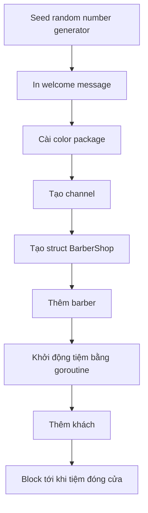

# 💈 Getting Started với Sleeping Barber: Vẽ bản đồ trước khi xây nhà

> Nguồn: `036-Getting-started-with-the-Sleeping-Barber-project.txt` · [Udemy](https://ua.udemy.com/course/working-with-concurrency-in-go-golang/learn/lecture/32112626)

Chúng ta đã có đủ hành trang về channel, và giờ là lúc mang chúng ra dùng thật. Mình sẽ bắt đầu dự án Sleeping Barber — bài toán kinh điển mà mình đã giới thiệu ở đầu section — bằng một bước ít ai ngờ: **chỉ viết comment**. Nghe lạ đúng không? Nhưng với bài toán phức tạp, vẽ bản đồ trước khi xây nhà luôn là cách làm khôn ngoan.

### 🧾 Dựng project và ghi lại luật chơi

Mình mở một thư mục mới trong Visual Studio Code, khởi tạo module bằng `go mod init barber` rồi tạo file `main.go`. Theo thói quen khi làm dự án, mình đặt một đoạn comment ở đầu file để phát biểu lại bài toán — nội dung này mình đã chuẩn bị sẵn và dán vào. *Các bạn muốn có đoạn comment đó thì chỉ cần tải source của bài giảng này về là có nhé.*

Luật chơi của tiệm hớt tóc, phát biểu lại một cách gọn gàng:

1. Nếu không có khách trong phòng chờ, barber **ngủ** trên ghế.
2. Nếu khách đến và barber đang ngủ, khách **đánh thức barber** để được cắt tóc.
3. Nếu khách đến khi barber đang làm việc: hết ghế thì **rời đi**, còn ghế trống thì **ngồi xuống chờ**.
4. Khi cắt xong một mái tóc, barber **nhìn vào phòng chờ**: không có ai thì đi ngủ, có người thì cắt tiếp.
5. Tiệm ngừng nhận khách mới khi tới giờ đóng cửa, nhưng barber **không được về** nếu phòng chờ còn người. Cắt xong cho tất cả mọi người, barber mới về nhà.

Bài toán này, cũng như những bài trước trong khóa, được **Dijkstra đề xuất năm 1965**. Và mục đích của nó rất đáng để ý: chứng minh rằng trong nhiều trường hợp, các bạn **không cần dùng semaphore — thứ mà trong Go chúng ta gọi là mutex — để giải quyết vấn đề**. Mình sẽ chứng minh điều đó ngay trong dự án này.

### 🗺️ Chia bài toán theo kiểu "top-down"

Vì bài toán khá phức tạp, mình chia nó thành các phần nhỏ theo thứ tự triển khai:

1. **Seed random number generator** — vì chương trình sẽ có yếu tố ngẫu nhiên. Chỉ một dòng code.
2. **In welcome message** — một lệnh `fmt.Println` là đủ.
3. **Cài color package** — để mọi thứ trông đẹp mắt hơn một chút.
4. **Tạo channel nếu cần** — chắc chắn là cần, ít nhất một cái.
5. **Tạo data structure cho barbershop** — mô tả phòng chờ lớn bao nhiêu, cắt tóc mất bao lâu, có bao nhiêu barber, những channel cần thiết...
6. **Thêm barber** — bắt đầu với một người, rồi thêm nhiều hơn để xem mọi thứ vận hành ra sao.
7. **Khởi động tiệm** — chạy cấu trúc dữ liệu đó ở chế độ nền, nhiều khả năng là một goroutine, cho đến khi tiệm đóng cửa: mọi người đã cắt xong, phòng chờ trống, đã qua thời gian mở cửa tối đa.
8. **Thêm khách** — bằng cách nào đó khách phải xuất hiện.
9. **Block cho tới khi tiệm đóng cửa** — giữ chương trình chạy cho đến khi mọi thứ hoàn tất.

### 🧠 Vì sao lại bắt đầu bằng comment?

Nghe thì có vẻ chậm, nhưng đây là cách tiếp cận **top-down** rất đáng học: thay vì lao ngay vào code, mình phác thảo các phần việc trước. Trong các bài sau, mình sẽ thay dần từng comment bằng code thật — có thể sẽ xê dịch, thêm hoặc bớt đôi chút, nhưng ít nhất bài toán phức tạp này đã được chia thành những mảnh "dễ nhai".

Dự án này **phức tạp hơn hẳn** những bài chúng ta từng làm, nhưng nó là phần giới thiệu tuyệt vời cho việc dùng channel thực chiến. *Đừng sốt ruột nếu chưa thấy code đâu nhé — chậm mà chắc.*

### 🎯 Tự kiểm tra nhanh

**Câu 1:** Bài toán Sleeping Barber được ai đề xuất và vào năm nào?

<b>Xem đáp án</b>

**Đáp án:** Dijkstra, năm 1965.

Giải thích: Đây cũng là điểm chung với những bài toán classic trước đó trong khóa.

Tham chiếu: Mục Dựng project và ghi lại luật chơi.

**Câu 2:** Mục đích cốt lõi của bài toán này là gì?

<b>Xem đáp án</b>

**Đáp án:** Chứng minh rằng trong nhiều trường hợp không cần dùng semaphore (trong Go gọi là mutex) để giải quyết vấn đề.

Giải thích: Đây là điểm cốt lõi mà dự án sẽ chứng minh.

Tham chiếu: Mục Dựng project và ghi lại luật chơi.

**Câu 3:** Khách đến khi barber đang bận và hết ghế thì sao?

<b>Xem đáp án</b>

**Đáp án:** Khách rời đi.

Giải thích: Nếu còn ghế trống thì khách ngồi chờ tới lượt.

Tham chiếu: Mục Dựng project và ghi lại luật chơi.

**Câu 4:** Khi hết giờ mở cửa, điều gì xảy ra với barber?

<b>Xem đáp án</b>

**Đáp án:** Tiệm ngừng nhận khách mới, nhưng barber phải cắt cho hết người đang chờ rồi mới được về.

Giải thích: Barber chỉ ra về khi phòng chờ đã trống.

Tham chiếu: Mục Dựng project và ghi lại luật chơi.

**Câu 5:** Bước "khởi động tiệm" sẽ được chạy dưới dạng gì?

<b>Xem đáp án</b>

**Đáp án:** Một goroutine chạy nền, cho đến khi tiệm đóng cửa.

Giải thích: Tiệm cần chạy song song với phần còn lại của chương trình.

Tham chiếu: Mục Chia bài toán theo kiểu top-down.

Bước tiếp theo, chúng ta sẽ bắt tay vào code thật: khai báo các biến cấu hình, tạo channel và dựng cấu trúc `BarberShop`. Hẹn gặp các bạn! 🚀

## Nguồn tham khảo

- [Wikipedia — Sleeping barber problem](https://en.wikipedia.org/wiki/Sleeping_barber_problem)
