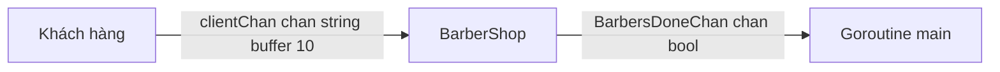

# ⚙️ Variables và Barber Shop: Khai báo "linh hồn" của tiệm hớt tóc

> Nguồn: `037-Defining-some-variables-the-barber-shop-and-getting-started-.txt` · [Udemy](https://ua.udemy.com/course/working-with-concurrency-in-go-golang/learn/lecture/32125800)

Sau khi đã phác thảo bản đồ ở bài trước, hôm nay chúng ta bắt đầu thay comment bằng code thật. Sẽ mất vài bài mới xong, nhưng cứ đi từng bước: trước tiên là các biến cấu hình, rồi channel, rồi "trái tim" của dự án — cấu trúc `BarberShop`. Các bạn mở `main.go` lên và gõ theo mình nhé.

### 📏 Bốn biến cấp package

Bắt đầu với những con số quyết định "luật vật lý" của tiệm:

```go
var seatingCapacity = 10
var arrivalRate = 100
var cutDuration = 1000 * time.Millisecond
var timeOpen = 10 * time.Second
```

* `seatingCapacity` = **10**: số ghế trong phòng chờ. Một khởi đầu hợp lý.
* `arrivalRate` = **100** (mili giây): khách đến cách nhau "khoảng" từng ấy thời gian — mình không muốn ngồi chờ cả buổi để xem chương trình chạy.
* `cutDuration` = **1000 mili giây**: thời gian cắt một mái tóc. Mình dùng mili giây thay vì số nguyên cho dễ chỉnh nhanh/chậm về sau.
* `timeOpen` = **10 giây**: thời gian tiệm mở cửa.

### 🎲 Seed random và "màu mè" cho output

Mình seed bộ sinh số ngẫu nhiên bằng `time.Now().UnixNano()` — sẽ dùng nó kết hợp với `arrivalRate` để khách không phải lúc nào cũng đến đúng một khoảng thời gian cố định.

Để output dễ nhìn, mình cài package màu sắc đa nền tảng (chạy được trên Linux, Windows và Mac):

```bash
go get github.com/fatih/color
```

Rồi in tiêu đề `The Sleeping Barber Problem` bằng màu vàng, kèm một dòng gạch ngang cho đẹp.

### 📡 Hai channel: client và done

Đây là phần quan trọng nhất với chúng ta — các channel:

```go
clientChan := make(chan string, seatingCapacity)
doneChan := make(chan bool)
```

* `clientChan` là channel of string, dùng để gửi khách vào tiệm. Mình cố tình cho nó **buffered với kích thước đúng bằng `seatingCapacity`**: như vậy có thể chứa nhiều khách một lúc, nhưng **không bao giờ vượt quá số ghế của phòng chờ** (hiện tại là 10).
* `doneChan` là channel of `bool`, dùng để báo hiệu "mọi thứ xong rồi, có thể về nhà".

### 🏗️ Type BarberShop trong file riêng

Vì bài toán phức tạp hơn những bài trước, mình tạo thêm file `barbershop.go` (cùng `package main`) để chứa những thứ liên quan tới tiệm:

```go
type BarberShop struct {
	ShopCapacity    int
	HairCutDuration time.Duration
	NumberOfBarbers int
	BarbersDoneChan chan bool
	ClientsChan     chan string
	Open            bool
}
```

Các trường cần thiết lần lượt là: sức chứa của tiệm, thời gian cắt tóc, số lượng barber, channel báo barber đã xong việc, channel nhận khách, và cuối cùng là trạng thái `Open` — `true` khi tiệm mở, `false` khi tiệm đóng.

### 🏪 Khởi tạo shop trong main

Quay lại `main.go`, mình tạo biến `shop` và điền các trường từ những gì đã khai báo:

```go
shop := BarberShop{
	ShopCapacity:    seatingCapacity,
	HairCutDuration: cutDuration,
	NumberOfBarbers: 0,
	ClientsChan:     clientChan,
	BarbersDoneChan: doneChan,
	Open:            true,
}
```

Số barber ban đầu là `0` — chúng ta sẽ thêm họ ở phần "Add barbers". Còn `Open` mình hard-code luôn là `true` vì tiệm chắc chắn mở cửa khi chương trình khởi động. Sau đó in một dòng màu xanh: **tiệm mở cửa đón ngày mới**.



Về kế hoạch thêm barber: mình sẽ có **một tiệm chạy nền** làm nhiệm vụ của nó, và **mỗi barber chạy như một goroutine riêng**. Với một barber thì một goroutine; với năm barber thì năm goroutine. Cách thực hiện gọn nhất là một method `AddBarber` nhận receiver là type shop — mình sẽ viết nó trong bài tiếp theo.

*À, một lỗi nhỏ cuối bài: `go get` khiến file import dư một package không dùng, xóa nó đi là hết cảnh báo ngay.*

### 🎯 Tự kiểm tra nhanh

**Câu 1:** Vì sao `clientChan` được tạo với buffer đúng bằng `seatingCapacity`?

<details>
<summary><b>Xem đáp án</b></summary>

**Đáp án:** Để chứa được nhiều khách cùng lúc nhưng không bao giờ vượt quá số ghế của phòng chờ.

Giải thích: Hiện tại `seatingCapacity` là 10 nên tối đa 10 khách trong channel.

Tham chiếu: Mục Hai channel client và done.

</details>

**Câu 2:** Bộ sinh số ngẫu nhiên được seed bằng gì và để làm gì?

<details>
<summary><b>Xem đáp án</b></summary>

**Đáp án:** Seed bằng `time.Now().UnixNano()`, dùng kết hợp với `arrivalRate` để khách đến ở những khoảng thời gian hơi khác nhau.

Giải thích: Điều này giúp mô phỏng dòng khách tự nhiên hơn.

Tham chiếu: Mục Seed random và màu mè cho output.

</details>

**Câu 3:** `BarberShop` có những trường nào?

<details>
<summary><b>Xem đáp án</b></summary>

**Đáp án:** Sức chứa tiệm, thời gian cắt tóc, số barber, channel báo barber xong việc, channel nhận khách và trạng thái mở/đóng cửa.

Giải thích: Đây là cấu trúc mô tả toàn bộ "cơ sở vật chất" của tiệm.

Tham chiếu: Mục Type BarberShop trong file riêng.

</details>

**Câu 4:** Vì sao trường `Open` được đặt sẵn là `true`?

<details>
<summary><b>Xem đáp án</b></summary>

**Đáp án:** Vì tiệm chắc chắn đang mở cửa vào thời điểm chương trình khởi động.

Giải thích: Đây là giá trị hard-code có chủ đích.

Tham chiếu: Mục Khởi tạo shop trong main.

</details>

**Câu 5:** Mỗi barber sẽ chạy dưới dạng gì?

<details>
<summary><b>Xem đáp án</b></summary>

**Đáp án:** Mỗi barber là một goroutine riêng.

Giải thích: Một barber thì một goroutine, năm barber thì năm goroutine — sẽ thêm qua method `AddBarber`.

Tham chiếu: Mục Khởi tạo shop trong main.

</details>

Bài tới chúng ta sẽ thêm barber đầu tiên — anh chàng Frank — và xem anh ấy làm gì khi phòng chờ trống trơn. Hẹn gặp các bạn! 🚀

## Nguồn tham khảo

- [GitHub — fatih/color](https://github.com/fatih/color)
