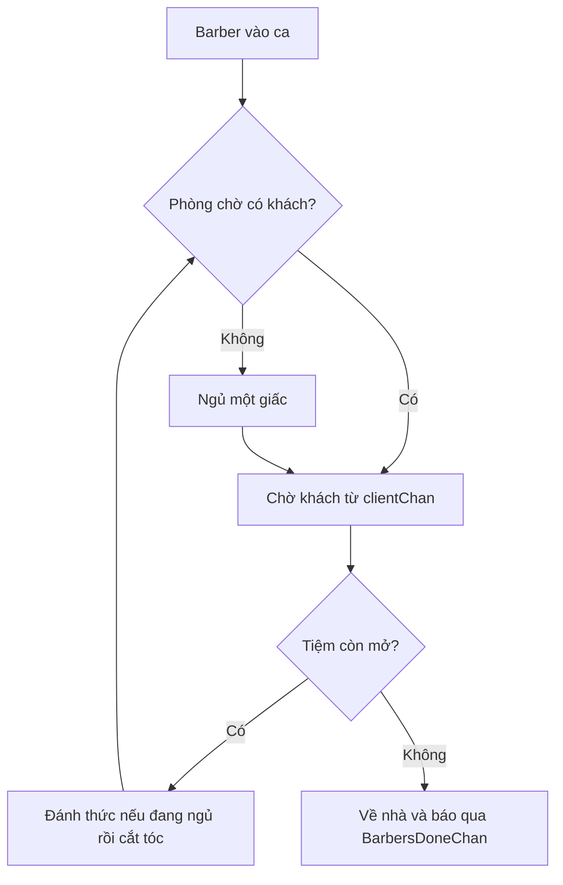

# 💈 Adding a Barber: Frank nhận ca đầu tiên và ngủ một giấc ngon lành

> Nguồn: `038-Adding-a-Barber.txt` · [Udemy](https://ua.udemy.com/course/working-with-concurrency-in-go-golang/learn/lecture/32126362)

Tiệm đã dựng xong, giờ là lúc tuyển nhân viên. Hôm nay chúng ta thêm **một barber** — anh Frank — và cho anh ấy chạy như một goroutine riêng. Chúng ta sẽ bắt đầu với đúng một người cho dễ quan sát, rồi vài bài nữa mới "tăng quân". Mở file `barbershop.go` lên và gõ theo mình nhé.

### 🧩 Method AddBarber: mỗi barber một goroutine

Mình thêm một method vào type `BarberShop` (receiver là pointer `*BarberShop`), nhận vào tên của barber:

```go
func (shop *BarberShop) AddBarber(barber string) {
	shop.NumberOfBarbers++
	// ... phần còn lại sẽ viết ngay bên dưới
}
```

Mỗi lần gọi hàm này, `NumberOfBarbers` tăng lên một. Và mỗi barber sẽ là **một goroutine riêng**: thêm một barber thì có một goroutine, thêm năm barber thì có năm goroutine. Bên trong method, mình dùng một hàm inline với từ khóa `go`:

```go
go func() {
	// mọi thứ bên trong chạy nền
}()
```

Barber cần quyền truy cập vào mọi thứ thuộc về tiệm, nhưng quan trọng nhất là **channel nhận khách** — vì công việc của barber là cắt tóc, nên phải tìm được khách trước đã.

### 😴 Vòng đời của barber trong code

Công việc của một barber gói gọn thế này: ngủ, được khách đánh thức (việc của khách), cắt tóc, kiểm tra phòng chờ, ngủ tiếp, và cuối cùng là về nhà. Trong code, mình bắt đầu bằng việc anh ấy tỉnh táo đến tiệm rồi đi kiểm tra phòng chờ:

```go
go func() {
	isSleeping := false
	color.Yellow("%s goes to the waiting room to check for clients.", barber)

	for {
		if len(shop.ClientsChan) == 0 {
			color.Yellow("There is nothing to do, so %s takes a nap.", barber)
			isSleeping = true
		}

		client, shopOpen := <-shop.ClientsChan
		// ...
	}
}()
```

Để ý cách kiểm tra phòng chờ trống: dùng `len(shop.ClientsChan) == 0`. Nhớ lại rằng `clientChan` là **buffered channel có kích thước bằng số ghế trong phòng chờ** — nên độ dài của nó chính là số khách đang đợi. Nếu bằng 0, barber "ngủ" và đánh dấu `isSleeping = true`.

Sau đó barber **lắng nghe channel** để nhận khách. Và đây là chỗ mình dùng lại chiêu ở bài `select`: lấy thêm tham số thứ hai:

```go
client, shopOpen := <-shop.ClientsChan
```

* Nếu `shopOpen` là `true`: đây là một vị khách thật, tiệm còn mở.
* Nếu `shopOpen` là `false`: channel đã đóng và rỗng — hết khách, hết ngày.

*Vậy sao không dùng thẳng trường `Open` của `BarberShop` cho tiện?* Vì khi có nhiều hơn một barber, sẽ có **race condition** (tranh chấp dữ liệu): nhiều goroutine cùng lúc đọc/ghi vào `Open`. Còn tham số thứ hai thì an toàn tuyệt đối vì đi kèm chính thao tác nhận từ channel.

Tiếp theo là xử lý khách:

```go
if shopOpen {
	if isSleeping {
		color.Yellow("%s wakes %s up.", client, barber)
		isSleeping = false
	}
	shop.CutHair(barber, client)
} else {
	shop.SendBarberHome(barber)
	return
}
```

* Nếu tiệm còn mở và barber đang ngủ thì khách đánh thức anh ấy dậy, rồi cắt tóc.
* Nếu tiệm đã đóng: đưa barber về nhà và `return` để kết thúc goroutine này.



### ✂️ CutHair và SendBarberHome

Thay vì nhồi hết logic vào trong goroutine, mình tách ra hai hàm cho gọn gàng. Hàm cắt tóc in thông báo màu xanh, chờ hết `shop.HairCutDuration` rồi in thông báo hoàn thành:

```go
func (shop *BarberShop) CutHair(barber, client string) {
	color.Green("%s is cutting %s's hair.", barber, client)
	time.Sleep(shop.HairCutDuration)
	color.Green("%s is finished cutting %s's hair.", barber, client)
}
```

Hàm đưa barber về nhà thì đơn giản hơn, nhưng có một chi tiết quan trọng: khi barber về nghĩa là goroutine của anh ấy sắp biến mất, anh ấy **không thể nhận thêm khách nữa**. Nên phải gửi tín hiệu cho tiệm biết:

```go
func (shop *BarberShop) SendBarberHome(barber string) {
	color.Cyan("%s is going home.", barber)
	shop.BarbersDoneChan <- true
}
```

Một giá trị `true` được gửi vào `BarbersDoneChan` — đó là cách tiệm biết "barber này đã xong việc".

### 🧪 Chạy thử với Frank

Quay lại `main.go`, sau dòng thông báo tiệm mở cửa, mình thêm barber đầu tiên:

```go
shop.AddBarber("Frank")
```

Và thêm `time.Sleep(5 * time.Second)` để chương trình dừng lại một lát, đủ để xem chuyện gì xảy ra. Chạy `go run .` nào.

Kết quả: tiêu đề hiện ra, thông báo tiệm mở cửa, rồi **Frank đi kiểm tra phòng chờ**, thấy không có gì để làm nên... **ngủ một giấc**. Một khởi đầu nhẹ nhàng cho ngày làm việc của anh ấy. Mọi thứ diễn ra đúng như mong đợi, không có lỗi nào cả.

Còn thiếu vài thứ nữa: khởi động tiệm dưới dạng goroutine, rồi gửi khách đến. Đó sẽ là nội dung của bài tiếp theo. Hẹn gặp các bạn! 🚀
