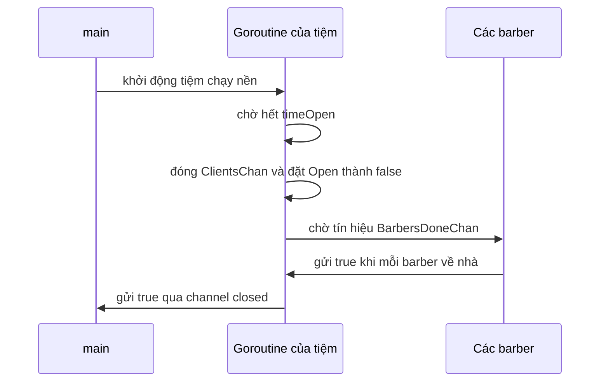

# 🏪 Starting the Barbershop: Cho tiệm chạy nền và đóng cửa đúng giờ

> Nguồn: `039-Starting-the-barbershop-as-a-GoRoutine.txt` · [Udemy](https://ua.udemy.com/course/working-with-concurrency-in-go-golang/learn/lecture/32127048)

Chúng ta đang tiến rất gần đích rồi. Hôm nay mình sẽ cho **cả tiệm chạy nền dưới dạng goroutine**, và quan trọng không kém: viết logic **đóng cửa** đúng luật — ngừng nhận khách mới, nhưng phục vụ cho hết những ai đang chờ. Các bạn mở lại `main.go` và `barbershop.go` nhé.

### ✅ Điểm lại những gì đã có

* Đã seed bộ sinh số ngẫu nhiên — tuy chưa dùng nhưng sẽ dùng rất sớm.
* Đã in welcome message.
* Đã tạo hai channel: một để gửi khách cho barber, một để biết barber đã xong việc trong ngày.
* Đã tạo type `BarberShop` và điền đầy đủ các trường.
* Đã thêm được barber, và barber biết tự kiểm tra phòng chờ — không có khách thì ngủ một giấc.

Việc còn lại trong danh sách comment: **khởi động tiệm dưới dạng goroutine**.

### ⏰ Goroutine của tiệm: chờ hết `timeOpen` rồi đóng cửa

Mình mở một goroutine cho tiệm. Nhiệm vụ đầu tiên của nó là chờ cho hết quãng thời gian `timeOpen` — đúng 10 giây như đã cấu hình (đoạn chờ này chính là chỗ mình nói "time after time open", tức dùng `time.After` với `timeOpen`). Khi thời gian mở cửa kết thúc, goroutine làm ba việc theo thứ tự:

1. Gọi `shop.CloseShopForDay()` — hàm này chưa tồn tại, mình viết ngay sau đây.
2. Gửi `true` vào channel **`shopClosing`**.
3. Gửi `true` vào channel **`closed`**.

Vì sao cần tới **hai** channel? Vì hai mục đích khác nhau:

* `shopClosing` báo cho phần sinh khách biết tiệm **sắp đóng**, để ngừng tạo khách mới. Nhớ luật chơi: khách vẫn có thể đến trước giờ đóng, tìm được ghế trống và ngồi chờ — barber không được về khi phòng chờ còn người.
* `closed` báo cho `main` biết tiệm đã **đóng hẳn**, mọi thứ hoàn tất.

### 🚪 CloseShopForDay: đóng channel, chờ đủ barber, dọn dẹp

Đây là hàm quan trọng nhất của bài hôm nay:

```go
func (shop *BarberShop) CloseShopForDay() {
	color.Cyan("Closing shop for the day.")
	close(shop.ClientsChan)
	shop.Open = false

	for i := 1; i <= shop.NumberOfBarbers; i++ {
		<-shop.BarbersDoneChan
	}

	close(shop.BarbersDoneChan)
	color.Green("The barber shop is now closed for the day and everyone has gone home.")
}
```

Đi qua từng bước:

* **Đóng `ClientsChan`**: từ giờ không nhận khách mới nữa. Các barber đang lắng nghe channel này sẽ nhận được `shopOpen == false` và biết đường về nhà.
* **Đặt `shop.Open = false`**: đánh dấu tiệm đã đóng.
* **Chờ đủ số barber**: mình lặp từ 1 đến `shop.NumberOfBarbers` và mỗi vòng chờ một giá trị từ `BarbersDoneChan`. Nhớ lại bài trước, mỗi barber khi về nhà đều gửi `true` vào channel này — nên vòng lặp sẽ **block cho đến khi mọi barber đã về hết**.
* **Đóng `BarbersDoneChan`** cho sạch sẽ, rồi in thông báo màu xanh. Dòng gạch ngang in kèm chỉ để dễ nhìn trong output — *hoàn toàn không liên quan gì tới concurrency đâu nhé.*



### 🧪 Chạy thử: sao vẫn chưa thấy gì khác?

Mình chạy lại chương trình và... mọi thứ vẫn y như cũ. Nghe hơi lạ đúng không, vì trong goroutine của tiệm rõ ràng có đoạn chờ `timeOpen`?

Câu trả lời nằm ở chỗ: **chúng ta chưa gửi khách nào vào tiệm cả**. `main` vẫn đang dừng ở `time.Sleep(5 * time.Second)`, và khi `main` kết thúc thì mọi goroutine đang chạy đều bị "chết theo" — kể cả goroutine của tiệm. Vì vậy chương trình dừng sau 5 giây, trước cả khi mốc 10 giây kịp tới.

Giải pháp rất rõ ràng: cần bắt đầu gửi khách, rồi để `main` **block cho tới khi nhận được tín hiệu từ channel `closed`**. Đó chính là nội dung bài tiếp theo. Hẹn gặp các bạn! 🚀
