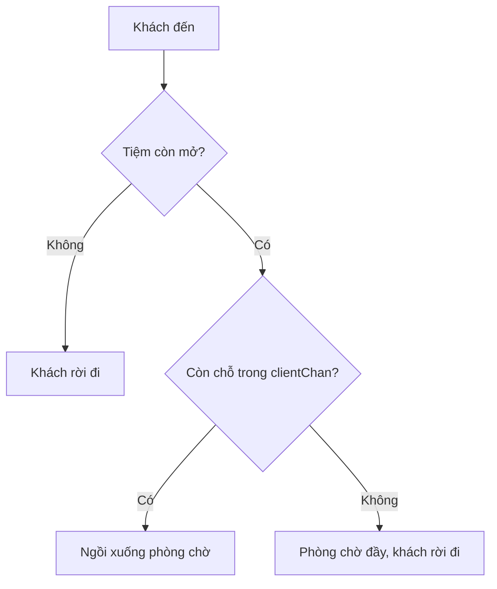

# 🚶 Sending Clients to the Shop: Ba số phận của một vị khách

> Nguồn: `040-Sending-clients-to-the-shop.txt` · [Udemy](https://ua.udemy.com/course/working-with-concurrency-in-go-golang/learn/lecture/32163630)

Tiệm đã chạy nền, barber đã sẵn sàng — nhưng tiệm mà không có khách thì cũng buồn. Hôm nay chúng ta sẽ **sinh khách với khoảng thời gian ngẫu nhiên**, viết hàm `AddClient` xử lý mọi tình huống một vị khách có thể gặp, và cho `main` chờ tới khi tiệm đóng hẳn. Chỉ còn một bước nữa là chạy được chương trình hoàn chỉnh!

### ⏱️ Giải mã `time.After(timeOpen)`

Trước khi thêm khách, mình muốn các bạn hiểu rõ đoạn chờ trong goroutine của tiệm: `time.After(timeOpen)` **block cho đến khi quãng thời gian `timeOpen` trôi qua** — với cấu hình hiện tại là 10 giây.

Vậy vì sao trong `main` vẫn còn `time.Sleep`? Vì một lý do rất quan trọng: **khi hàm `main` kết thúc, mọi goroutine đang chạy đều chết theo**. Chúng ta cần thêm khách để chương trình có việc để làm trước khi thấy được kết quả. Nhưng `time.Sleep` chỉ là giải pháp tạm — cuối bài này nó sẽ được thay bằng một cách chờ "đúng bài" hơn.

### 👥 Goroutine sinh khách với `rand.Int()`

Khách của chúng ta được mô phỏng bằng những cái tên cực kỳ ấn tượng: `Client 1`, `Client 2`, `Client 3`... *Đúng rồi, không có gì hoa mỹ cả.* Mình tạo một biến đếm và một goroutine nữa:

```go
clients := 1

go func() {
	for {
		randomMilliseconds := rand.Int() % (2 * arrivalRate)

		select {
		case <-shopClosing:
			return
		case <-time.After(time.Duration(randomMilliseconds) * time.Millisecond):
			shop.AddClient(fmt.Sprintf("Client %d", clients))
			clients++
		}
	}
}()
```

Hai điểm đáng chú ý:

* `randomMilliseconds := rand.Int() % (2 * arrivalRate)` — đây là lúc bộ sinh số ngẫu nhiên đã seed từ đầu chương trình phát huy tác dụng. Chia lấy dư cho `2 * arrivalRate` để khách đến ở những khoảng **hơi so le** nhau, trông tự nhiên hơn.
* `select` mà chúng ta học ở bài trước xuất hiện trở lại với hai case: nếu nhận tín hiệu từ `shopClosing` thì `return` — hết ngày, ngừng sinh khách; còn nếu hết khoảng thời gian ngẫu nhiên thì thêm một khách mới.

### 🪑 AddClient: ba số phận của một vị khách

Hàm `AddClient` nhận vào tên khách và xử lý đúng theo luật của tiệm. Trước hết in thông báo khách đã đến, rồi rẽ nhánh theo trạng thái `shop.Open`:

```go
func (shop *BarberShop) AddClient(client string) {
	color.Green("*** %s arrives.", client)

	if shop.Open {
		select {
		case shop.ClientsChan <- client:
			color.Yellow("%s takes a seat in the waiting room.", client)
		default:
			color.Red("The waiting room is full, so %s leaves.", client)
		}
	} else {
		color.Red("The shop is already closed, so %s leaves.", client)
	}
}
```

Khi tiệm còn mở, lại là một `select` với hai khả năng:

* Gửi được khách vào `ClientsChan` (channel có kích thước đúng bằng sức chứa phòng chờ): khách **ngồi xuống chờ**. Mình đổi màu thông báo từ xanh dương sang vàng vì xanh dương trên nền tối khó đọc.
* `default`: buffer đã đầy — tức **phòng chờ hết ghế** — khách đành **ra về**. Đây chính là chỗ `default` trong `select` phát huy tác dụng mà không gây deadlock.

Còn nếu tiệm đã đóng, khách cũng ra về, kèm thông báo màu đỏ cho dễ thấy.



### 🏁 `<-closed`: để main chờ tới khi tiệm đóng hẳn

Quay lại `main`, mình gọi `shop.AddClient(...)` trong goroutine sinh khách (kèm việc tăng biến đếm), rồi **xóa `time.Sleep`** và thay bằng:

```go
<-closed
```

Dòng này khiến `main` **block cho đến khi nhận được giá trị từ channel `closed`** — mà `closed` chỉ được gửi giá trị từ goroutine của tiệm, sau khi đã chờ hết giờ mở cửa và đóng tiệm xong xuôi. Nhờ vậy, chương trình sẽ sống đủ lâu để mọi goroutine làm việc đến nơi đến chốn, thay vì bị "chết non" như lần chạy trước.

Mọi mảnh ghép đã vào đúng vị trí. Nếu không có gì sai sót, chạy chương trình sẽ cho ra output đúng theo luật của Sleeping Barber. Cùng kiểm tra ở bài cuối nhé! 🚀
