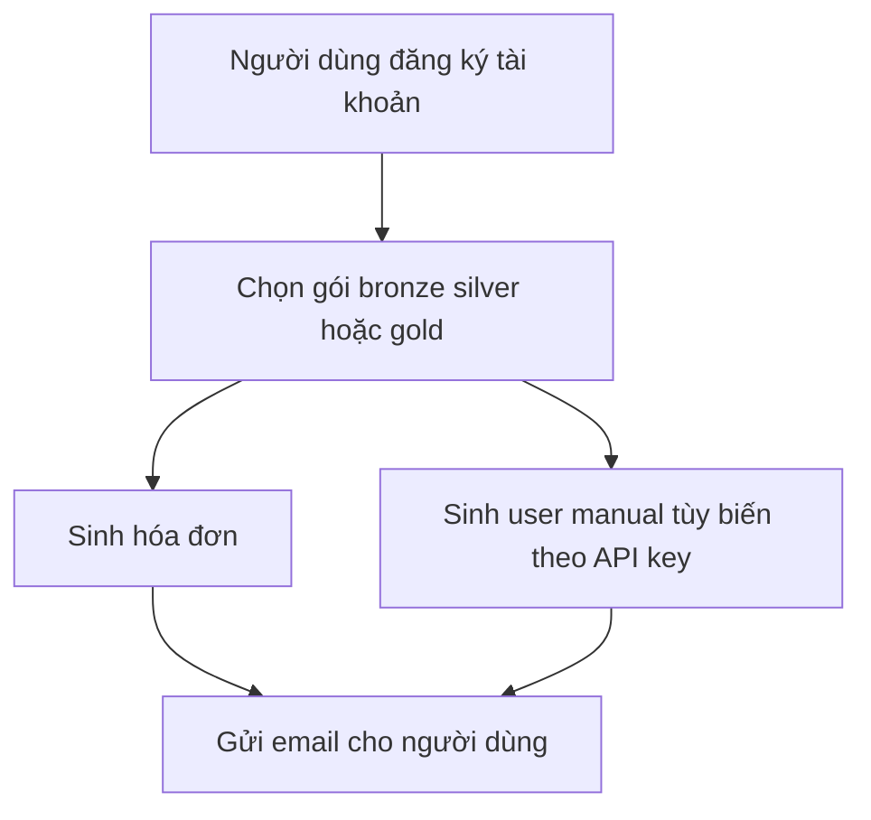

# 🏗️ Dự án cuối khóa: Subscription Service — nơi concurrency bước vào đời thực

> Nguồn: `042-What-well-cover-in-this-section.txt` · [Udemy](https://ua.udemy.com/course/working-with-concurrency-in-go-golang/learn/lecture/32167030)

Chúng ta đã cùng nhau đi qua rất nhiều bài toán kinh điển: Producer/Consumer, Dining Philosophers, Sleeping Barber... Giờ là lúc mình và các bạn bước sang **dự án cuối khóa** — một ứng dụng dùng concurrency theo kiểu gần với công việc thực tế hơn. Trong bài này, mình sẽ phác thảo xem chúng ta sắp xây cái gì trước khi gõ dòng code đầu tiên nhé.

### 🎯 Dịch vụ chúng ta sắp xây

Mục tiêu là xây một **tập con (subset) của một dịch vụ tưởng tượng** cho phép người dùng mua một trong **ba gói subscription**: **bronze**, **silver** hoặc **gold**. Gói đó dùng để làm gì thì không quan trọng — cứ tưởng tượng đó là dịch vụ truy cập API nào đó là được.

Cụ thể, khi ai đó đăng ký tài khoản và mua một gói:

* Hệ thống **sinh một hóa đơn (invoice)** và gửi cho người dùng.
* Hệ thống **sinh thêm một user manual** cho người dùng đó.
* Ví dụ, đây có thể là dịch vụ yêu cầu tài liệu cho một API, và họ muốn tạo ra bản hướng dẫn **tùy biến riêng**, có ví dụ gắn với đúng **API key** của từng khách hàng.

Điểm mấu chốt, như mình đã nhấn mạnh xuyên suốt khóa học: chúng ta đang xây một thứ **thực sự dùng concurrency**, chứ không chỉ một ví dụ minh họa cho vui.

### 🔁 Luồng nghiệp vụ ở mức cao

Nhìn thì đơn giản, nhưng phía sau mỗi bước đều có chỗ để áp dụng concurrency — đặc biệt là khâu **gửi email** và **sinh tài liệu**.

### 🛠️ Phần này là "boilerplate" — nhưng bắt buộc phải đi qua

Phần đầu tiên của dự án cuối khóa dành trọn cho việc **dựng khung web application**:

* Đưa các **route** và **handler** vào vị trí.
* Viết **logic database**.
* **Quản lý session** cho việc đăng nhập.
* **Render các trang** phía server.

Nghe có vẻ chưa liên quan gì đến concurrency, nhưng đây là những việc **phải giải quyết xong** trước khi có thể viết những dòng code concurrent thực sự. Nói cách khác, dọn dẹp phần boilerplate trước, rồi mới bắt tay vào phần thú vị.

*Đừng lo nếu các bạn chưa quen với web application trong Go — mình sẽ đi chậm và cụ thể từng bước, ai cũng theo được.*

Vậy là các bạn đã nắm được bức tranh tổng thể. Bài sau, mình bắt đầu mở code, tạo khung dự án và tải về những package cần thiết. Hẹn gặp các bạn ở bài tiếp theo! 🚀
