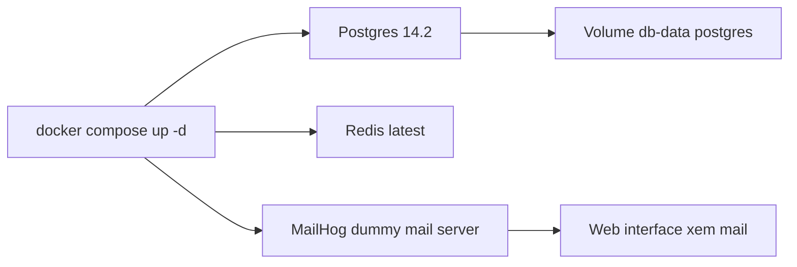

# 🐳 Dựng môi trường dev bằng Docker: Postgres, Redis và MailHog

> Nguồn: `044-Setting-up-our-Docker-development-environment.txt` · [Udemy](https://ua.udemy.com/course/working-with-concurrency-in-go-golang/learn/lecture/32190156)

Trong dự án này, chúng ta cần ba "người bạn đồng hành": **Postgres** làm database, **Redis** làm nơi lưu session, và một **dummy mail server** để "bắt" email thay vì gửi đi thật. Mình chọn cách chạy tất cả bằng **Docker**, và mình thật lòng khuyên các bạn làm theo.

### 🎯 Chuyện Docker có "làm chậm máy" không?

Nhiều bạn nhắn cho mình: *"Docker làm chậm máy tôi lắm"*. Thật tình thì **chưa bao giờ** như vậy với mình. Như đã kể, mình đang chạy mọi thứ trên một chiếc **Mac 7 năm tuổi** và Docker vẫn chạy ngon lành.

Tất nhiên, nếu bạn muốn **cài Redis và Postgres trực tiếp trên máy** thì cứ tự nhiên. Nhưng mình vẫn khuyên bạn thử Docker một lần: nó chạy rất tốt và **không ngốn tài nguyên đến thế đâu**.

### 📦 Ba service trong `docker-compose` có sẵn

Vào mục **course resources** của bài này, tải file `docker-compose.zip`, giải nén rồi đặt ở **root của project** — nằm cạnh folder `cmd` và file `go.mod`.

File này định nghĩa ba service cực kỳ đơn giản:

* **Postgres 14.2** — phiên bản mình dùng xuyên suốt khóa học.
* **Redis** — mình dùng bản **latest**, không quan trọng lắm, mới nhất là đủ.
* **MailHog** — cái tên nghe hơi kém duyên một chút, nhưng đây là **dummy mail server**: nó "bắt" email của chúng ta thay vì gửi thật, và có cả **web interface** để xem lại mail.



### 🗂️ Chuẩn bị thư mục lưu dữ liệu

Trong file `docker-compose.yml`, dòng 16 khai báo **volume** lưu dữ liệu Postgres vào thư mục hiện hành (dấu `.`) rồi vào `db-data/postgres`.

Docker thường tự tạo thư mục này, nhưng *mình không phải người lạc quan*, nên mình tự tay tạo:

1. Ở root project, tạo folder `db-data`.
2. Trong đó tạo folder `postgres` cho Postgres.
3. Và một folder `redis` cho Redis.

### ⌨️ Khởi động và kiểm tra

Mở terminal, gõ:

```bash
docker compose up -d
```

Cờ `-d` sẽ chạy các container **ở chế độ nền**. Docker sẽ tạo và khởi động cả ba service; bạn sẽ thấy nó sinh ra hàng loạt file cho Postgres trong `db-data`.

Lần khởi động đầu tiên sẽ hơi lâu vì Postgres phải **khởi tạo database**. Và nó không tạo database rỗng đâu nhé — nó tạo sẵn database tên **`concurrency`**, truy cập bằng username **`postgres`** và password là **`password`**.

Bạn có thể mở **Docker Dashboard** (trên Mac là icon chú cá voi nhỏ, trên Windows là system tray), vào **Containers**, mở rộng project rồi bấm vào từng container để xem trạng thái.

### 🖥️ Cài đặt đúng phiên bản & công cụ xem database

Nếu chưa có Docker, trong course resources của bài này có link tải — hướng dẫn có đủ cho **Mac, Windows và Linux**.

*Một lưu ý nhỏ cho người dùng Mac:* nếu máy bạn dùng chip **Intel** đời cũ (như mình) thì chọn bản dành cho Intel; còn máy dùng chip **Apple Silicon (M1)** thì phải tải bản tương ứng. Chọn đúng kẻo cài xong không chạy.

Cuối cùng, mình khuyên cài một **database client** cho tử tế thay vì ngồi gõ lệnh — mình dùng **Beekeeper Studio**:

* Có bản cho Mac và cả Windows.
* Hỗ trợ đủ Windows, Mac lẫn Linux.
* Dùng bản **Community Edition** là **miễn phí** và thừa sức làm việc (có bản Ultimate trả phí, nhưng không cần).

Tóm lại: cài Docker → chạy `docker compose up -d` → đợi database khởi tạo xong → cài Beekeeper Studio nếu cần client. Xong rồi thì mình hẹn các bạn ở bài sau, nơi chúng ta viết code kết nối tới Postgres. 🚀
