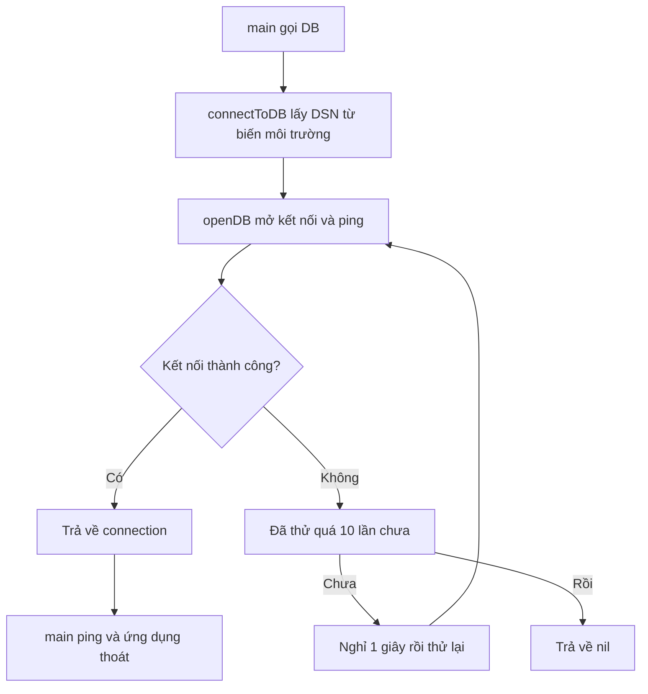

# 🐘 Kết nối Postgres: ba hàm nhỏ và một vòng lặp "kiên nhẫn"

> Nguồn: `045-Adding-postgres.txt` · [Udemy](https://ua.udemy.com/course/working-with-concurrency-in-go-golang/learn/lecture/32188462)

Docker của chúng ta đã chạy, database `concurrency` đã sẵn sàng. Hôm nay mình sẽ viết code để ứng dụng **kết nối tới Postgres** — theo cách sạch sẽ và kiên nhẫn, vì biết đâu ứng dụng khởi động trước khi database kịp sẵn sàng. Đi từng bước nhé.

### 🔍 Kiểm tra kết nối bằng Beekeeper trước

Trước khi viết code, mình muốn chắc chắn database **thật sự kết nối được**. Mở Beekeeper Studio, chọn connection type **Postgres** rồi điền thông tin y hệt trong `docker-compose.yml`:

* Host `localhost`, port `5432`.
* User `postgres`, password `password`.
* Database mặc định: `concurrency`.

Bấm **Test Connection** — kết nối ngon lành, khỏi lo.

*Nhắc nhẹ:* nếu muốn tắt các container thì chỉ cần lệnh `docker compose down`; còn muốn chạy lại thì `docker compose up -d`. Lúc này mình cần Docker chạy tiếp.

### 🧱 Hàm `DB()` — gọn gàng hơn là viết hết trong `main`

Quay lại file `main.go`. Mình hoàn toàn có thể viết hết logic kết nối ngay trong `main()`, nhưng như vậy **không sạch**. Thay vào đó, mình gọi một hàm `DB()` trả về `*sql.DB`.

Bên trong `DB()`, mình gọi tiếp `connectToDB()` và kiểm tra kết quả:

* Nếu `con == nil` — tức đã thử hết cách mà vẫn không nối được — thì chẳng còn gì để xoay xở nữa: `log.Panic("can't connect to database")`.
* Ngược lại thì trả về connection.

Việc tách thành nhiều hàm nghe có vẻ "lắm hàm", nhưng đây chính là cách mình **giữ code sạch** và đảm bảo có **nhiều lần thử kết nối** nếu cần.

### 🔁 `connectToDB()` — thử lại nhưng có giới hạn

Đây là hàm "kiên nhẫn": nó thử kết nối **một số lần cố định**, quá số lần đó thì đành buông xuôi.

Đầu tiên mình đặt biến đếm `count := 0`, rồi lấy chuỗi kết nối **DSN** từ **biến môi trường** bằng `os.Getenv("DSN")`. Sau đó là vòng lặp:

```go
for {
    connection, err := openDB(dsn)
    if err != nil {
        log.Println("Postgres not yet ready...")
    } else {
        log.Println("Connected to database!")
        return connection
    }
    if count > 10 {
        return nil
    }
    log.Println("Backing off...")
    time.Sleep(1 * time.Second)
    count++
}
```

Nghĩa là: nếu database chưa sẵn sàng thì thông báo "Postgres chưa sẵn sàng", chờ một chút rồi thử lại. **10 giây là quá đủ** để database kịp lên. Nhưng nếu đã thử quá số lần cho phép mà vẫn thất bại, trả về `nil` để `DB()` báo lỗi nghiêm trọng.



*Đừng lo nếu bạn thấy hơi rối vì tách thành nhiều hàm — cách này giúp mình kiểm soát việc thử lại rõ ràng hơn hẳn.*

### 🔌 `openDB()`, import driver và chạy thử

Hàm cuối cùng nhận vào `dsn string` và trả về **hai** thứ: con trỏ `*sql.DB` (connection pool) và `error`:

```go
db, err := sql.Open("pgx", dsn)
if err != nil {
    return nil, err
}

err = db.Ping()
if err != nil {
    return nil, err
}

return db, nil
```

Sau `sql.Open`, mình **ping thử** database để chắc chắn kết nối thật sự hoạt động rồi mới trả về.

Về import, ngoài `database/sql` (driver chuẩn của standard library), mình cần thêm driver thật sự:

```go
_ "github.com/jackc/pgx/v4"
_ "github.com/jackc/pgx/v4/stdlib"
```

Dấu gạch dưới `_` là **blank identifier**: package này không được gọi trực tiếp trong code, nhưng **vẫn cần hiện diện** để đăng ký driver.

Cuối cùng, trong `main()` mình tạm viết `db := DB()` rồi `db.Ping()` để chương trình compile được. Chạy được hay không giờ chỉ còn phụ thuộc vào `DSN` — và đây chính là lúc dùng tới **Makefile** mà các bạn đã cài từ section đầu.

### 🎯 Tự kiểm tra nhanh

**Câu 1:** Vì sao mình tách logic kết nối thành ba hàm `DB`, `connectToDB`, `openDB` thay vì viết hết trong `main`?

<details>
<summary><b>Xem đáp án</b></summary>

**Đáp án:** Để code sạch hơn và có thể thử kết nối lại nhiều lần nếu database chưa sẵn sàng.

Giải thích: `DB` gọi `connectToDB`, còn `connectToDB` gọi `openDB` trong một vòng lặp có giới hạn số lần thử.

Tham chiếu: Mục Hàm DB và connectToDB.

</details>

**Câu 2:** Chuỗi kết nối DSN được lấy từ đâu?

<details>
<summary><b>Xem đáp án</b></summary>

**Đáp án:** Từ biến môi trường `DSN` thông qua `os.Getenv("DSN")`.

Giải thích: Sau này Makefile sẽ khai báo sẵn biến môi trường này để chạy ứng dụng.

Tham chiếu: Mục connectToDB.

</details>

**Câu 3:** Điều gì xảy ra nếu đã thử kết nối quá số lần cho phép?

<details>
<summary><b>Xem đáp án</b></summary>

**Đáp án:** `connectToDB` trả về `nil`, và `DB` sẽ `log.Panic` với thông báo không thể kết nối database.

Giải thích: Sau hơn 10 lần thử mà database vẫn chưa lên thì coi như có lỗi nghiêm trọng.

Tham chiếu: Mục Hàm DB.

</details>

**Câu 4:** Vì sao import driver `pgx` bằng blank identifier `_`?

<details>
<summary><b>Xem đáp án</b></summary>

**Đáp án:** Vì code không gọi package này trực tiếp, nhưng vẫn cần nó hiện diện để đăng ký driver.

Giải thích: `database/sql` chỉ là driver chuẩn; driver thật sự cho Postgres phải được import dù không dùng trực tiếp.

Tham chiếu: Mục openDB và import driver.

</details>

**Câu 5:** `openDB` làm gì sau khi gọi `sql.Open`?

<details>
<summary><b>Xem đáp án</b></summary>

**Đáp án:** Gọi `db.Ping()` để kiểm tra kết nối thật sự, nếu lỗi thì trả về `nil` kèm error.

Giải thích: Chỉ mở connection pool là chưa đủ; ping mới xác nhận kết nối hoạt động.

Tham chiếu: Mục openDB và import driver.

</details>

Vậy là code kết nối database đã xong. Bài sau, mình dựng **Makefile** và thử xem ứng dụng có thật sự nối được tới Postgres không. Hẹn gặp lại các bạn! 🚀
