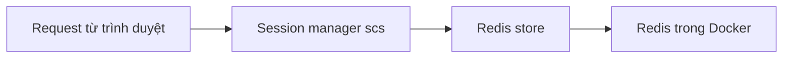

# 🔐 Sessions & Redis: ứng dụng "nhớ" người dùng như thế nào?

> Nguồn: `047-Adding-sessions-Redis.txt` · [Udemy](https://ua.udemy.com/course/working-with-concurrency-in-go-golang/learn/lecture/32188458)

Database đã kết nối thành công. Bước tiếp theo: **kết nối Redis và khởi tạo sessions**. Đây là phần nền tảng để sau này người dùng đăng nhập, đăng xuất và mua subscription. Tin tốt là nó **đơn giản hơn các bạn tưởng** nhiều.

### 🧩 Khai báo session trong `main()`

Trong `main.go`, ngay dưới comment `create sessions`, mình gọi hàm `initSession()` và gán vào biến `session`:

```go
session := initSession()
```

Sau đó mình xuống cuối file để viết hai hàm: `initSession()` và `initRedis()`. Đúng kiểu "gọi trước, viết sau" mà mình vẫn hay làm — *các bạn cứ viết theo mình, IDE báo đỏ cũng đừng lo, chút nữa là hết à.*

### 🔌 `initRedis()` — kết nối tới Redis

Hàm này trả về một **con trỏ tới `redis.Pool`** (pool các kết nối Redis):

```go
func initRedis() *redis.Pool {
    redisPool := &redis.Pool{
        MaxIdleTime: 10,
        Dial: func() (redis.Conn, error) {
            return redis.Dial("tcp", os.Getenv("REDIS_DSN"))
        },
    }
    return redisPool
}
```

* `MaxIdleTime: 10` — thời gian tối đa cho một kết nối nhàn rỗi, một giá trị mặc định tốt.
* Hàm `Dial` là một hàm inline; chuỗi kết nối TCP lấy từ **biến môi trường `REDIS_DSN`** bằng `os.Getenv`.
* Điều hay là trong Makefile chúng ta **đã khai báo sẵn biến môi trường này**, nên không phải lo gì thêm.

### 🍪 `initSession()` — cấu hình "trí nhớ" của ứng dụng

Hàm này trả về con trỏ `*scs.SessionManager` (package `scs` v2 của Alex Edwards) và chỉ làm vài việc rất dễ:

1. Tạo session manager mới bằng `scs.New()`.
2. **Nơi lưu dữ liệu session:** `session.Store = redisstore.New(initRedis())` — mọi thông tin session sẽ nằm trong **Redis**.
3. **Thời gian sống:** `session.Lifetime = 24 * time.Hour` — session kéo dài **một ngày**.
4. **Cookie tồn tại giữa các lần ghé thăm:** `session.Cookie.Persist = true`.
5. **SameSite:** `session.Cookie.SameSite = http.SameSiteLaxMode` — lấy từ package `http`.
6. **Bảo mật cookie:** `session.Cookie.Secure = true`. Trên `localhost` thì nó chưa thật sự "secure", nhưng khi ứng dụng lên môi trường thật thì đây là cấu hình đúng.



Cuối cùng hàm `return session`.

### ⚠️ Vì sao lúc này code chưa chạy được?

Sau khi viết xong, chương trình **sẽ báo lỗi** — vì biến `session` chưa được sử dụng ở đâu cả. Điều này **hoàn toàn bình thường**: chúng ta đang xây dở. Trong bài sau, mình sẽ set up **application config**, lúc đó `session` sẽ có "chỗ ở" của nó và mọi thứ khớp lại.

### 🎯 Tự kiểm tra nhanh

**Câu 1:** Package nào được dùng để quản lý session?

<details>
<summary><b>Xem đáp án</b></summary>

**Đáp án:** `scs` v2 của Alex Edwards (`github.com/alexedwards/scs/v2`).

Giải thích: Mình chọn package này vì nó chưa từng làm mình thất vọng.

Tham chiếu: Mục initSession.

</details>

**Câu 2:** Dữ liệu session được lưu ở đâu?

<details>
<summary><b>Xem đáp án</b></summary>

**Đáp án:** Trong Redis, thông qua `redisstore`.

Giải thích: `scs` hỗ trợ nhiều store (database, cookie...), nhưng mình chọn Redis vì nhanh và đơn giản khi dùng với session manager.

Tham chiếu: Mục initSession.

</details>

**Câu 3:** Session được đặt thời gian sống bao lâu?

<details>
<summary><b>Xem đáp án</b></summary>

**Đáp án:** `24 * time.Hour` — một ngày.

Giải thích: Đây là giá trị mặc định hợp lý cho session của ứng dụng.

Tham chiếu: Mục initSession.

</details>

**Câu 4:** `Cookie.Persist = true` có ý nghĩa gì?

<details>
<summary><b>Xem đáp án</b></summary>

**Đáp án:** Cookie của session tồn tại giữa các lần truy cập website.

Giải thích: Mình muốn session "nhớ" người dùng giữa các lần ghé thăm.

Tham chiếu: Mục initSession.

</details>

**Câu 5:** Chuỗi kết nối Redis lấy từ đâu?

<details>
<summary><b>Xem đáp án</b></summary>

**Đáp án:** Từ biến môi trường `REDIS_DSN` qua `os.Getenv`, đã được khai báo sẵn trong Makefile.

Giải thích: Cách này giữ thông tin kết nối tách khỏi code.

Tham chiếu: Mục initRedis.

</details>

Vậy là chúng ta đã có session lưu trong Redis — "trí nhớ" của ứng dụng đã sẵn sàng. Bài sau, mình set up application config để các thành phần dùng chung session này. Hẹn gặp lại các bạn! 🚀
