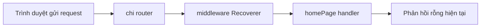

# 🛣️ Route, handler và khoảnh khắc web server "sống" lần đầu

> Nguồn: `049-Setting-up-a-route-handler-for-the-home-page-and-starting-th.txt` · [Udemy](https://ua.udemy.com/course/working-with-concurrency-in-go-golang/learn/lecture/32188434)

Hôm nay là một cột mốc nhỏ: chúng ta sẽ làm ứng dụng **thật sự khởi động** và lắng nghe kết nối web. Để làm được điều đó, mình cần handler, route và một hàm khởi động server. Bắt tay vào nhé.

### 🧩 `handlers.go` — handler đầu tiên cho trang chủ

Trong folder `cmd/web`, mình tạo file `handlers.go` (package main) và viết một **stub handler** cho trang chủ:

* Hàm có **receiver `app *config`** — nhờ vậy handler truy cập được mọi thứ trong application config ở bài trước.
* Tên hàm: `homePage`.
* Vì là handler nên nó nhận đúng **hai tham số**: `w http.ResponseWriter` và `r *http.Request`.

```go
func (app *config) homePage(w http.ResponseWriter, r *http.Request) {

}
```

Hiện tại thân hàm để trống — nó sẽ sớm được "làm đầy" bằng nội dung trang chủ.

### 🛣️ `routes.go` — đăng ký đường dẫn với chi router

Mình tạo thêm file `routes.go` (cũng package main), với hàm có receiver `app *config` tên `routes()` trả về `http.Handler`:

1. Tạo router: `mux := chi.NewRouter()` — `mux` là viết tắt của **multiplexer**, cách gọi rất phổ biến. Lưu ý chọn đúng **phiên bản v5** vì máy mình cài nhiều bản.
2. Đăng ký middleware có sẵn của chi: `mux.Use(middleware.Recoverer)` — đúng kiểu middleware làm chi trở thành package tuyệt vời.
3. Đăng ký route cho trang chủ: `mux.Get("/", app.homePage)`.
4. `return mux`.



*Ghi chú nhỏ:* trong folder lúc này đã xuất hiện một folder `templates` — các bạn cứ bỏ qua, chúng ta sẽ tạo nó ở bài sau.

### 🌐 Hàm `serve()` — khởi động web server

Quay lại `main.go`, mình viết hàm `serve()` với receiver `app *config`:

* Tạo biến `srv` kiểu `&http.Server{}`.
* Gán `Addr` bằng `fmt.Sprintf(":%s", webPort)` — dấu hai chấm là bắt buộc với kiểu này, rồi tới cổng 80 từ hằng số `webPort` ta đã khai báo ở đầu dự án.
* Gán `Handler: app.routes()`.
* Ghi log thông báo đang khởi động web server kèm cổng.
* Gọi `srv.ListenAndServe()` và kiểm tra lỗi: nếu có lỗi thì `log.Panic(err)`.

Trong `main()`, chỉ cần gọi `app.serve()` — thế là đủ.

### ⌨️ Chạy thử: `make start` và `make stop`

Mở terminal, gõ:

```bash
make start
```

Makefile build ứng dụng và... nó **đang chạy thật**! Bạn sẽ để ý thấy mình vẫn có **command prompt trở lại** trong khi ứng dụng chạy.

Thử truy cập trang chủ: bạn sẽ thấy **màn hình trắng** — vì handler `homePage` còn rỗng, chưa render gì cả. Không sao, đúng như mong đợi ở giai đoạn này.

Rồi gõ `make stop` để dừng ứng dụng. Nó dừng gọn gàng.

Vậy là web server đã "sống", chúng ta đang tiến rất gần tới việc hiển thị trang thật sự. Bài sau, mình làm cho handler trang chủ render một trang hoàn chỉnh bằng template. Hẹn gặp lại các bạn! 🚀
