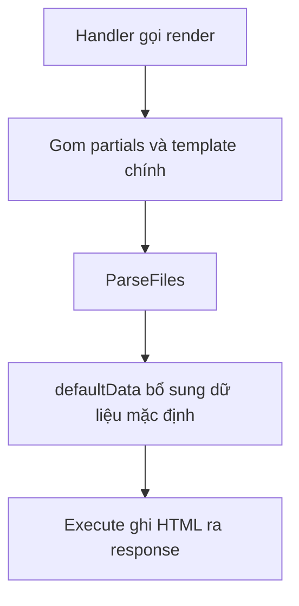

# 🎨 Templates & hàm `render`: dạy ứng dụng "nói" HTML

> Nguồn: `050-Setting-up-templates-and-building-a-render-function.txt` · [Udemy](https://ua.udemy.com/course/working-with-concurrency-in-go-golang/learn/lecture/32188450)

Handler đã có, route đã có, web server cũng chạy — nhưng truy cập vào vẫn là **màn hình trắng** vì chúng ta chưa render được gì. Hôm nay mình sẽ dạy ứng dụng "nói" HTML: dùng bộ **templates** có sẵn và viết **hàm render** kèm dữ liệu mặc định. Bài này hơi dài một chút, nhưng mình đi từng bước, các bạn cứ thong thả.

### 📦 Bộ template có sẵn trong course resources

Vì đây không phải khóa học về viết Go template, mình đã chuẩn bị sẵn file `templates.zip` trong **course resources**. Tải về, giải nén và đặt trong folder `cmd/web`, sao cho toàn bộ file HTML nằm trong folder tên `templates`.

Cấu trúc bộ template:

* **`base.layout.gohtml`** — layout nền cho mọi template: `doctype`, thẻ `html` mở/đóng, thẻ `body` mở/đóng... Bên trong nó gọi các template khác như header, nav, alerts, footer, và để lại hai **block** cho nội dung: `content` và JavaScript.
* Các file partial có tên dạng **`*.partial.gohtml`**: `header`, `nav` (thanh điều hướng bootstrap tiêu chuẩn ở đầu trang), `footer`, `alerts`.
* **Header** import bootstrap, có một chỉnh nhỏ so với mặc định: mình thích **label của form in đậm**.
* **Footer** nhận dữ liệu `.Now` (thời gian hiện tại), đọc ra **năm** để in, và import JavaScript của bootstrap.

Các template khá đơn giản và sẽ được chỉnh dần về sau. Mấu chốt là chúng ta có sẵn thứ để bắt đầu.

### 🧱 `render.go` — `pathToTemplates` và `templateData`

Mình tạo file `render.go` trong `cmd/web` (package main). Hai thứ đầu tiên cần có:

* Biến `pathToTemplates` trỏ tới `cmd/web/templates`. Mình dùng **biến** chứ không dùng hằng số, vì khi viết test mình không muốn phải "đè" giá trị của một hằng.
* Struct `templateData` — kiểu dữ liệu truyền cho template, gồm:
  1. `StringMap` (`map[string]string`), cùng họ hàng `IntMap`, `FloatMap`.
  2. `Data` (`map[string]any`) — chứa gì cũng được. `any` mới có từ Go 1.18; **nếu máy bạn dùng bản cũ hơn thì nên nâng cấp Go**, còn nếu vì lý do gì đó không nâng được thì viết `interface{}`, công dụng tương đương.
  3. `Flash`, `Warning`, `Error` (đều là `string`) — dành cho các thông báo: thành công thì màu xanh, lỗi thì màu đỏ.
  4. `Authenticated` — cuối cùng mình để kiểu `bool`. Ban đầu mình định dùng `int` với 1 là đã đăng nhập, 0 là chưa, nhưng khi viết code thì nhận ra `bool` hợp hơn.
  5. `Now` — giá trị `time.Time` để dùng ở footer.
  6. `User` — con trỏ tới `data.User`, mình **comment lại** làm chỗ đánh dấu: khi nào có bảng người dùng trong database thì sẽ quay lại.

### 🔧 Hàm `render()` — gom template và thực thi

Hàm `render` có receiver `app *config` và nhận bốn thứ: response writer, request, tên template (`t string`), và dữ liệu (`td *templateData`).

Điểm cần nhớ về Go template: nếu một template phụ thuộc vào **partial** hay **layout**, mình phải **liệt kê tên đầy đủ của tất cả chúng** khi parse. Nên mình:

* Tạo slice `partials` chứa các template bắt buộc: `base.layout.gohtml`, `header.partial.gohtml`, `nav.partial.gohtml`, `footer.partial.gohtml`, `alerts.partial.gohtml`.
* Tạo slice `templateSlice` — thêm template chính mà hàm nhận được, rồi duyệt `partials` để nối từng partial vào.

Nếu `td == nil` (vì người gọi có thể không truyền dữ liệu), mình tạo một `templateData` rỗng — vì `nil` thì không làm gì được cả.

Tiếp theo là phần quen thuộc của package `html/template` chuẩn:

```go
ts, err := template.ParseFiles(templateSlice...)
if err != nil {
    app.errorLog.Println(err)
    http.Error(w, err.Error(), http.StatusInternalServerError)
    return
}

err = ts.Execute(w, app.defaultData(td, r))
if err != nil {
    app.errorLog.Println(err)
    http.Error(w, err.Error(), http.StatusInternalServerError)
}
```

Lỗi ở bước nào thì ghi log, trả về **500 Internal Server Error** và dừng lại. Và thay vì `Execute` với `nil` như bản nháp đầu, mình truyền **dữ liệu mặc định** sẽ viết ngay sau đây.

### 🧠 `defaultData()`, `isAuthenticated()` và nối vào handler

Không phải dữ liệu nào cũng chỉ thuộc một trang — có những thứ **mọi template đều cần**. Nên mình viết thêm hàm `defaultData(td *templateData, r *http.Request) *templateData`:

* Lấy **flash**, **warning**, **error** từ session bằng `PopString` với context lấy từ request và các key tương ứng. Điểm hay của `PopString`: **đọc xong là xóa khỏi session** — cực tiện cho thông báo kiểu "chỉ hiện một lần".
* Kiểm tra người dùng đã xác thực chưa: nếu `isAuthenticated` trả về `true` thì gán `td.Authenticated = true`, kèm comment **TODO "get more user information"** — thông tin chi tiết để sau, khi database đã có bảng người dùng.
* Gán `td.Now = time.Now()` rồi `return td`.

Hàm `isAuthenticated(r *http.Request) bool` rất ngắn: kiểm tra session có key `userID` hay không bằng `Exists` — mình dự định khi người dùng đăng nhập sẽ lưu giá trị này vào session.



Cuối cùng, trong `handlers.go`, handler `homePage` chỉ còn một dòng:

```go
app.render(w, r, "home.page.gohtml", nil)
```

### 🎯 Tự kiểm tra nhanh

**Câu 1:** Vì sao `pathToTemplates` là biến chứ không phải hằng số?

<details>
<summary><b>Xem đáp án</b></summary>

**Đáp án:** Để khi viết test có thể đè giá trị một cách dễ dàng.

Giải thích: Hằng số không thể gán lại, còn biến thì linh hoạt hơn cho việc kiểm thử.

Tham chiếu: Mục render.go.

</details>

**Câu 2:** `PopString` khác gì việc đọc session thông thường?

<details>
<summary><b>Xem đáp án</b></summary>

**Đáp án:** Đọc xong là xóa luôn khỏi session.

Giải thích: Rất tiện cho các thông báo chỉ muốn hiển thị một lần như flash, warning, error.

Tham chiếu: Mục defaultData.

</details>

**Câu 3:** Khi render một template có partial hoặc layout, điều gì là bắt buộc?

<details>
<summary><b>Xem đáp án</b></summary>

**Đáp án:** Phải liệt kê đầy đủ tên của tất cả template liên quan khi parse.

Giải thích: Đó là lý do mình gom các partial vào slice `partials` rồi thêm template chính.

Tham chiếu: Mục Hàm render.

</details>

**Câu 4:** `defaultData` làm gì khi người dùng đã đăng nhập?

<details>
<summary><b>Xem đáp án</b></summary>

**Đáp án:** Gán `Authenticated = true` (kèm TODO lấy thêm thông tin người dùng), song song với việc luôn gán thời gian hiện tại `Now`.

Giải thích: Mọi template đều nhận được các dữ liệu mặc định như flash, warning, error, trạng thái đăng nhập và thời gian.

Tham chiếu: Mục defaultData.

</details>

**Câu 5:** Vì sao mọi thứ đã viết mà trang vẫn chưa render được?

<details>
<summary><b>Xem đáp án</b></summary>

**Đáp án:** Vì chúng ta còn thiếu bước cho handler biết về session — session middleware.

Giải thích: Handler cần truy cập session để lấy flash/warning/error và kiểm tra đăng nhập, việc này sẽ làm ở bài sau.

Tham chiếu: Đoạn kết bài.

</details>

Chúng ta đã có template, có hàm render, có dữ liệu mặc định — mọi thứ gần như sẵn sàng. Chỉ còn một bước nữa: cho handler "nhìn thấy" session thông qua **session middleware**. Hẹn gặp lại các bạn ở bài tiếp theo! 🚀
