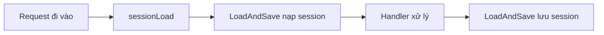

# 🧩 Session Middleware: Bước đệm nhỏ để ứng dụng web "sống" thật sự

> Nguồn: `051-Adding-session-middleware.txt` · [Udemy](https://ua.udemy.com/course/working-with-concurrency-in-go-golang/learn/lecture/32204592)

Chào các bạn, chúng ta quay lại với dự án Subscription Service nhé! Như mình đã nhắc ở bài trước, ứng dụng vẫn chưa thể chạy thật sự nếu thiếu một chút **middleware (lớp xử lý trung gian)** có nhiệm vụ nạp và lưu session trên mỗi request. Hôm nay chỉ cần thêm vài dòng code, và phần thưởng sẽ là lần đầu tiên các bạn nhìn thấy trang chủ của mình hiện ra trong trình duyệt.

### 🛠️ Tạo middleware.go và hàm sessionLoad

Trong thư mục `cmd/web`, mình tạo một file mới tên là `middleware.go`, `package main`, rồi viết một middleware thật đơn giản. Nếu cần tham khảo, hướng dẫn chi tiết có sẵn trên [repository GitHub của Alex Edwards](https://github.com/alexedwards/scs) — tác giả của package session SCS mà chúng ta đang dùng.

Hàm nhận receiver `app *config` như thường lệ, mình đặt tên là `sessionLoad`, nghe rất hợp lý. Giống như hầu hết middleware khác, nó nhận **một tham số duy nhất** `next` kiểu `http.Handler` và trả về một `http.Handler`:

```go
func (app *config) sessionLoad(next http.Handler) http.Handler {
    return app.session.LoadAndSave(next)
}
```

Công việc bên trong chỉ có vậy: gọi `LoadAndSave` trên session của ứng dụng rồi chuyển request cho `next`. *Đừng lo nếu bạn thấy ít code quá mà tưởng mình bỏ sót gì — thật ra chỉ cần chừng đó thôi!*

### 🔌 Gắn middleware vào routes.go

Viết xong thì phải dùng tới nó. Mình mở `routes.go`, tìm đến **phần middleware**, và ngay sau dòng recover khỏi panic, thêm vào:

```go
mux.Use(app.sessionLoad)
```

Từ giờ, mọi request đi qua router đều được nạp session trước khi tới handler, rồi lưu lại sau khi handler xử lý xong:



### ✅ Chạy thử: trang chủ đã hiện ra!

Với middleware đã vào vị trí, mình chạy `make start` để build và khởi động ứng dụng, rồi mở trình duyệt truy cập `localhost` xem sao. Và đây — trang chủ hiện ra! Các link **Register**, **Log in** trên menu chưa hoạt động vì mình chưa viết route và handler cho chúng, nhưng điều quan trọng nhất đã được chứng minh: ứng dụng có thể **render một trang web và gửi tới người dùng cuối**.

*Nếu bạn gặp màn hình trắng hay lỗi gì đó thì đừng lo — cứ kiểm tra lại tên file, tên hàm rồi chạy lại vài lần là quen ngay.*

Vậy là session đã "chảy" qua từng request, và bộ khung web đã thực sự sống. Trong bài tiếp theo, chúng ta sẽ dựng thêm các **stub handler** và route cho những trang còn lại để website đầy đủ hơn nhé! 🚀

## Nguồn tham khảo

- [SCS: HTTP Session Management for Go](https://github.com/alexedwards/scs)
