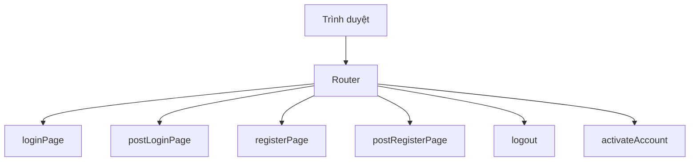

# 🧱 Dựng thêm Stub Handler và Route cho các trang còn lại

> Nguồn: `052-Setting-up-additional-stub-handlers-and-routes.txt` · [Udemy](https://ua.udemy.com/course/working-with-concurrency-in-go-golang/learn/lecture/32214440)

Giờ mình đã biết chắc ứng dụng có thể gửi một trang web tới người dùng, nên hôm nay chúng ta sẽ dựng thêm vài **stub handler (handler khung, chưa có logic xử lý)** cho những trang còn lại của site. Website của mình sẽ không có nhiều trang đâu — mục tiêu chính vẫn là **minh họa concurrency trong một ứng dụng thực tế**, nên chỉ cần một tập con của một site lớn nào đó là đủ. *Không sao cả, đủ để học là được!*

### 🛠️ Thêm các handler còn thiếu trong handlers.go

Mở file `handlers.go` — nơi đã có handler cho trang chủ — mình thêm một loạt handler mới. Tất cả đều theo đúng "khuôn" quen thuộc: receiver `app *config`, hai tham số `w http.ResponseWriter` và `r *http.Request`.

* **`loginPage`** — render template `login.page.gohtml` cho trang đăng nhập.
* **`postLoginPage`** — xử lý khi người dùng gửi form đăng nhập (POST); hiện để trống.
* **`logout`** — xử lý đăng xuất; cũng để trống.
* **`registerPage`** — render template `register.page.gohtml` cho trang đăng ký.
* **`postRegisterPage`** — xử lý sau khi người dùng điền form đăng ký; để trống.
* **`activateAccount`** — tiếp nhận link kích hoạt gửi trong email; viết tương tự handler trang đăng ký.

Handler render trang, xét cho cùng, cũng chỉ gọn như thế này:

```go
func (app *config) loginPage(w http.ResponseWriter, r *http.Request) {
    app.render(w, r, "login.page.gohtml", nil)
}
```

Nhắc lại ý tưởng của luồng đăng ký để các bạn dễ hình dung: sau khi đăng ký, mình sẽ gửi một **email kích hoạt** để xác minh địa chỉ email là hợp lệ; người dùng bấm vào link trong email — đó là một **GET request** — và handler `activateAccount` sẽ tiếp nhận.

### 🗺️ Nối route cho từng handler trong routes.go

Handler có rồi thì phải nối "đường" cho chúng. Sang file `routes.go`, mình khai báo lần lượt:

| Route | Method | Handler |
|---|---|---|
| `/login` | GET | `loginPage` |
| `/login` | POST | `postLoginPage` |
| `/logout` | GET | `logout` |
| `/register` | GET | `registerPage` |
| `/register` | POST | `postRegisterPage` |
| `/activate-account` | GET | `activateAccount` |

Có hai điểm đáng chú ý:

* Route `/login` xuất hiện **hai lần**: một GET để hiển thị trang, một POST để xử lý form. Tương tự với `/register`.
* `/logout` dùng GET vì chỉ đơn giản là "điều hướng cho xong chuyện"; còn `/activate-account` mình đặt tên như vậy cho rõ nghĩa, sau này muốn đổi cũng chẳng sao.



### ✅ Khởi động lại và kiểm tra

Mình chạy `make restart` để build và khởi động lại ứng dụng, rồi quay lại trình duyệt:

* Vào trang **Register** — trang hiện ra ngon lành.
* Vào trang **Login** — cũng hiện ra.

Những thứ khác chưa hoạt động, nhưng đây là một khởi đầu tốt: mình đã có sẵn chỗ để "lắp" logic vào.

Và điều thú vị nhất đang chờ ở phía trước: bài tiếp theo chúng ta sẽ xử lý **graceful shutdown** — lần đầu tiên trong section này thực sự đụng đến concurrency. Hẹn gặp lại các bạn! 🚀
