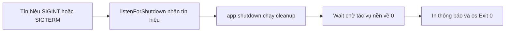

# 🛑 Graceful Shutdown: Đừng tắt ứng dụng một cách "phũ phàng"

> Nguồn: `053-Implementing-graceful-shutdown.txt` · [Udemy](https://ua.udemy.com/course/working-with-concurrency-in-go-golang/learn/lecture/32204328)

Ứng dụng cuối khóa của chúng ta rồi đây sẽ có nhiều **goroutine** chạy nền: có bạn chỉ ngồi lắng nghe channel, có bạn đang gửi email hay tạo hóa đơn. Nếu bạn dừng ứng dụng đột ngột, tất cả những goroutine ấy sẽ "chết" ngay lập tức, không kịp hoàn thành công việc — và đó chính là lúc chúng ta cần tới **graceful shutdown (tắt ứng dụng êm ái)**. Đây cũng là lần đầu tiên trong section này chúng ta thực sự sử dụng concurrency, tuy chưa phức tạp nhưng rất đáng học.

### 💥 Vì sao không nên tắt ứng dụng đột ngột?

Khi bạn cần dừng ứng dụng để làm gì đó — bảo trì server, cài một **hotfix (bản vá nóng)**... — dù lý do là gì thì ứng dụng cũng phải tắt. Nhưng nếu bạn tắt thẳng tay, ví dụ gõ `make stop`, thì các goroutine đang chạy sẽ dừng ngay lập tức mà không hoàn thành công việc.

Hậu quả không hề nhỏ:

* Một email lẽ ra phải được gửi thì không bao giờ tới tay người nhận.
* Một hóa đơn đang được tạo thì dở dang.

Vì vậy, **tắt êm là một thói quen tốt**: cho các tác vụ đang chạy nền có cơ hội hoàn thành rồi mới thực sự thoát.

### 📡 listenForShutdown: ngồi nghe tín hiệu tắt

Ở cuối file `main.go`, mình tạo một hàm sẽ chạy như goroutine, với receiver `app *config`, tên là `listenForShutdown`, không nhận tham số nào. Nhiệm vụ của nó là chạy nền và "nghe ngóng". Đầu tiên, mình tạo một channel tên `quit` kiểu `chan os.Signal`, với buffer length bằng 1 — *thật ra con số này là không cần thiết, nhưng mình cứ để đó cho chắc ăn!*

Sau đó gọi `signal.Notify` từ standard library để đăng ký nhận hai tín hiệu:

1. `syscall.SIGINT` — tín hiệu interrupt, thường là khi bạn nhấn Ctrl+C.
2. `syscall.SIGTERM` — tín hiệu terminate.

Rồi mình **block** chương trình bằng `<-quit`, đứng yên tại đó cho tới khi tín hiệu tắt được gửi tới. Vượt qua dòng này, mình gọi `app.shutdown()` — hàm này chưa tồn tại, mình viết ngay sau đây — và cuối cùng gọi `os.Exit(0)` để thoát với mã trạng thái 0.

```go
func (app *config) listenForShutdown() {
    quit := make(chan os.Signal, 1)
    signal.Notify(quit, syscall.SIGINT, syscall.SIGTERM)
    <-quit
    app.shutdown()
    os.Exit(0)
}
```

### 🧹 shutdown: dọn dẹp rồi chờ mọi việc hoàn tất

Hàm `shutdown` cũng có receiver `app *config` và làm hai việc. Việc đầu tiên là **chạy các cleanup task (tác vụ dọn dẹp)** — hiện tại mình chỉ in ra `would run cleanup tasks...` qua `app.InfoLog.Println`; sau này chỗ đó sẽ làm được nhiều thứ hơn.

Việc thứ hai là **chờ mọi thứ kết thúc**: gọi `app.Wait.Wait()` để block cho tới khi **WaitGroup** (chính là field `Wait` đã được thêm vào application config) có bộ đếm về 0. Khi xong, mình in tiếp thông báo `closing channels, and shutting down application...`.

```go
func (app *config) shutdown() {
    app.InfoLog.Println("would run cleanup tasks...")
    app.Wait.Wait()
    app.InfoLog.Println("closing channels, and shutting down application...")
}
```

Cơ chế phía sau rất đáng để nhớ. Mỗi khi muốn chạy một việc nền — gửi email, tạo hóa đơn... — mình sẽ gọi `app.Wait.Add(1)` để tăng bộ đếm, và trong chính hàm xử lý đó đặt `defer app.Wait.Done()` để giảm bộ đếm khi việc hoàn tất. Nhờ vậy, `Wait()` chỉ cho ứng dụng thoát khi **mọi tác vụ nền đã chạy xong một cách trọn vẹn**.

### 🚀 Kích hoạt và chạy thử

Còn một bước nữa: trong hàm `main`, ngay **trước khi khởi động web server**, mình thêm dòng `go app.listenForShutdown()` để hàm lắng nghe chạy nền. Rồi mình thử `make stop` để dừng, `make start` để khởi động lại, và lại `make stop` để xem điều gì xảy ra.

Khi tắt ứng dụng, terminal sẽ lần lượt hiện `would run cleanup tasks...`, rồi `closing channels...` và `shutting down application...`. Đó chính là một graceful shutdown.

Một lưu ý nhỏ: output này chắc chắn hiện trên Linux và Mac; còn trên Windows, tùy shell mà có thể các bạn không thấy gì — mình cũng từng loay hoay không hiểu vì sao, nhưng cứ tin mình, mọi thứ vẫn diễn ra đúng như vậy.



### 🎯 Tự kiểm tra nhanh

**Câu 1:** Vì sao không nên tắt ứng dụng đột ngột bằng `make stop`?

<details>
<summary><b>Xem đáp án</b></summary>

**Đáp án:** Vì các goroutine đang chạy sẽ chết ngay lập tức, có thể khiến email không được gửi hoặc hóa đơn không được tạo xong.

Giải thích: Tác vụ nền cần thời gian hoàn thành; tắt ngang sẽ bỏ dở chúng.

Tham chiếu: Mục Vì sao không nên tắt ứng dụng đột ngột.

</details>

**Câu 2:** Hàm `listenForShutdown` lắng nghe hai tín hiệu nào?

<details>
<summary><b>Xem đáp án</b></summary>

**Đáp án:** `syscall.SIGINT` và `syscall.SIGTERM`.

Giải thích: Hai tín hiệu này được đăng ký qua `signal.Notify(quit, ...)`.

Tham chiếu: Mục listenForShutdown.

</details>

**Câu 3:** Vì sao `listenForShutdown` cần chạy bằng `go` thay vì gọi trực tiếp?

<details>
<summary><b>Xem đáp án</b></summary>

**Đáp án:** Vì hàm này block chờ tín hiệu, cần chạy nền để không chặn luồng chính khởi động web server.

Giải thích: `go app.listenForShutdown()` được đặt ngay trước khi khởi động web server.

Tham chiếu: Mục Kích hoạt và chạy thử.

</details>

**Câu 4:** `app.Wait.Wait()` trong hàm `shutdown` có tác dụng gì?

<details>
<summary><b>Xem đáp án</b></summary>

**Đáp án:** Block cho tới khi bộ đếm của WaitGroup về 0, tức mọi tác vụ nền đã hoàn thành.

Giải thích: Đây là điểm cốt lõi giúp ứng dụng không thoát khi còn việc đang dở.

Tham chiếu: Mục shutdown.

</details>

**Câu 5:** Làm sao ứng dụng biết một tác vụ nền đang chạy để mà chờ?

<details>
<summary><b>Xem đáp án</b></summary>

**Đáp án:** Mỗi tác vụ nền gọi `app.Wait.Add(1)` khi bắt đầu và `defer app.Wait.Done()` khi kết thúc.

Giải thích: Bộ đếm tăng/giảm tương ứng với số việc đang chạy nền.

Tham chiếu: Mục shutdown.

</details>

Từ giờ, ứng dụng của chúng ta đã biết tắt một cách "đàng hoàng" và không bỏ rơi công việc dở dang. Bài tiếp theo, mình sẽ đổ dữ liệu vào database — tạo các bảng `plans`, `users`, `user_plans` và một tài khoản để đăng nhập. Hẹn gặp lại các bạn! 🚀

## Nguồn tham khảo

- [Package os/signal — pkg.go.dev](https://pkg.go.dev/os/signal)
