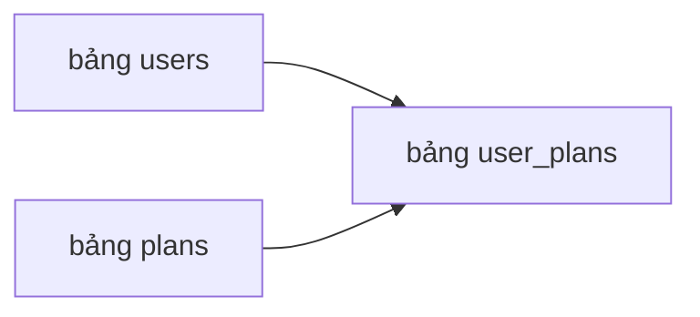

# 🗄️ Đổ dữ liệu vào Database: bảng plans, users và user_plans

> Nguồn: `054-Populating-the-database.txt` · [Udemy](https://ua.udemy.com/course/working-with-concurrency-in-go-golang/learn/lecture/32188476)

Trước khi làm việc với database, mình cần có bảng và ít nhất một người dùng — vì phải có ai đó để đăng nhập chứ! Tin vui là khóa học đã chuẩn bị sẵn một file SQL nhỏ gọn: việc của chúng ta chỉ là chạy nó, rồi cùng xem dữ liệu mẫu gồm những gì.

### 📥 Lấy file DB.sql từ tài nguyên bài học

Vào mục **course resources** của bài giảng này, bạn sẽ thấy file `DB.sql` để tải về. Các bạn giải nén, mở file bằng trình soạn thảo yêu thích, chọn tất cả rồi copy. Nội dung file chỉ là SQL cơ bản: tạo vài bảng và thêm dữ liệu cho một vài bảng trong số đó.

### 🐝 Chạy SQL bằng Beekeeper Studio

Mình mở **Beekeeper Studio** — công cụ quản lý database mình đang dùng — và kết nối tới database có tên `concurrency`. Đoạn SQL vừa copy được dán vào cửa sổ query hiện ra mặc định, sau đó chọn **Select All** và **Run Selection**.

Kết quả: database có thêm ba bảng — `plans`, `users` và `user_plans`. Trong đó bảng `plans` đã có sẵn nội dung.

### 💰 Bảng plans: ba gói Bronze, Silver, Gold

Một chi tiết mình muốn các bạn để ý: cột `plan_amount` lưu **giá của gói bằng cents** (đơn vị xu). Khi làm việc với tiền tệ, mình thường lưu trong database dưới dạng **số nguyên tròn**, rồi chia cho 100 khi hiển thị để ra giá trị dollars và cents.

Ba gói đang có:

* **Bronze** — $10.
* **Silver** — $20.
* **Gold** — $30.

### 👤 Bảng users: tài khoản mẫu để đăng nhập

Bảng `users` hiện có đúng một user:

* Username chính là email: `admin@example.com`.
* First name là `admin`, last name là `user`.
* Password được lưu dưới dạng **hash**, còn mật khẩu thật của tài khoản này là `verysecret` — viết liền, toàn chữ thường.

Ngoài ra còn vài cột đáng chú ý:

* `user_active` — `1` nghĩa là user đang hoạt động, `0` là không hoạt động.
* `is_admin` — cho biết user có phải quản trị viên hay không.
* `created_at` và `updated_at` — thời điểm tạo và cập nhật.

### 🔗 Bảng user_plans: nối người dùng với gói đăng ký

Đây là một **join table (bảng nối)** đúng nghĩa, chỉ gồm vài cột:

* `id` — khóa chính (primary key).
* `user_id` — khóa ngoại (foreign key) trỏ tới bảng `users`.
* `plan_id` — khóa ngoại trỏ tới bảng `plans`.
* `created_at` và `updated_at` — các timestamp.

Ví dụ cho dễ hình dung: nếu user số 1 mua gói Bronze, bảng này sẽ có một dòng với `user_id` là 1 và `plan_id` là 1 (giả sử Bronze có khóa chính là 1).

Vậy là database đã có nội dung. Trong bài tiếp theo, mình sẽ cài **data package** — gồm các câu lệnh SQL và models giúp ứng dụng tương tác với database. Hẹn gặp lại các bạn! 🚀
