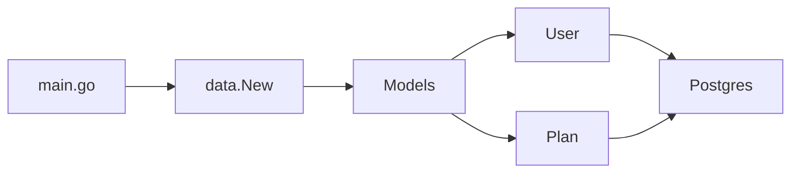

# 📦 Data Package và Database Models: cầu nối giữa ứng dụng và Postgres

> Nguồn: `055-Adding-a-data-package-and-database-models.txt` · [Udemy](https://ua.udemy.com/course/working-with-concurrency-in-go-golang/learn/lecture/32204318)

Chúng ta đã biết cách hiển thị trang web cho người dùng, database cũng đã có dữ liệu, nên giờ chỉ còn thiếu "cầu nối" để ứng dụng nói chuyện được với database. Vì đây là khóa học về **concurrency** chứ không phải lập trình database, mình sẽ tải sẵn package `data` từ tài nguyên khóa học cho nhanh — nhưng vẫn dành thời gian đọc qua từng file để các bạn biết mình đang dùng gì.

### 📂 Giải nén data.zip và đặt đúng chỗ

Trong tài nguyên của bài giảng có file `data.zip`. Các bạn giải nén, lấy thư mục `data` bên trong và đặt nó ở **root của project**, nằm cạnh thư mục `cmd` như mình đang có. Bên trong thư mục là ba file: `models.go`, `plan.go` và `user.go` — tất cả đều thuộc `package data` và chỉ import từ standard library, không có gì cao siêu cả.

* `user.go` — type `User` khớp với bảng users, kèm các phương thức thao tác với người dùng.
* `plan.go` — type `Plan` khớp với bảng plans, kèm các phương thức liên quan đến gói đăng ký.
* `models.go` — nơi kết nối database và đưa các model ra cho toàn ứng dụng.

### 👤 user.go: type User và các method

Type `User` mô tả đúng các cột trong database: `id` (số nguyên), `email`, `first_name`, `last_name`, `password`, `active`, `is_admin`, `created_at`, `updated_at` — và thêm cả `Plan` để biết user đã đăng ký gói nào.

Trên receiver `User`, mình có một loạt phương thức đơn giản:

* **Lấy toàn bộ user** — trả về slice các con trỏ `*User` kèm `error`. Code chạy một câu query đơn giản, lấy rows bằng `db.QueryContext`, rồi lặp qua từng row, đổ dữ liệu vào một biến `user` và append vào slice.
* **Lấy user theo email** — sẽ dùng ngay ở bài sau, khi người dùng đăng nhập.
* **Lấy một user theo ID** — lấy thông tin user, đồng thời tìm xem user đã mua gói nào chưa: nếu có thì gán plan vào user, nếu không thì để trống.
* **Update** user, **Delete** theo user ID, **DeleteByID** (làm điều tương tự nhưng nhận ID truyền vào thay vì lấy từ receiver), **Insert** user mới (sẽ dùng khi đăng ký tài khoản).
* **ResetPassword** và phương thức kiểm tra xem mật khẩu người dùng nhập có khớp với hash lưu trong database hay không.

### 🗂️ plan.go: gọn hơn nhưng cùng ý tưởng

File này ngắn hơn vì mình không làm nhiều việc với các gói đăng ký. Bên trong là struct khớp với bảng plans, cùng các phương thức:

* Lấy **tất cả các gói**.
* Lấy **một gói theo ID**.
* **SubscribeUser** — đăng ký một user vào một gói: chèn vào bảng `user_plans` cặp `user_id`, `plan_id` kèm các timestamp, thế là xong.
* Một hàm tiện ích nhỏ định dạng giá từ database thành chuỗi tiền tệ: giá trị `1000` sẽ được trả về dưới dạng `$10.00` (hoặc `$10`).

### 🔌 models.go: cầu nối cho toàn bộ ứng dụng

`models.go` là file quan trọng nhất, vì nó đưa các hàm database ra khắp ứng dụng:

* Constant `DBTimeout` — nếu một thao tác database không xong trong **3 giây**, chắc chắn có gì đó sai.
* `DB` — connection pool, con trỏ `*sql.DB` dùng để kết nối Postgres.
* Hàm `New` — sẽ được gọi từ `main.go`; nó tạo ra type `Models`, ban đầu chỉ có field `User`, và mình thêm tiếp field `Plan`.

Điểm hay là: mỗi lần thêm một model vào hàm `New` và thêm field tương ứng vào `Models`, model đó **lập tức có mặt trong toàn bộ ứng dụng** — mọi model cùng các phương thức của chúng đều sẵn sàng, không cần chỉnh sửa gì thêm.

Ở `config.go`, mình thêm field `Models` kiểu `data.Models`. Rồi trong `main.go`, tại chỗ khởi tạo application config, ngay sau field `Wait`, mình thêm `Models: data.New(db)` — biến `db` đã có sẵn từ trước. Chạy `make restart` để build: mọi thứ compile trôi chảy.

### 🎯 Tự kiểm tra nhanh

**Câu 1:** Thư mục `data` chứa những file nào và nằm ở đâu?

<b>Xem đáp án</b>

**Đáp án:** `models.go`, `plan.go`, `user.go`; đặt ở root project, cạnh thư mục `cmd`.

Giải thích: Cả ba file thuộc `package data` và chỉ dùng standard library.

Tham chiếu: Mục Giải nén data.zip.

**Câu 2:** Constant `DBTimeout` có giá trị bao nhiêu và ý nghĩa là gì?

<b>Xem đáp án</b>

**Đáp án:** 3 giây — nếu thao tác database không hoàn thành trong 3 giây thì coi như có vấn đề.

Giải thích: Đây là cách đặt ngưỡng timeout cho các thao tác database.

Tham chiếu: Mục models.go.

**Câu 3:** Phương thức nào lấy user theo email, và nó sẽ dùng ở đâu?

<b>Xem đáp án</b>

**Đáp án:** `GetByEmail`, dùng khi người dùng đăng nhập.

Giải thích: Đăng nhập bắt đầu bằng việc tìm user theo địa chỉ email.

Tham chiếu: Mục user.go.

**Câu 4:** `SubscribeUser` ghi dữ liệu gì và vào bảng nào?

<b>Xem đáp án</b>

**Đáp án:** Chèn `user_id`, `plan_id` và các timestamp vào bảng `user_plans`.

Giải thích: Đây là bảng nối giữa người dùng và gói đăng ký.

Tham chiếu: Mục plan.go.

**Câu 5:** Thêm một model mới vào hàm `New` và type `Models` thì có lợi ích gì?

<b>Xem đáp án</b>

**Đáp án:** Model đó lập tức có mặt trong toàn bộ ứng dụng.

Giải thích: Không cần chỉnh sửa gì thêm ở nơi khác.

Tham chiếu: Mục models.go.

Giờ ứng dụng đã truy cập được database, dù chưa dùng đến dữ liệu bên trong. Bài sau sẽ là logic **đăng nhập / đăng xuất** — có database, có session, có Redis, và tiến gần hơn tới phần concurrency thú vị nhất của dự án. Hẹn gặp lại các bạn! 🚀
