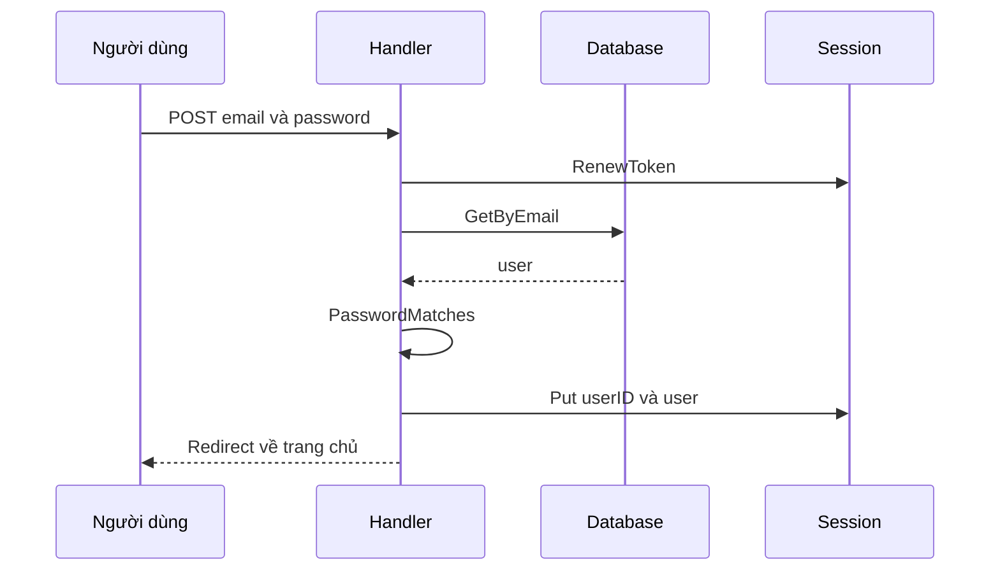

# 🔐 Đăng nhập, Đăng xuất: Khi ứng dụng bắt đầu "nhớ" người dùng

> Nguồn: `056-Implementing-the-loginlogout-functions.txt` · [Udemy](https://ua.udemy.com/course/working-with-concurrency-in-go-golang/learn/lecture/32215258)

Đã có database, đã có session, giờ là lúc chúng ta viết logic **đăng nhập** và **đăng xuất** để ứng dụng bắt đầu "nhớ" người dùng giữa các request. Mình sẽ đi chậm từng bước, vì đây là bài dài với vài chi tiết nhỏ nhưng cực kỳ quan trọng — nào là làm mới token, lưu dữ liệu vào session, rồi cả "mẹo" tạo thông báo chỉ hiện đúng một lần.

### 🔑 Luồng đăng nhập: từ form tới database

Handler `postLoginPage` được gọi khi ai đó gửi form ở trang đăng nhập, với **email** và **password**. Ý tưởng rất đơn giản:

* Nếu đăng nhập được → lưu thông tin vào session rồi chuyển hướng người dùng sang trang khác.
* Nếu không được → đưa họ quay lại trang đăng nhập kèm thông báo lỗi.

Một thói quen tốt mà mình luôn nhắc: **mỗi khi đăng nhập hoặc đăng xuất, hãy làm mới (renew) session token** đang lưu trong session. Gói SCS của Alex Edwards làm việc này cực dễ:

```go
app.session.RenewToken(r.Context())
```

Tiếp theo, mình đọc dữ liệu từ form theo cách quen thuộc — gọi `r.ParseForm()`, nếu lỗi thì log lại (trong môi trường production các bạn có thể làm "kỹ tính" hơn, nhưng ở đây mình ưu tiên đi tiếp để học concurrency):

```go
err := r.ParseForm()
if err != nil {
    app.errorLog.Println(err)
}

email := r.Form.Get("email")
password := r.Form.Get("password")
```

Với email trong tay, mình tìm user trong database bằng `app.models.User.GetByEmail(email)`. Nếu có lỗi — hoặc nếu mật khẩu không khớp — mình xử lý theo cùng một cách: đặt thông báo lỗi vào session rồi chuyển hướng về trang đăng nhập.

```go
app.session.Put(r.Context(), "error", "invalid credentials")
http.Redirect(w, r, "/login", http.StatusSeeOther)
return
```

Một lưu ý về bảo mật: mình **không tiết lộ quá nhiều thông tin** trên màn hình đăng nhập. Dù email không tồn tại hay mật khẩu sai, tất cả chỉ là "invalid credentials" mà thôi.



### 🍪 Đăng nhập thành công: lưu gì vào session?

Khi mọi bước đều trôi chảy, mình lưu **hai thứ** vào session:

```go
app.session.Put(r.Context(), "userID", user.ID)
app.session.Put(r.Context(), "user", user)
```

Sau đó là một flash message và chuyển hướng về trang chủ:

```go
app.session.Put(r.Context(), "flash", "successful login")
http.Redirect(w, r, "/", http.StatusSeeOther)
```

Quy tắc đáng nhớ: **sau một form POST thành công, hãy redirect sang nơi khác** — để người dùng lỡ nhấn F5 cũng không vô tình gửi form lần hai.

Có một chi tiết khiến mình từng "dính" khi mới làm: muốn lưu cả struct `data.User` vào session, bạn phải **đăng ký kiểu dữ liệu này** lúc khởi tạo session trong `main.go`:

```go
gob.Register(data.User{})
```

Nếu quên, chương trình vẫn compile và chạy bình thường — nhưng ngay khi có người đăng nhập thành công, bạn sẽ nhận lỗi kiểu *"không biết lưu kiểu này vào session"*. Đó là một "đặc sản" của ngôn ngữ **strongly typed (định kiểu mạnh)**, chứ không phải lỗi của các bạn đâu.

Mình thử `make restart` rồi đăng nhập với `admin@example.com` và mật khẩu `verysecret`: thành công! Dòng "successful login" hiện lên. Nhấn F5, thông báo biến mất — vì flash message được lấy ra bằng `PopString`: đọc xong là tự xóa khỏi session, chỉ hiện đúng một lần.

### 🚪 Đăng xuất: xóa session và làm mới token

Nút Logout trên thanh điều hướng hiện trỏ vào một stub nên bấm vào chỉ thấy màn hình trống. May quá, đăng xuất cực dễ:

```go
app.session.Destroy(r.Context())
app.session.RenewToken(r.Context())
http.Redirect(w, r, "/login", http.StatusSeeOther)
```

Mình hủy toàn bộ session, làm mới token, rồi đưa người dùng về trang đăng nhập. Thử nghiệm thú vị: vì session lưu trong **Redis**, mình restart ứng dụng mà vẫn đang đăng nhập. Bấm Logout, link **Log in** xuất hiện trở lại và link **Logout** biến mất.

### 🧭 Hậu trường: navbar và alerts thay đổi nhờ đâu?

Bí mật nằm ở biến `authenticated` trong **default data** được truyền cho mọi template: `true` khi đã đăng nhập, `false` khi chưa. Nhờ đó navbar chỉ cần rẽ nhánh — chưa đăng nhập thì hiện link Register/Log in, đã đăng nhập thì hiện link Logout.

Các thông báo ở đầu trang cũng tương tự: partial `alert.page.gohtml` kiểm tra dữ liệu `flash` mà mọi trang đều nhận, rồi hiển thị bằng **Bootstrap**:

* Thành công → alert xanh.
* Lỗi → alert đỏ, kèm nội dung biến `error`.
* Cảnh báo → alert warning với nội dung biến `warning`.

### 🎯 Tự kiểm tra nhanh

**Câu 1:** Login handler xử lý hai nhánh kết quả như thế nào?

<details>
<summary><b>Xem đáp án</b></summary>

**Đáp án:** Thành công thì lưu thông tin vào session và redirect; thất bại thì quay lại trang đăng nhập kèm lỗi.

Giải thích: Đây là luồng chuẩn của một handler đăng nhập.

Tham chiếu: Mục Luồng đăng nhập.

</details>

**Câu 2:** Vì sao cần làm mới session token khi đăng nhập và đăng xuất?

<details>
<summary><b>Xem đáp án</b></summary>

**Đáp án:** Vì mỗi khi quyền truy cập thay đổi (đăng nhập/đăng xuất), nên đổi token phiên để an toàn hơn.

Giải thích: Đây là thói quen tốt được nhắc trong bài; gói SCS hỗ trợ sẵn qua `RenewToken`.

Tham chiếu: Mục Luồng đăng nhập và Mục Đăng xuất.

</details>

**Câu 3:** Vì sao phải gọi `gob.Register(data.User{})` khi khởi tạo session?

<details>
<summary><b>Xem đáp án</b></summary>

**Đáp án:** Để session biết cách lưu kiểu dữ liệu `User` vào session.

Giải thích: Nếu thiếu, ứng dụng vẫn chạy nhưng sẽ lỗi ngay khi có người đăng nhập thành công.

Tham chiếu: Mục Đăng nhập thành công.

</details>

**Câu 4:** Vì sao cả trường hợp sai email lẫn sai mật khẩu đều chỉ báo "invalid credentials"?

<details>
<summary><b>Xem đáp án</b></summary>

**Đáp án:** Để không tiết lộ quá nhiều thông tin trên màn hình đăng nhập.

Giải thích: Người dùng chỉ cần biết là không đăng nhập được.

Tham chiếu: Mục Luồng đăng nhập.

</details>

**Câu 5:** Vì sao sau khi POST thành công phải redirect, và vì sao flash message chỉ hiện một lần?

<details>
<summary><b>Xem đáp án</b></summary>

**Đáp án:** Redirect để tránh người dùng submit form hai lần; flash hiện một lần vì được lấy ra bằng `PopString` (đọc là xóa khỏi session).

Giải thích: Đây là hai chi tiết giúp trải nghiệm đăng nhập "sạch" hơn.

Tham chiếu: Mục Đăng nhập thành công.

</details>

Vậy là chúng ta đã đăng nhập và đăng xuất ngon lành. Bây giờ hãy nhìn về phía trước, vì đây mới là phần hấp dẫn nhất của cả section: trang đăng ký.

Khi có người đăng ký, các bước sẽ là:

1. Tạo user — thao tác này không tốn thời gian.
2. **Gửi email kích hoạt trong nền** — vì gửi email rất tốn thời gian xử lý, không ai muốn ngồi chờ 4-5-10 giây trong khi kết nối tới mail server chậm.
3. Đăng ký user vào một gói tài khoản — chỉ là chèn một dòng vào database.

Sau đó, khi người dùng bấm link trong email, handler `activateAccount` sẽ làm tiếp: **xác thực URL** (để chắc chắn link không phải do người lạ tạo ra), **tạo hóa đơn**, gửi email kèm tài liệu hướng dẫn tương ứng với gói (Bronze nhận tài liệu Bronze, Gold nhận tài liệu Gold — thậm chí là PDF được tùy biến), và cuối cùng gửi email đính kèm hóa đơn.

Tất cả những việc "nặng đô" đó sẽ được xử lý bằng **concurrency** — chính là lý do cả khóa học này tồn tại. Hẹn gặp lại các bạn ở bài tiếp theo! 🚀

## Nguồn tham khảo

- [SCS: HTTP Session Management for Go](https://github.com/alexedwards/scs)
- [Package encoding/gob — pkg.go.dev](https://pkg.go.dev/encoding/gob)
