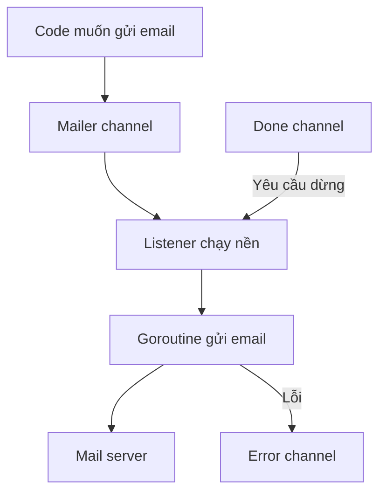

# 📬 Gửi email bất đồng bộ: khi lá thư không được phép chặn cả chương trình

> Nguồn: `057-What-well-cover-in-this-section.txt` · [Udemy](https://ua.udemy.com/course/working-with-concurrency-in-go-golang/learn/lecture/32248326)

Ứng dụng subscription của chúng ta đã có route, handler, session — nhưng còn một việc rất "đời" chưa làm được: **gửi email**. Trong section này, mình và các bạn sẽ bắt đầu thêm **concurrency** (lập trình đồng thời) vào codebase, cụ thể là gửi email **trong background** (chạy nền). Nghe thì to tát, nhưng mình đi chậm từng bước, các bạn cứ yên tâm.

### 🎯 Vì sao phải gửi email ở background?

Lý do rất thực tế: **gửi email có thể làm chậm mọi thứ**. Hãy tưởng tượng ứng dụng đang kết nối tới một dịch vụ mail như Mailgun, và hôm nay dịch vụ đó đang có "một ngày tồi tệ" — server phản hồi cực kỳ chậm.

Điều mình không muốn là code cứ **đứng khựng lại chờ** cho đến khi email gửi xong. Thay vào đó, ta gửi nó đi trong nền rồi tiếp tục làm việc khác. Người dùng bấm nút, trang vẫn mượt, còn email cứ thong thả bay phía sau.

### 🧩 Ba channel, nhưng chỉ hai tham gia gửi mail

Cách triển khai dùng **ba channel** (kênh truyền dữ liệu giữa các goroutine):

1. **Mailer channel** — nơi nhận thông tin email cần gửi. Có một thứ chạy nền lắng nghe channel này; khi nhận được message, nó **fire off một goroutine mới** để gửi email đồng thời.
2. **Error channel** — chuyên hứng lỗi. Nếu có trục trặc khi gửi, lỗi được đẩy vào đây.
3. **Done channel** — không tham gia gửi email, chỉ dùng để **tắt mọi thứ** khi cần dừng.

Chỉ có **hai** channel tham gia trực tiếp vào việc gửi email; channel thứ ba đóng vai "công tắc nguồn".

### 🧹 Nhiệm vụ thứ ba: dọn dẹp khi tắt ứng dụng

Phần này quan trọng không kém: **thêm logic cleanup** (dọn dẹp) cho ứng dụng.

Hãy tưởng tượng app đang gửi email và làm đủ thứ ở background, rồi ai đó quyết định: "Tôi cần dừng app để cài bản mới". Nếu tắt phụt, những việc đang xếp hàng hoặc đang chạy nền sẽ **chết lặng lẽ — và bạn không bao giờ biết chuyện gì đã xảy ra**. Đó là một vấn đề thật sự.

Nên mình sẽ thêm logic cho phép **chờ mọi thứ đang chạy nền hoàn tất**, rồi mới dừng ứng dụng — và nhân dịp đó làm luôn vài việc dọn dẹp khác.

### 🎯 Tự kiểm tra nhanh

**Câu 1:** Mục tiêu chính của section này là gì?

<b>Xem đáp án</b>

**Đáp án:** Thêm concurrency vào codebase, bắt đầu bằng việc gửi email trong background.

Giải thích: Trọng tâm là gửi email bất đồng bộ thay vì bắt chương trình ngồi chờ.

Tham chiếu: Đoạn mở bài.

**Câu 2:** Vì sao gửi email trực tiếp có thể làm chậm ứng dụng?

<b>Xem đáp án</b>

**Đáp án:** Vì phải kết nối tới dịch vụ mail, và dịch vụ đó có thể phản hồi rất chậm — ví dụ Mailgun đang "có một ngày tồi tệ".

Giải thích: Code sẽ dừng lại chờ cho tới khi email gửi xong, thay vì làm việc khác.

Tham chiếu: Mục Vì sao phải gửi email ở background.

**Câu 3:** Có bao nhiêu channel và vai trò của từng channel?

<b>Xem đáp án</b>

**Đáp án:** Ba channel: mailer channel nhận email cần gửi, error channel hứng lỗi, done channel để tắt mọi thứ; chỉ hai channel đầu tham gia vào việc gửi email.

Giải thích: Mailer channel có listener chạy nền; nhận message thì fire off một goroutine gửi email.

Tham chiếu: Mục Ba channel.

**Câu 4:** Chuyện gì xảy ra nếu ứng dụng dừng đột ngột khi còn việc chạy nền?

<b>Xem đáp án</b>

**Đáp án:** Những việc đang xếp hàng hoặc đang chạy nền sẽ chết lặng lẽ, và bạn không bao giờ biết chuyện gì đã xảy ra.

Giải thích: Đó là lý do cần logic chờ mọi thứ hoàn tất trước khi dừng app.

Tham chiếu: Mục Nhiệm vụ thứ ba.

**Câu 5:** Cleanup logic mà mình sắp thêm có tác dụng gì?

<b>Xem đáp án</b>

**Đáp án:** Chờ mọi thứ đang chạy nền hoàn tất rồi mới dừng ứng dụng, kèm vài việc dọn dẹp khác.

Giải thích: Mục tiêu là không để công việc đã xếp hàng bị "chết" giữa chừng khi tắt app.

Tham chiếu: Mục Nhiệm vụ thứ ba.

Ba mục tiêu đã rõ: gửi email trong nền, hứng lỗi qua channel, và dọn dẹp cho tử tế khi tắt app. Giờ thì bắt tay vào code thôi — bài sau mình dựng file `mailer.go` với hai type `Mail` và `Message`. Hẹn gặp lại các bạn! 🚀
