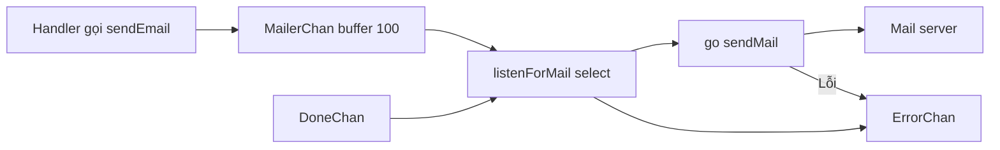

# 🎧 Gửi email bất đồng bộ: listener goroutine và bộ ba channel

> Nguồn: `061-Getting-started-sending-a-message-asynchronously.txt` · [Udemy](https://ua.udemy.com/course/working-with-concurrency-in-go-golang/learn/lecture/32250906)

Đây rồi, khoảnh khắc chúng ta chờ đợi: đưa email vào chạy nền. Mình sẽ viết **listener goroutine** lắng nghe mailer channel, tạo bộ ba channel trong hàm `createMail`, nối tất cả vào `main.go` — và quan trọng không kém: chỉ ra một dòng `defer` mà nếu quên, ứng dụng của bạn sẽ không bao giờ tắt được một cách êm ái. Đi thôi!

### 🧹 Dọn route test trước đã

Route `test-email` hôm trước giờ chỉ làm rối file routes, nên mình xóa nó và lưu lại — imports tự động được dọn theo. Gọn gàng rồi, quay lại `mailer.go`.

### 🎧 `listenForMail` — trái tim của cơ chế bất đồng bộ

Hàm có receiver `app *config`, không nhận tham số, và sẽ **chạy mãi** trong một vòng `for`. Bên trong là `select` — công cụ lắng nghe nhiều channel cùng lúc, lâu rồi mới gặp lại:

```go
for {
    select {
    case msg := <-app.Mailer.MailerChan:
        go app.Mailer.sendMail(msg, app.Mailer.ErrorChan)
    case err := <-app.Mailer.ErrorChan:
        app.errorLog.Println(err)
    case <-app.Mailer.DoneChan:
        return
    }
}
```

Ba case, ba nhiệm vụ:

1. **Có message mới** → `go app.Mailer.sendMail(...)`: đây chính là "fire off a goroutine" mà mình nói từ đầu — email gửi hoàn toàn trong nền.
2. **Có lỗi** → xử lý. Mình chỉ `Println` cho đơn giản, nhưng đây là chỗ tùy dự án: gửi text cho ai đó, báo qua Slack... logic này rất riêng.
3. **Nhận tín hiệu từ done channel** → `return`, kết thúc goroutine.



### 🧱 Thêm `Mailer` vào config và tạo `createMail`

Listener cần truy cập mailer từ `app`, nên file `config.go` được thêm một field: `Mailer` kiểu `Mail`.

Rồi trong `main.go`:

1. `app.Mailer = app.createMail()` — hàm mới toanh.
2. `go app.listenForMail()` — bắt đầu lắng nghe.

`createMail` tạo ba channel:

```go
errorChan := make(chan error)
mailerChan := make(chan Message, 100)
doneChan := make(chan bool)
```

Để ý `mailerChan` nhé: nếu để **unbuffered**, mỗi lúc chỉ gửi/xếp hàng được đúng một message. Mình cho nó **buffer 100** — tối đa 100 message được chờ trong channel trước khi block.

Sau đó dựng biến `Mail` với domain, host, port, encryption, from name/address hard-code như bài test, còn `Wait: app.Wait` để dùng chung WaitGroup, cùng ErrorChan, MailerChan, DoneChan vừa tạo. Hàm trả về biến này, thế là xong.

### ⚠️ Dòng `defer` ai cũng dễ quên

Khoan hưởng thụ thành quả — có một thứ sẽ khiến bạn "đau đầu" rất nhanh khi bắt đầu gửi email từ ứng dụng. Nghĩ thử xem mình đang quên gì trong `sendMail`?

Nếu bạn nghĩ tới **WaitGroup** thì chính xác. Phải có:

```go
defer m.Wait.Done()
```

Nếu không, WaitGroup sẽ **không bao giờ được giảm về 0**, và ta không thể thoát ứng dụng một cách êm ái — chỉ còn cách tìm process ID rồi kill bằng tay. Cách đó thì chẳng vui chút nào.

*Các bạn cứ thong thả đọc lại đoạn này, vì đây đúng là kiểu lỗi ai cũng từng mắc — mình cũng vậy.*

### 🎯 Tự kiểm tra nhanh

**Câu 1:** Khi listener nhận được message trên mailer channel, nó làm gì?

<details>
<summary><b>Xem đáp án</b></summary>

**Đáp án:** Nó fire off một goroutine mới bằng `go app.Mailer.sendMail(msg, app.Mailer.ErrorChan)` để gửi email trong nền.

Giải thích: Nhờ vậy handler không phải chờ email gửi xong.

Tham chiếu: Mục listenForMail.

</details>

**Câu 2:** Error channel được xử lý thế nào trong bài này?

<details>
<summary><b>Xem đáp án</b></summary>

**Đáp án:** Mình chỉ in lỗi ra log bằng `app.errorLog.Println(err)`; tùy dự án có thể gửi text, báo Slack...

Giải thích: Đây là logic đặc thù của từng ứng dụng.

Tham chiếu: Mục listenForMail.

</details>

**Câu 3:** Vì sao `mailerChan` được tạo với buffer 100?

<details>
<summary><b>Xem đáp án</b></summary>

**Đáp án:** Vì nếu để unbuffered thì mỗi lúc chỉ gửi hoặc xếp hàng được một message; buffer 100 cho phép 100 message chờ trước khi block.

Giải thích: Giúp ứng dụng không bị nghẽn khi có nhiều email cần gửi liên tiếp.

Tham chiếu: Mục createMail.

</details>

**Câu 4:** Quên `defer m.Wait.Done()` thì hậu quả là gì?

<details>
<summary><b>Xem đáp án</b></summary>

**Đáp án:** WaitGroup không bao giờ được giảm, ứng dụng không thoát được êm ái — phải tìm process ID và kill bằng tay.

Giải thích: Đây là lỗi rất dễ mắc khi mới làm việc với WaitGroup.

Tham chiếu: Mục Dòng defer ai cũng dễ quên.

</details>

**Câu 5:** `Mailer` được tạo và khởi động ở đâu?

<details>
<summary><b>Xem đáp án</b></summary>

**Đáp án:** Tạo bằng `app.createMail()` (gán vào field `Mailer` trong config), rồi khởi động listener bằng `go app.listenForMail()` trong `main.go`.

Giải thích: `createMail` dựng ba channel và biến `Mail` với WaitGroup dùng chung từ app.

Tham chiếu: Mục Thêm Mailer vào config.

</details>

Thế là email đã chạy nền thật sự. Nhưng mỗi lần gửi vẫn phải nhớ `Wait.Add(1)` — dễ quên lắm. Bài sau mình viết một hàm helper nhỏ xíu để việc gửi email chỉ còn một dòng. Hẹn gặp lại các bạn! 🚀
