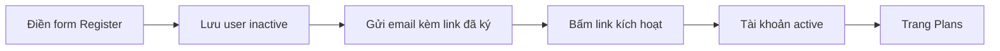

# 🗺️ Section mới: Đăng ký người dùng & hiển thị các gói Subscription

> Nguồn: `065-What-well-cover-in-this-section.txt` · [Udemy](https://ua.udemy.com/course/working-with-concurrency-in-go-golang/learn/lecture/32252704)

Chào các bạn, chúng ta bước sang một section mới của dự án Subscription Service: **đăng ký và kích hoạt người dùng**, rồi hiển thị danh sách các gói đăng ký để họ chọn. Mình nói trước cho các bạn yên tâm: section này **không có nhiều concurrency** — nhưng đây là đoạn đường bắt buộc phải đi qua để tới những bài mà concurrency thực sự phát huy tác dụng.

### 🎯 Vì sao section này ít concurrency?

Nghe tên khóa học là *Working with Concurrency in Go* mà section này lại "hiền" như vậy, thoạt nhìn có vẻ hơi lạ. Nhưng mọi thứ đều có lý do:

* Chúng ta cần dựng xong phần **thêm user vào hệ thống** và **xác thực tài khoản** trước đã.
* Chỉ khi luồng đăng ký — kích hoạt chạy trơn tru, mình mới có "chỗ đứng" để viết những đoạn code mà concurrency là lựa chọn đúng đắn.
* Nói cách khác: đây là phần dọn đường — làm cho gọn gàng rồi tiến lên.

---

### 📧 Đăng ký tài khoản qua email kích hoạt

Luồng mà mình sẽ xây dựng rất giống mọi website thật mà các bạn từng dùng:

1. Người dùng bấm **Register**, điền email, chọn mật khẩu và để lại tên.
2. Hệ thống lưu user vào database nhưng để ở trạng thái **chưa kích hoạt (inactive)**.
3. Một **email kèm link kích hoạt** được gửi đi.
4. Người dùng bấm vào link đó, tài khoản mới chuyển sang **active**.

Và đây là chi tiết mình muốn các bạn chú ý ngay từ đầu: vì lý do **bảo mật**, URL nằm trong email **phải được ký (signed)** để không ai có thể sửa nội dung rồi giả mạo. Nghe thì to tát, nhưng cách làm thực sự rất đơn giản — chúng ta sẽ xử lý ngay ở bài sau.

---

### 💳 Thêm trang hiển thị các gói Subscription

Việc cuối cùng của section: chỉnh ứng dụng để có một **trang liệt kê toàn bộ các gói đăng ký** mà người dùng có thể mua. Đây là bước chuẩn bị cho phần thú vị nhất — khi ai đó bấm chọn một gói, chúng ta sẽ có cớ để chạy **hóa đơn, email, tài liệu PDF... trong nền** bằng goroutine.

Tóm lại, section này gồm ba việc: thêm user, kích hoạt user, và hiển thị các gói đăng ký. Nghe đơn giản đúng không? *Cứ đi từng bước cùng mình, không cần vội.* Hẹn gặp lại các bạn ở bài tiếp theo, nơi chúng ta bắt tay tạo template email và làm quen với "signer" nhé! 🚀
