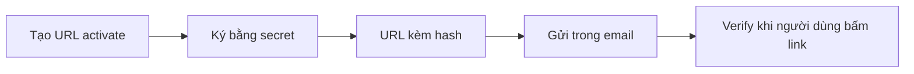

# 📧 Mail Templates & URL Signer: tấm khiên cho link kích hoạt

> Nguồn: `066-Adding-mail-templates-and-URL-signer-code.txt` · [Udemy](https://ua.udemy.com/course/working-with-concurrency-in-go-golang/learn/lecture/32252808)

Hôm nay mình bắt tay vào việc đăng ký người dùng: khách vào site, bấm Register, nhập email, chọn mật khẩu và để lại tên. Sau khi form được gửi đi, chúng ta sẽ **thêm user nhưng để inactive**, gửi một email có link *Activate your account*, và chỉ khi họ bấm vào link đó thì tài khoản mới được kích hoạt. Trước khi viết handler, mình cần chuẩn bị hai thứ: **email template** và **bộ code ký URL**.

### 📝 Tạo cặp template email HTML và plain text

Trong thư mục `cmd/web/templates`, mình tạo hai file mới:

* `confirmation-email.html.gohtml` — bản HTML.
* `confirmation-email.plain.gohtml` — bản plain text.

Để nhanh, mình copy nội dung từ file mail template có sẵn (`mail.html.gohtml`) rồi sửa lại. Với bản HTML, mình thêm đoạn mở đầu kiểu *"Thank you for registering. Click the link below to activate your account"*, rồi đổi phần link thành một thẻ `<a>` với `href="{{ . }}"` — nơi dữ liệu chúng ta truyền vào sẽ được render — và phần chữ hiển thị là *Activate your account*.

Với bản plain text, mình cũng copy y nguyên rồi **gỡ hết các thẻ HTML**, vì đây là văn bản thuần và HTML sẽ không hoạt động ở đây. Cấu trúc `{{ define "body" }}` thì giữ nguyên để hàm build message vẫn tìm thấy phần nội dung như cũ. Vậy là chúng ta đã có cặp template email để dùng.

---

### 🚨 Nếu không ký, URL sẽ là một lỗ hổng

Nếu cứ gửi thẳng, link trong email sẽ có dạng:

```text
https://<trang-của-bạn>/activate?email=<email-người-đăng-ký>
```

Đây là một **lỗ hổng bảo mật**: email nằm ngay trong URL nghĩa là **bất kỳ ai cũng có thể đoán email** và tự kích hoạt tài khoản của người khác. Mình nói vui thế này: *không phải ai cũng rảnh đi làm chuyện đó, nhưng bạn biết đấy — ngoài kia thiếu gì người muốn "phá" bạn.* Họ có thể thử hàng loạt email và kích hoạt càng nhiều càng tốt. Vậy nên cách duy nhất là làm cho URL trở thành **tamper-proof (không thể bị sửa đổi)**.

---

### 🔐 signer.go: ký URL bằng package go-alone

Trong tài nguyên của bài giảng có file `signer.go.zip`. Các bạn tải về, giải nén rồi **copy nội dung vào thư mục `cmd/web`** — mình tạo file `signer.go` và dán vào. Bộ code này dùng package `github.com/bwmarrin/go-alone`, nên mình cài bằng:

```bash
go get github.com/bwmarrin/go-alone
```

Đây là một package rất gọn: nó cho phép tạo **chữ ký cho bất kỳ đoạn text nào**, và nhiệm vụ của nó ở đây là ký URL kích hoạt mà chúng ta đặt trong email.

Điểm cần để ý trong `signer.go` là **hằng số secret**: mình chọn đại `ABC123` lặp lại ba lần. *Các bạn đừng bắt chước y nguyên nhé* — trong code thật, secret phải dài và an toàn hơn nhiều, và thường không lưu trong code mà đọc từ **biến môi trường (environment variable)**.

Bộ code này có ba phương thức đơn giản:

* Một phương thức **sinh token từ một chuỗi**: đưa vào một URL, nó trả về URL kèm **một hash nối ở cuối**.
* `Verify` — đưa vào đoạn text đã ký (với chúng ta là link đã ký) và kiểm tra xem chữ ký có khớp với thứ mình tạo ra hay không.
* Phương thức thứ ba kiểm tra **thời hạn**: cho phép làm link hết hạn sau 60 phút hoặc bất kỳ khoảng thời gian nào bạn muốn.



### 🎯 Tự kiểm tra nhanh

**Câu 1:** Link kích hoạt trong email có dạng ra sao, và vì sao phải ký nó?

<details>
<summary><b>Xem đáp án</b></summary>

**Đáp án:** Link có dạng `.../activate?email=<email>`; phải ký để URL trở thành tamper-proof, tránh việc ai đó đoán email và kích hoạt tài khoản người khác.

Giải thích: Email nằm trong URL là lỗ hổng vì ai cũng có thể thử hàng loạt email.

Tham chiếu: Mục Nếu không ký, URL sẽ là một lỗ hổng.

</details>

**Câu 2:** Hai file template email mới tên gì và nằm ở đâu?

<details>
<summary><b>Xem đáp án</b></summary>

**Đáp án:** `confirmation-email.html.gohtml` và `confirmation-email.plain.gohtml`, đặt trong `cmd/web/templates`.

Giải thích: Cả hai đều được copy từ `mail.html.gohtml` có sẵn rồi chỉnh lại.

Tham chiếu: Mục Tạo cặp template email.

</details>

**Câu 3:** Bản plain text khác bản HTML ở điểm nào?

<details>
<summary><b>Xem đáp án</b></summary>

**Đáp án:** Bản plain text gỡ toàn bộ thẻ HTML và giữ cấu trúc `{{ define "body" }}`.

Giải thích: HTML sẽ không hoạt động trong email dạng văn bản thuần.

Tham chiếu: Mục Tạo cặp template email.

</details>

**Câu 4:** `signer.go` dùng package nào và cài đặt ra sao?

<details>
<summary><b>Xem đáp án</b></summary>

**Đáp án:** Package `github.com/bwmarrin/go-alone`, cài bằng `go get github.com/bwmarrin/go-alone`.

Giải thích: File `signer.go` được lấy từ `signer.go.zip` trong tài nguyên bài giảng và copy vào `cmd/web`.

Tham chiếu: Mục signer.go.

</details>

**Câu 5:** Ba phương thức của bộ signer dùng để làm gì?

<details>
<summary><b>Xem đáp án</b></summary>

**Đáp án:** Sinh token từ chuỗi (nối hash vào URL), verify chữ ký, và kiểm tra thời hạn hết hạn của link.

Giải thích: Ví dụ link có thể hết hạn sau 60 phút.

Tham chiếu: Mục signer.go.

</details>

Vậy là template email đã sẵn sàng và chúng ta đã có "cây bút" để ký URL. Trong bài tiếp theo, mình quay lại `handlers.go` với hàm `postRegisterPage` — nơi mọi thứ bắt đầu nối lại với nhau. Hẹn gặp lại các bạn! 🚀

## Nguồn tham khảo

- [bwmarrin/go-alone — GitHub](https://github.com/bwmarrin/go-alone)
