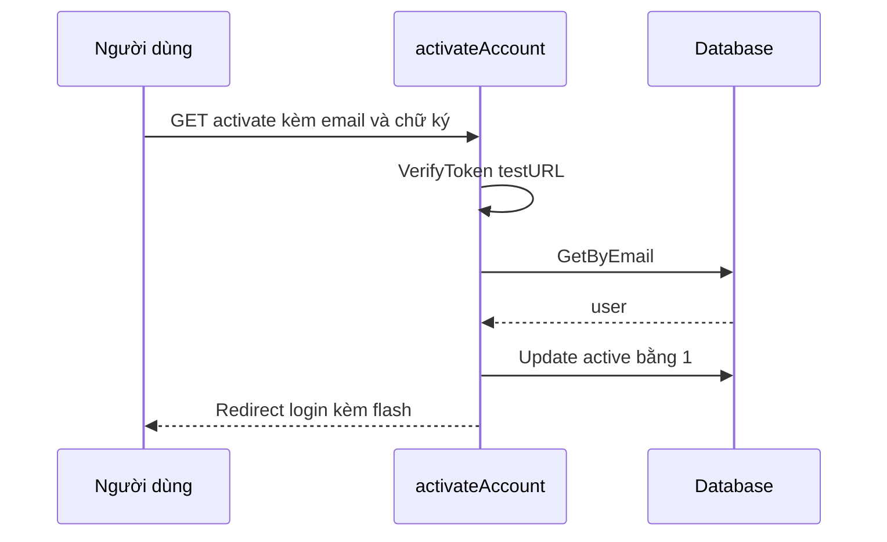

# 🔓 Kích hoạt tài khoản: xác thực chữ ký URL rồi bật user

> Nguồn: `068-Activating-a-user.txt` · [Udemy](https://ua.udemy.com/course/working-with-concurrency-in-go-golang/learn/lecture/32267744)

Bài trước chúng ta đã đăng ký được user (ở trạng thái inactive) và gửi email kích hoạt. Giờ là lúc viết **handler và route** để người dùng bấm link trong email, hệ thống xác thực rồi chuyển tài khoản sang **active**. Handler nằm ở đúng chỗ mình đã dựng sẵn stub: `activateAccount` trong `handlers.go`.

### 🧭 Một GET request, không phải form POST

Điều đầu tiên cần nhớ: đây là **GET request** — người dùng chỉ **bấm vào một link**, không gửi form. Và việc đầu tiên handler phải làm là **xác thực URL**, bởi vì ai cũng có thể gõ đại một URL lên thanh địa chỉ.

---

### 🔍 Xác thực URL trước khi làm gì khác

Mình lấy phần đuôi của request rồi dựng lại thành URL đầy đủ để đem đi kiểm tra:

```go
url := r.URL.RequestURI()
testURL := fmt.Sprintf("https://localhost%s", url)
ok := VerifyToken(testURL)
```

* `r.URL.RequestURI()` lấy đúng phần đường dẫn kèm query mà người dùng gõ vào (bao gồm cả chữ ký đã nối ở cuối).
* `https://localhost` tiếp tục được **hard-code**; bình thường bạn sẽ đọc từ biến môi trường hoặc file `.env`.
* `VerifyToken` nhận URL kèm hash và trả về `true`/`false`.

Nếu kết quả là `false`, nghĩa là **chữ ký không hợp lệ** — URL đã bị sửa hoặc không phải do mình tạo ra. Lúc đó mình đặt lỗi vào session (`invalid token`, các bạn có thể ghi gì cũng được), redirect người dùng về **trang chủ** với `http.StatusSeeOther`, rồi `return`. *Không có lý do gì để đi xa hơn ở nhánh này.*

---

### ✅ Tìm user theo email và bật active

Qua được cửa xác thực, mình tiến hành kích hoạt. Cách làm rất đơn giản: lấy user từ database, đổi `active` thành `1`, rồi lưu lại. Vì đã có địa chỉ email, mình tìm user bằng chính email lấy từ query parameter:

```go
user, err := app.models.User.GetByEmail(r.URL.Query().Get("email"))
if err != nil {
    app.session.Put(r.Context(), "error", "no user found")
    http.Redirect(w, r, "/", http.StatusSeeOther)
    return
}

user.Active = 1
err = user.Update()
```

Nếu `Update` lỗi, mình cũng đặt thông báo kiểu `unable to update user` rồi dừng lại. Còn nếu mọi thứ trôi chảy, mình đặt **flash message** *"account activated, you can now log in"* và redirect về trang **login**. Vài comment cũ còn sót trong handler sẽ được mình chuyển sang đúng handler khi làm những phần sau.

---

### 🛣️ Đổi route thành `/activate`

Bước cuối là nối route. Trong `routes.go`, mình sửa route stub cũ thành:

```go
mux.Get("/activate", app.activateAccount)
```

Tên này **khớp với URL trong email** (`https://localhost/activate?email=...`) — dễ nhớ và cũng là bước đơn giản nhất trong bài.

---

### 🧪 Bấm link trong MailHog và đăng nhập

Mình chạy `make restart`, quay lại trình duyệt, mở email kích hoạt còn nguyên trong **MailHog** và bấm *Activate your account*. Kết quả:

1. Trang hiện thông báo **"account activated, you can now log in"**.
2. Mình đăng nhập bằng tài khoản vừa đăng ký (`me@here.com` / `test`) — thành công tốt đẹp.



### 🎯 Tự kiểm tra nhanh

**Câu 1:** Vì sao handler `activateAccount` nhận GET request thay vì form POST?

<details>
<summary><b>Xem đáp án</b></summary>

**Đáp án:** Vì người dùng chỉ bấm vào link trong email, không gửi form.

Giải thích: Link trong email là một lần truy cập GET đơn giản.

Tham chiếu: Mục Một GET request, không phải form POST.

</details>

**Câu 2:** Vì sao phải gọi `VerifyToken` trước khi kích hoạt tài khoản?

<details>
<summary><b>Xem đáp án</b></summary>

**Đáp án:** Để chắc chắn URL do chính hệ thống tạo ra và không bị sửa đổi; nếu sai thì báo `invalid token` và redirect về trang chủ.

Giải thích: Đây là lớp bảo vệ chống giả mạo link kích hoạt.

Tham chiếu: Mục Xác thực URL trước khi làm gì khác.

</details>

**Câu 3:** `testURL` được dựng như thế nào?

<details>
<summary><b>Xem đáp án</b></summary>

**Đáp án:** Lấy `r.URL.RequestURI()` rồi ghép với tiền tố `https://localhost` bằng `fmt.Sprintf`.

Giải thích: Phần đường dẫn kèm query bao gồm cả chữ ký đã nối ở cuối URL.

Tham chiếu: Mục Xác thực URL trước khi làm gì khác.

</details>

**Câu 4:** Ba bước kích hoạt user trong database là gì?

<details>
<summary><b>Xem đáp án</b></summary>

**Đáp án:** Tìm user theo email bằng `GetByEmail`, đặt `Active = 1`, gọi `Update`.

Giải thích: Email được lấy từ query parameter của URL.

Tham chiếu: Mục Tìm user theo email và bật active.

</details>

**Câu 5:** Vì sao route kích hoạt phải là `/activate`?

<details>
<summary><b>Xem đáp án</b></summary>

**Đáp án:** Vì đó chính là đường dẫn nằm trong link của email đã gửi.

Giải thích: Route cũ chỉ là stub, cần sửa cho khớp với URL thực tế.

Tham chiếu: Mục Đổi route thành /activate.

</details>

Bước tiếp theo sẽ là thêm một menu item hoặc button để **user đã đăng nhập có thể subscribe vào một gói**. Việc đó cần thêm vài handler, và cũng là lúc chúng ta bắt đầu viết được code **concurrency** cho dự án này. Hẹn gặp lại các bạn! 🚀

## Nguồn tham khảo

- [net/http — StatusSeeOther](https://pkg.go.dev/net/http#StatusSeeOther)
