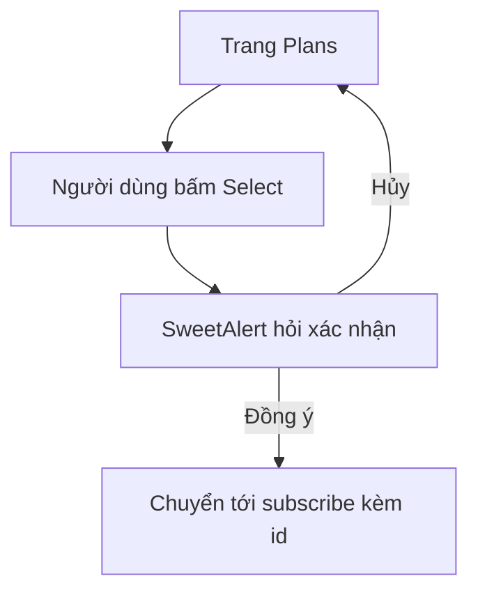

# 💳 Trang Subscription Plans: bảng ba gói và nút Select

> Nguồn: `070-Displaying-the-Subscription-Plans-page.txt` · [Udemy](https://ua.udemy.com/course/working-with-concurrency-in-go-golang/learn/lecture/32268326)

Giờ chúng ta đã tạo được tài khoản, kích hoạt và đăng nhập được — bước tiếp theo là **hiển thị danh sách các gói đăng ký** để user chọn mua. Database của mình có ba gói: **Bronze, Silver và Gold**. Bài này gồm ba phần: viết handler, dựng template, và thêm một chút JavaScript cho "đẹp đội hình".

### 🛡️ Handler chooseSubscription: chỉ dành cho người đã đăng nhập

Mình mở `handlers.go`, xuống cuối file và tạo handler mới với receiver quen thuộc `app *config`:

```go
func (app *config) chooseSubscription(w http.ResponseWriter, r *http.Request) {
```

Nguyên tắc đầu tiên: **không ai được xem trang này nếu chưa đăng nhập**. Mình hoàn toàn có thể viết middleware cho việc đó, nhưng đây là ví dụ đơn giản nên mình đặt logic ngay trong handler — kiểm tra session có key `userID` hay không:

```go
if !app.session.Exists(r.Context(), "userID") {
    app.session.Put(r.Context(), "warning", "you must log in to see this page")
    http.Redirect(w, r, "/login", http.StatusTemporaryRedirect)
    return
}
```

Chưa đăng nhập thì mình đặt một **warning** vào session, redirect về trang login với `http.StatusTemporaryRedirect`, rồi `return`. Qua được cửa này nghĩa là user đã đăng nhập — hiển thị trang thôi.

---

### 📦 Lấy danh sách plans từ database

Trong package `data` đã có sẵn cách lấy toàn bộ gói: `GetAll`. Mình gọi và kiểm tra lỗi:

```go
plans, err := app.models.Plan.GetAll()
if err != nil {
    app.errorLog.Println(err)
    return
}
```

Nếu lỗi, có thể là do kết nối database có vấn đề. Mình chỉ log ra rồi `return` — *các bạn có thể hiển thị một trang lỗi tử tế hơn, mình để phần đó như bài tập cho các bạn.*

---

### 🧾 Truyền plans vào template

Template cần một bảng để vẽ các gói, nên mình tạo một `map` dữ liệu và nhét `plans` vào:

```go
dataMap := make(map[string]any)
dataMap["plans"] = plans

app.render(w, r, "plans.page.gohtml", &templateData{Data: dataMap})
```

`make(map[string]any)` — key là `string`, value là `any`, chứa gì cũng được. Sau đó render template `plans.page.gohtml` (chưa tồn tại, mình làm ngay sau đây) và truyền vào một `templateData` với `Data` là map vừa tạo.

---

### 🖼️ Dựng plans.page.gohtml với bảng Bootstrap

Trong `cmd/web/templates`, mình tạo file `plans.page.gohtml`. Để tiết kiệm thời gian, mình **copy nội dung trang home** rồi sửa: đổi title thành *plans* và xóa hết phần nội dung cũ, chỉ giữ lại khung.

Phần thân trang là một bảng với các class `table table-compact table-striped`, gồm header ba cột **Plan / Price / Select** (căn giữa bằng `text-center`), và body range qua đúng key `plans` mà mình đã đặt trong handler:

```html
<tbody>
    {{ range .Data.plans }}
    <tr>
        <td>{{ .PlanName }}</td>
        <td class="text-center">{{ .PlanAmountFormatted }}</td>
        <td class="text-center">
            <a href="#!" class="btn btn-primary btn-sm"
               onclick="selectPlan({{ .ID }}, '{{ .PlanName }}')">Select</a>
        </td>
    </tr>
    {{ end }}
</tbody>
```

Hai điểm thú vị trong bảng:

* `.PlanAmountFormatted` lấy từ database — ví dụ Bronze lưu **1000 cents**, hàm định dạng sẽ đổi thành **$10.00**, đúng kiểu người dùng mong đợi nhìn thấy.
* Cột Select là một **button Bootstrap** (`btn btn-primary btn-sm` — xanh, nhỏ, dễ thấy) với `href="#!"` và một **onclick handler** gọi hàm `selectPlan`, truyền vào **ID của gói** và **tên gói** (đặt trong dấu nháy đơn để hiện lên hộp thoại xác nhận).

---

### 🍬 SweetAlert2 và hàm selectPlan

Khi người dùng bấm Select, mình muốn hiện một **dialog xác nhận** với hai nút Select và Cancel. Để làm nhanh và đẹp, mình cài thư viện **SweetAlert2**:

1. Mở trình duyệt, tìm *SweetAlert2* — link cũng có sẵn trong course resources của bài giảng.
2. Vào **jsDelivr**, tìm `sweetalert2` và chọn file `sweetalert2 all.min.js`.
3. Bấm *Show and configure all links*, chọn link dạng **JS** rồi copy vào clipboard.
4. Quay lại template, dán thẻ `<script src="...">` đó **ngay trước thẻ script đang mở**.

Giờ là hàm xử lý — nhận hai tham số `x` (ID gói) và `plan` (tên gói):

```javascript
function selectPlan(x, plan) {
    Swal.fire({
        title: 'Subscribe',
        html: 'Are you sure you want to subscribe to the ' + plan + '?',
        showCancelButton: true,
        confirmButtonText: 'Subscribe',
    }).then((result) => {
        if (result.isConfirmed) {
            window.location.href = '/subscribe?id=' + x;
        }
    });
}
```

* `Swal.fire` mở dialog với tiêu đề **Subscribe**, nội dung hỏi *"Are you sure you want to subscribe to the ...?"*, bật nút Cancel và đổi chữ nút xác nhận thành **Subscribe**.
* `.then((result) => ...)` nhận kết quả; nếu `result.isConfirmed` là `true` (do SweetAlert2 cung cấp), mình chuyển hướng tới `/subscribe?id=` kèm ID gói.
* Dòng chuyển hướng hiện đang được **comment lại**, vì route `/subscribe` chưa tồn tại — mình sẽ bật nó ở bài sau.



### 🎯 Tự kiểm tra nhanh

**Câu 1:** Vì sao handler kiểm tra session `userID` ngay từ đầu?

<details>
<summary><b>Xem đáp án</b></summary>

**Đáp án:** Để đảm bảo chỉ người đã đăng nhập mới xem được trang; người chưa đăng nhập bị đặt warning và redirect về trang login.

Giải thích: Có thể viết middleware, nhưng ví dụ đơn giản nên logic nằm ngay trong handler.

Tham chiếu: Mục Handler chooseSubscription.

</details>

**Câu 2:** Danh sách plans được lấy bằng cách nào?

<details>
<summary><b>Xem đáp án</b></summary>

**Đáp án:** Gọi `app.models.Plan.GetAll()` và kiểm tra lỗi; lỗi thì log và dừng.

Giải thích: `GetAll` là phương thức có sẵn trong package `data`.

Tham chiếu: Mục Lấy danh sách plans từ database.

</details>

**Câu 3:** Vì sao dùng `make(map[string]any)` và key `plans`?

<details>
<summary><b>Xem đáp án</b></summary>

**Đáp án:** Để truyền plans sang template qua `Data`; template sẽ range đúng theo key `plans`.

Giải thích: `any` cho phép map chứa bất kỳ giá trị nào.

Tham chiếu: Mục Truyền plans vào template.

</details>

**Câu 4:** SweetAlert2 được dùng để làm gì trong trang Plans?

<details>
<summary><b>Xem đáp án</b></summary>

**Đáp án:** Hiện dialog xác nhận Subscribe/Cancel trước khi chuyển hướng người dùng.

Giải thích: Hàm `selectPlan` gọi `Swal.fire` với tiêu đề, nội dung, nút Cancel và chữ nút xác nhận.

Tham chiếu: Mục SweetAlert2 và hàm selectPlan.

</details>

**Câu 5:** Nút Select truyền những gì cho hàm JavaScript?

<details>
<summary><b>Xem đáp án</b></summary>

**Đáp án:** ID của gói và tên gói.

Giải thích: Tên gói để hiện trong dialog; ID để sau này chuyển hướng tới `/subscribe?id=<id>`.

Tham chiếu: Mục Dựng plans.page.gohtml và Mục SweetAlert2.

</details>

Vậy là handler và template đã xong. Trong bài tiếp theo, mình sẽ **nối route** và thử nghiệm toàn bộ trang Plans xem có render đúng như mình nghĩ không. Hẹn gặp lại các bạn! 🚀

## Nguồn tham khảo

- [SweetAlert2 — beautiful, accessible JavaScript popup boxes](https://sweetalert2.github.io/)
- [Bootstrap 5.1 — Tables](https://getbootstrap.com/docs/5.1/content/tables/)
