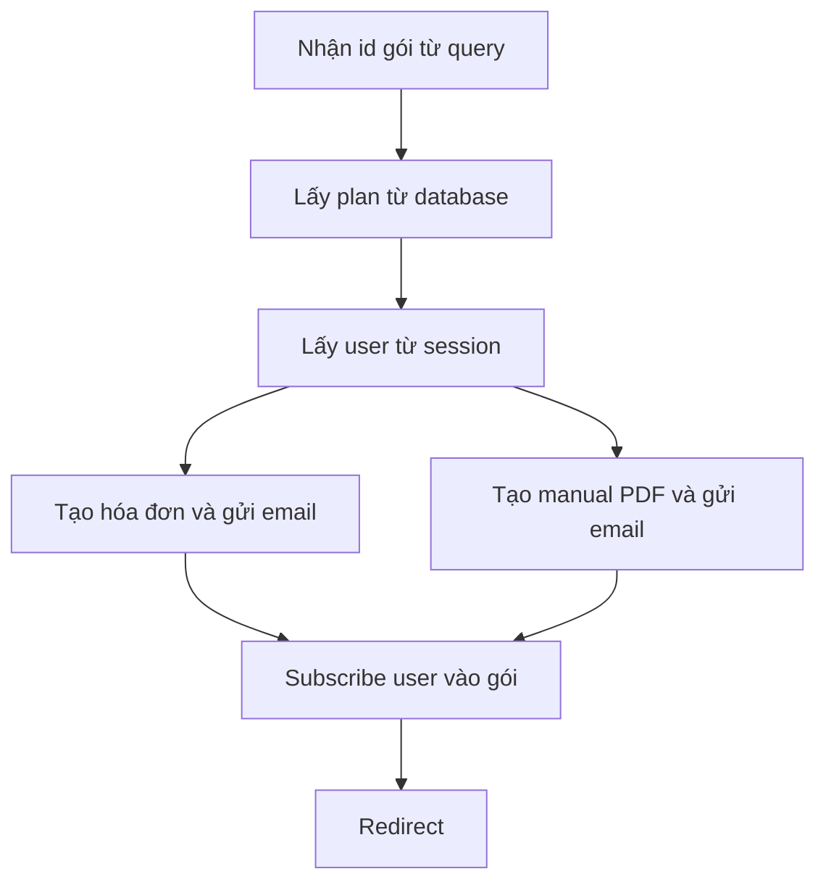

# 🧩 Stub handler `subscribeToPlan`: bản đồ cho section tiếp theo

> Nguồn: `072-Writing-a-stub-handler-for-choosing-a-plan.txt` · [Udemy](https://ua.udemy.com/course/working-with-concurrency-in-go-golang/learn/lecture/32269102)

Bước tiếp theo trong dự án là **route và handler cho việc subscribe vào một gói**. Bài này chưa viết logic thật — mình chỉ dựng một **stub handler với đầy đủ comment** để vẽ ra "bản đồ" những việc cần làm. Nghe có vẻ ít ỏi, nhưng đây chính là bước quan trọng nhất: khi các bước đã rõ ràng, chúng ta mới thấy được **chỗ nào nên chạy concurrent**.

### 🔓 Mở lại dòng chuyển hướng và nối route `/subscribe`

Trong `plans.page.gohtml`, dòng chuyển hướng mình comment lại từ bài trước giờ được **bật lên** — vì trong vài phút nữa nó sẽ có đích đến thật. URL mà nút Select hướng tới là `/subscribe`.

Trong `routes.go`, mình thêm route:

```go
mux.Get("/subscribe", app.subscribeToPlan)
```

Handler `subscribeToPlan` chưa tồn tại — mình tạo stub cho nó ngay bây giờ, với receiver `app *config` và hai tham số response writer, request như mọi handler khác.

---

### 🗺️ Các bước handler sẽ làm

Mình đặt comment cho từng bước để lát nữa "đổ" code vào:

1. **Lấy ID của gói được chọn** — ID này đến dưới dạng **query parameter tên `id`**.
2. **Lấy plan từ database** — vì mình cần biết một vài thông tin về gói đó.
3. **Lấy user từ session** — vậy là mình đã biết: user là ai, và họ chọn gói nào.

Tiếp theo là những việc nặng đô hơn:

4. **Tạo hóa đơn (invoice)**.
5. **Gửi email kèm hóa đơn đính kèm**.
6. **Tạo manual** — mình giả định rằng mua gói Gold sẽ được nhận một **manual dạng PDF tùy biến** gửi qua email. Mình sẽ làm một bản đơn giản thôi, vì *cầu kỳ một tài liệu hoàn chỉnh cho một dịch vụ không tồn tại thì đâu có cần thiết* — miễn là PDF có thông tin tùy biến bên trong.
7. **Gửi email kèm manual đính kèm**.
8. **Subscribe user vào gói** (ghi vào bảng `user_plans`).
9. **Redirect** người dùng đi tiếp.



---

### ⚡ Việc nào tuần tự, việc nào chạy nền

Nhìn vào bản đồ trên, các bạn sẽ thấy có hai nhóm công việc rõ rệt:

* **Chạy tuần tự (sequential):** lấy ID gói, lấy plan, lấy user — toàn là thao tác nhanh, làm ngay được.
* **Nên chạy nền (background/concurrent):** tạo hóa đơn, gửi email kèm hóa đơn, tạo manual, gửi email kèm manual. Đây đều là những việc **tốn thời gian** — đúng kiểu để goroutine "gánh".

Và đó chính là công việc của section tiếp theo: biến những bước trong stub này thành code chạy **đồng thời**, để người dùng không phải ngồi chờ hóa đơn, PDF và email xử lý xong mới thấy phản hồi.

### 🎯 Tự kiểm tra nhanh

**Câu 1:** Route và handler mới được thêm trong bài là gì?

<details>
<summary><b>Xem đáp án</b></summary>

**Đáp án:** Route `/subscribe` trỏ tới handler `subscribeToPlan`.

Giải thích: Dòng chuyển hướng trong `plans.page.gohtml` được bật lại để hướng tới route này.

Tham chiếu: Mục Mở lại dòng chuyển hướng và nối route.

</details>

**Câu 2:** ID của gói được chọn đến từ đâu?

<details>
<summary><b>Xem đáp án</b></summary>

**Đáp án:** Từ query parameter tên `id`.

Giải thích: Đây là bước đầu tiên được ghi trong stub handler.

Tham chiếu: Mục Các bước handler sẽ làm.

</details>

**Câu 3:** Những việc nào trong handler nên chạy trong nền?

<details>
<summary><b>Xem đáp án</b></summary>

**Đáp án:** Tạo hóa đơn, gửi email kèm hóa đơn, tạo manual, gửi email kèm manual.

Giải thích: Đây là các việc tốn thời gian, còn lấy ID/plan/user thì làm tuần tự ngay được.

Tham chiếu: Mục Việc nào tuần tự, việc nào chạy nền.

</details>

**Câu 4:** Manual được hiểu như thế nào trong dự án này?

<details>
<summary><b>Xem đáp án</b></summary>

**Đáp án:** Một PDF tùy biến gửi kèm email (ví dụ khi mua gói Gold), làm đơn giản vì dịch vụ chỉ là giả định.

Giải thích: Mục tiêu là tạo một PDF có thông tin tùy biến, không cần format cầu kỳ.

Tham chiếu: Mục Các bước handler sẽ làm.

</details>

**Câu 5:** Vì sao bài này chỉ viết comment mà chưa viết logic?

<details>
<summary><b>Xem đáp án</b></summary>

**Đáp án:** Để xác định rõ các bước và nhận diện phần việc nào nên chạy concurrent trước khi viết code.

Giải thích: Stub handler là bản đồ cho section "Adding Concurrency to Choosing a Plan" tiếp theo.

Tham chiếu: Đoạn mở bài và đoạn kết.

</details>

Vậy là stub đã sẵn sàng làm giá đỡ. Hẹn gặp lại các bạn ở bài tiếp theo — nơi concurrency chính thức quay trở lại với dự án! 🚀
