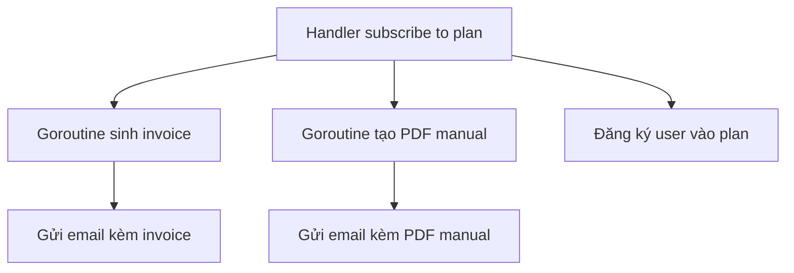

# 🚀 Đưa concurrency vào luồng subscribe: hóa đơn, PDF manual và đăng ký gói cùng chạy nền

> Nguồn: `073-What-well-cover-in-this-section.txt` · [Udemy](https://ua.udemy.com/course/working-with-concurrency-in-go-golang/learn/lecture/32252614)

Section trước chúng ta đã dựng xong trang plans và một handler "khung xương" cho việc chọn gói. Sang section này, mình và các bạn sẽ làm cho nó chạy thật — tức là lúc người dùng bấm **Subscribe** — và đây cũng chính là chỗ chúng ta đưa **concurrency thực chiến** vào codebase, chứ không chỉ một câu lệnh `go` đơn lẻ như mấy bài đầu. Các bạn cứ thong thả, mình đi từng bước một.

### 🧭 Nối tiếp đúng chỗ đang dang dở

Chúng ta tiếp tục với chính đoạn code của section trước, không viết lại từ đầu. Phần còn thiếu là các handler **cho phép người dùng đăng ký một gói (subscribe to a plan)** — hiện tại chúng mới chỉ là các bước được ghi chú trong handler mà thôi. Đến đây thì mọi thứ đã đủ chín để mình thêm vào những đoạn concurrency "xịn" hơn hẳn.

### ⚙️ Handler sẽ "bắn" ra vài goroutine chạy nền

Cụ thể, mình sẽ viết một handler bắn ra **một vài goroutine** (luồng chạy nhẹ, do Go quản lý) cùng lúc:

* **Goroutine thứ nhất — sinh hóa đơn.** Ở đây mình chỉ viết một hàm stub (khung giả) tạo ra một hóa đơn "đồ chơi" thôi, vì chuyện hóa đơn thật sự không phải trọng tâm của khóa học. Điều quan trọng là nó **chạy trong nền**.
* **Goroutine thứ hai — tạo PDF manual.** Mình giả định rằng khi các bạn mua một gói dịch vụ, các bạn sẽ nhận được một **user manual (sách hướng dẫn)** được cá nhân hóa dưới dạng PDF gửi kèm email. Công việc của goroutine này là: mở một file PDF có sẵn, sửa nội dung bên trong, lưu lại, rồi gửi tới người dùng như một **attachment (tệp đính kèm)**.
* Điểm mấu chốt: hai goroutine này **chạy đồng thời**, không phải cái này xong mới tới cái kia.

### 🧾 Và tất nhiên: đăng ký gói cho người dùng

Song song với mấy việc "nặng" kia, chúng ta vẫn phải **subscribe user vào plan** trong database — đây là việc nhẹ, làm ngay được, nhưng cũng cần được đặt đúng chỗ trong luồng xử lý để trang web phản hồi mượt mà.

*À, mình biết là mới nhìn thì hơi rối: vừa goroutine, vừa email, vừa update database. Nhưng đừng lo, mình sẽ tách từng miếng nhỏ ra, bài nào việc nấy. Cứ chạy theo mình, sai cũng không sao cả.*

Vậy là bức tranh đã rõ: một handler, hai goroutine chạy nền, một lần subscribe, và kết quả là hai email bay tới hộp thư của người dùng. Giờ thì bắt tay vào việc đầu tiên — dọn dẹp chuyện bảo vệ trang bằng middleware cho gọn gàng. Hẹn gặp lại các bạn ở bài tiếp theo! 🚀
