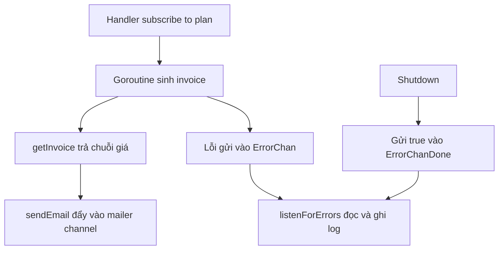

# 🧾 Sinh hóa đơn chạy nền: WaitGroup, "tổng đài" bắt lỗi và hai template mới

> Nguồn: `075-Generating-an-Invoice.txt` · [Udemy](https://ua.udemy.com/course/working-with-concurrency-in-go-golang/learn/lecture/32293574)

Bước tiếp theo trong luồng subscribe là **sinh hóa đơn (invoice)** và gửi cho người vừa mua gói. Ở môi trường production thật, mình sẽ phải tính thuế, xử lý đủ thứ giấy tờ lằng nhằng — nhưng trong khóa học này mình chỉ **mô phỏng** thôi. Dù vậy, mình vẫn viết code theo đúng khung mà các bạn có thể gặp ngoài đời: biết đâu sau này chỗ đó sẽ là một service xuất hóa đơn thật. Nào, bắt đầu bằng việc cho nó chạy nền.

### ⚙️ Goroutine đầu tiên: cộng WaitGroup rồi `go`

Muốn một việc chạy nền, việc đầu tiên luôn là báo cho chương trình biết "còn việc đang chạy" — mình cộng một vào **WaitGroup** nằm trong config:

```go
app.Wait.Add(1)
go func() {
	defer app.Wait.Done()

	invoice, err := app.getInvoice(user, plan)
	if err != nil {
		app.ErrorChan <- err
	}

	msg := Message{
		To:       user.Email,
		Subject:  "Your invoice",
		Data:     invoice,
		Template: "invoice",
	}
	app.sendEmail(msg)
}()
```

Mình tạo một **hàm ẩn danh (inline function)** rồi cho nó chạy bằng từ khóa `go`, và nhớ **`defer app.Wait.Done()`** để trả lại "phiếu" cho WaitGroup khi xong việc. Bên trong, mình gọi `app.getInvoice` — hàm này chưa tồn tại, mình viết ngay lát nữa.

### 📡 Lỗi trong goroutine thì gửi đi đâu? Làm cái "tổng đài"!

Đây là chỗ rất đáng nói. Khi code chạy trong goroutine mà gặp lỗi, mình **không có cách nào trả error về** như hàm thường. Giải pháp: gửi nó vào một **channel (kênh)**. Và thay vì tạo channel lắt nhắt, mình tập trung chúng ở `config.go`:

```go
ErrorChan     chan error
ErrorChanDone chan bool
```

Rồi khởi tạo một lần trong `main.go` bằng `make(chan error)` và `make(chan bool)`. Tiếp theo là hàm lắng nghe lỗi — cũng viết trong `main.go`:

```go
func (app *Config) listenForErrors() {
	for {
		select {
		case err := <-app.ErrorChan:
			app.errorLog.Println(err)
		case <-app.ErrorChanDone:
			return
		}
	}
}
```

Một vòng `for` vô tận, bên trong là `select` ngồi chờ đúng hai trường hợp: có lỗi gửi tới thì ghi log; nhận tín hiệu "xong" từ `ErrorChanDone` thì thoát hàm. Ngoài đời các bạn có thể thay `Println` bằng gửi tin nhắn Slack, gửi SMS, hay ghi vào database — tùy nhu cầu. Mình khởi động nó bằng `go app.listenForErrors()`.

Còn khi **tắt ứng dụng**, mình cũng phải dọn dẹp cho đàng hoàng: gửi `true` vào `ErrorChanDone`, rồi đóng cả hai channel bằng `close`.



### 💌 Hàm `getInvoice`, Message và hai template

Quay lại handler, mình thay chỗ trống bằng `app.ErrorChan <- err` để báo lỗi về "tổng đài". Rồi viết hàm sinh hóa đơn — một hàm giả lập cực gọn:

```go
func (app *Config) getInvoice(user data.User, plan *data.Plan) (string, error) {
	return plan.PlanAmountFormatted, nil
}
```

Hàm nhận **user** và **con trỏ tới plan**, trả về chuỗi và error. Ở đây mình chỉ trả về **giá đã được format sẵn** của gói (`PlanAmountFormatted`) — ngoài đời đây sẽ là chỗ các bạn làm đủ thứ tính toán và bắt lỗi.

Tiếp theo, mình đóng gói email bằng struct `Message`: `To` là email người dùng, `Subject` là `"Your invoice"`, `Data` là chuỗi hóa đơn, và `Template` chỉ định template tùy biến — chính là `"invoice"` — thay vì template mặc định. Xong thì gọi `app.sendEmail(msg)`; các bạn nhớ lại bài trước, helper này tự cộng WaitGroup và đẩy message vào channel của mailer giúp mình.

Còn hai template thì rất nhẹ nhàng: trong thư mục `templates`, mình tạo `invoice.html.gohtml` và `invoice.plain.gohtml` bằng cách **copy** từ `mail.html.gohtml` và `mail.plain.gohtml`, rồi sửa lời thành `Your invoice` kèm giá tiền. *Các bạn nhớ gõ tên file cho đúng đấy nhé, sai một ký tự là template không render được đâu.*

### 🎯 Tự kiểm tra nhanh

**Câu 1:** Vì sao trước khi `go` một hàm phải gọi `app.Wait.Add(1)`?

<details>
<summary><b>Xem đáp án</b></summary>

**Đáp án:** Để WaitGroup biết có thêm một việc đang chạy, còn `defer app.Wait.Done()` sẽ trả lại khi việc xong.

Giải thích: Nếu không cộng/trừ đúng, chương trình sẽ chờ nhầm hoặc thoát sớm.

Tham chiếu: Mục Goroutine đầu tiên.

</details>

**Câu 2:** Vì sao lỗi phát sinh trong goroutine không thể xử lý như hàm thường?

<details>
<summary><b>Xem đáp án</b></summary>

**Đáp án:** Vì nó chạy nền, không có chỗ nhận giá trị `return` — nên phải gửi qua channel.

Giải thích: Trong bài này, lỗi được đẩy vào `ErrorChan` để "tổng đài" xử lý.

Tham chiếu: Mục Lỗi trong goroutine thì gửi đi đâu.

</details>

**Câu 3:** Hai channel mới trong config dùng để làm gì?

<details>
<summary><b>Xem đáp án</b></summary>

**Đáp án:** `ErrorChan` nhận lỗi từ khắp nơi trong ứng dụng; `ErrorChanDone` báo cho hàm lắng nghe dừng lại.

Giải thích: Cả hai được khởi tạo trong `main.go` và đóng lại trong lúc shutdown.

Tham chiếu: Mục Lỗi trong goroutine thì gửi đi đâu.

</details>

**Câu 4:** `listenForErrors` chạy theo cơ chế nào?

<details>
<summary><b>Xem đáp án</b></summary>

**Đáp án:** Vòng `for` vô tận với `select`: nhận lỗi từ `ErrorChan` thì ghi log, nhận từ `ErrorChanDone` thì `return`. Nó được khởi động bằng `go app.listenForErrors()`.

Giải thích: Đây là một goroutine thường trú, chỉ kết thúc khi ứng dụng tắt.

Tham chiếu: Mục Lỗi trong goroutine thì gửi đi đâu.

</details>

**Câu 5:** `getInvoice` trả về gì và hai template mới tên là gì?

<details>
<summary><b>Xem đáp án</b></summary>

**Đáp án:** `getInvoice` trả về chuỗi `plan.PlanAmountFormatted` cùng error `nil`; hai template là `invoice.html.gohtml` và `invoice.plain.gohtml`, copy từ cặp `mail.html.gohtml` / `mail.plain.gohtml`.

Giải thích: Hàm này chỉ là bản giả lập; bản thật sẽ có nhiều phép tính và bắt lỗi hơn.

Tham chiếu: Mục Hàm getInvoice, Message và hai template.

</details>

Vậy là hóa đơn đã có thể bay đi, kèm một "tổng đài" bắt lỗi dùng chung cho cả ứng dụng. Việc còn lại — và là phần khó nhằn hơn một chút — là **sinh PDF manual** rồi gửi kèm cho người dùng. Hẹn gặp lại các bạn ở bài tiếp theo! 🚀
