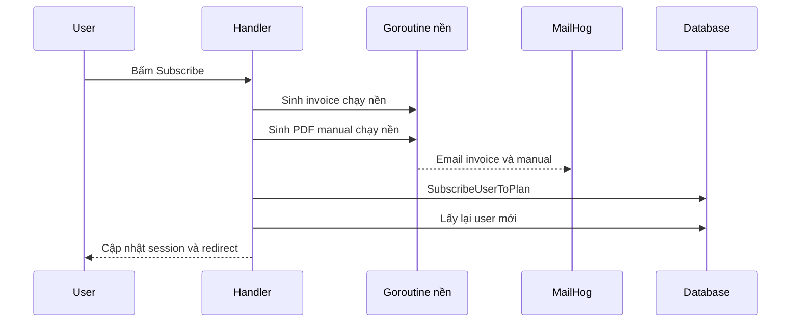

# 🕵️ Chạy thử & săn bug: hóa đơn "mất" $20, PDF thiếu tên và cú subscribe hoàn chỉnh

> Nguồn: `077-Trying-things-out-subscribing-a-user-updating-the-session-an.txt` · [Udemy](https://ua.udemy.com/course/working-with-concurrency-in-go-golang/learn/lecture/32293812)

Chúng ta đã viết thêm kha khá code kể từ lần chạy thử gần nhất, nên hôm nay mình sẽ bật ứng dụng lên, quan sát hai email bay ra và… truy tìm lỗi. Thú thật với các bạn: mình khá chắc là sẽ có gì đó sai, và đúng là có thật. Nhưng cứ bình tĩnh, mình đi từng bước, tìm bug bằng log và sửa gọn gàng.

### 🚀 Lần chạy thử đầu tiên: hóa đơn tới ngay, manual tới sau vài giây

Docker vẫn đang chạy, mình gõ `make start` để build và khởi động ứng dụng. Vào `localhost`, mình đăng nhập bằng tài khoản admin (`admin@example.com` với mật khẩu `verysecret`), rồi mở trang plans. Trước đó mình đã tự tay thêm một gói bronze vào database, giờ thử "đổi" sang silver.

Trang này **chưa lưu thay đổi đâu** — phần đó mình chưa làm — nhưng hy vọng nó vẫn bắn ra hai email: một chiếc hóa đơn bay tới rất nhanh, và một chiếc manual tới trễ vài giây vì cái `time.Sleep` mà mình cố tình đặt. Mình bấm **Select**, xác nhận **Subscribe**, rồi sang **MailHog**:

* Hóa đơn đã tới — nhưng **không có số tiền nào cả**. Có gì đó sai rồi.
* Manual cũng tới kèm file PDF tên đẹp, nhưng trong đó cũng **thiếu mất một thứ**.

Ừm, hai lỗi. Đi tìm từng cái một.

### 🕵️ Bug #1: hóa đơn "mất" số tiền

Mình quay lại `handlers.go` và nghĩ: chắc gì `plan` đã được lấy đúng? Thêm một dòng log cho chắc:

```go
log.Println("Plan ID:", planID)
```

và kiểm tra error đàng hoàng: nếu lỗi thì `app.errorLog.Println("Error getting plan:", err)`. *Mỗi lần mình tự nhủ "chắc không cần check error đâu", thể nào mình cũng hối hận — hầu như lần nào cũng vậy.*

Sau khi `make restart`, mình thấy một tin vui: lỗi test mình gửi ở bài trước đã chạy qua **centralized error channel** của ứng dụng — "tổng đài" bắt lỗi hoạt động tốt. Rồi bấm subscribe lại, console in ra `Plan ID: 1` và không có lỗi. Vậy plan lấy được.

Mình thêm log trong `getInvoice` để xem giá tiền đang là gì. Chạy lại, kết quả: **"Amount is nothing"**. À, ra rồi — khi lấy plan theo ID từ model, mình **quên populate trường `PlanAmountFormatted`**. Trường này tồn tại trong struct, chỉ là mình chưa gán giá trị cho nó. Mình sửa bằng cách gán nó từ `AmountForDisplay`, restart, chọn silver, subscribe lại:

* Console in ra `$20`.
* MailHog: hóa đơn mới nhất hiển thị `$20`. Hoàn hảo.

### 🕵️ Bug #2: PDF manual thiếu tên gói

Lỗi thứ hai tinh vi hơn. Mình mở email manual, xem phần **mime** của file đính kèm và thấy thông tin bị thiếu. Lần theo chỗ gọi `generateManual` trong handler, mình nhận ra dòng chữ `"%s User Guide"` **chưa có giá trị thay thế** cho `%s` — mình quên điền tên gói vào đó. Bổ sung `plan.PlanName` là xong.

Restart, xóa sạch message trong MailHog cho dễ nhìn, rồi subscribe silver một lần nữa. Mở file PDF mới ra kiểm tra:

* Tên người dùng — có.
* `Silver Plan` — có.
* `User Guide` — có.

Vậy là cả hai email đều đúng nội dung. Giờ chỉ còn thiếu đúng một việc: đăng ký gói thật cho người dùng.

### 📝 Subscribe user thật và cập nhật lại session

Việc đăng ký hóa ra rất nhẹ nhàng — gọi model là xong:

```go
err = app.Models.Plan.SubscribeUserToPlan(user, *plan)
if err != nil {
	app.errorLog.Println(err)
	app.Session.Put(r.Context(), "error", "Error subscribing to plan.")
	http.Redirect(w, r, "/members/plans", http.StatusTemporaryRedirect)
	return
}

user, err = app.Models.User.GetOne(user.ID)
if err != nil {
	app.errorLog.Println(err)
}
app.Session.Put(r.Context(), "user", user)
```

Để ý chỗ mình truyền `*plan` — hàm cần giá trị plan, nên mình "mở" con trỏ ra bằng dấu `*`. Nếu đăng ký lỗi thì báo về trang plans như thường lệ.

Nhưng còn một cái bẫy nữa mà các bạn rất dễ quên: **user trong session vẫn đang giữ plan cũ**. Mình thay gói ở database rồi, còn bản user lưu trong session thì chưa. Nên mình phải lấy một bản user mới tinh từ database bằng `app.Models.User.GetOne(user.ID)`, rồi `app.Session.Put` đè lại vào session. À, mình lấy ID từ chính user trong session — ID thì không đổi, chỉ có thông tin gói là thay thôi.

Cuối cùng là flash message `"Subscribed"` và redirect về `/members/plans` với `http.StatusSeeOther` (đã đặt từ bài trước). Restart lần nữa, vào MailHog xóa hết message, reload trang plans: mình đang ở gói **bronze**. Bấm chọn **silver**, subscribe, trang tự refresh — và **silver trở thành "current plan"**, còn bronze hiện nút select. Chạy ngon lành!

### 🧠 Vì sao tách hai goroutine thay vì gộp một?

Có thể các bạn đã thắc mắc: trong handler, mình bắn ra **hai goroutine riêng**, mỗi goroutine lại bắn tiếp một goroutine nữa khi gửi email — sao không gom tất cả vào một chỗ cho gọn?

Lý do rất đơn giản: gộp lại thì chúng chạy **tuần tự**. Mình sẽ phải sinh xong hóa đơn mới bắt đầu sinh manual, trong khi tách ra thì cả hai **chạy đồng thời**. Với code đồ chơi này thì chẳng nhanh chậm gì mấy, nhưng ngoài đời, một hóa đơn có thể mất vài giây, còn một PDF phức tạp có thể mất rất lâu — ví dụ manual cho một API cần chèn ví dụ code khớp đúng API key của từng người dùng. Lúc đó, chạy song song tiết kiệm được kha khá thời gian.

Trường hợp **duy nhất** mình buộc phải gộp là khi goroutine thứ hai cần dữ liệu do goroutine thứ nhất tạo ra. Ở đây thì không: cả hóa đơn lẫn manual đều chỉ cần user và plan, nên tách ra vô tư.



### 🎯 Tự kiểm tra nhanh

**Câu 1:** Vì sao hóa đơn lúc đầu không có số tiền?

<details>
<summary><b>Xem đáp án</b></summary>

**Đáp án:** Vì hàm lấy plan theo ID trong model không populate trường `PlanAmountFormatted`.

Giải thích: Trường này có trong struct nhưng bị bỏ trống, nên hóa đơn in ra chuỗi rỗng; sửa bằng cách gán từ `AmountForDisplay`.

Tham chiếu: Mục Bug #1.

</details>

**Câu 2:** PDF manual thiếu gì và được sửa thế nào?

<details>
<summary><b>Xem đáp án</b></summary>

**Đáp án:** Chuỗi format `"%s User Guide"` chưa có giá trị thay thế; bổ sung `plan.PlanName` là xong.

Giải thích: Sau khi sửa, file PDF hiện đúng tên người dùng và tên gói.

Tham chiếu: Mục Bug #2.

</details>

**Câu 3:** Sau khi subscribe thành công, vì sao phải lấy lại user từ database và `Put` vào session?

<details>
<summary><b>Xem đáp án</b></summary>

**Đáp án:** Vì user trong session vẫn đang giữ thông tin plan cũ; phải cập nhật bản mới để trang plans hiển thị đúng gói hiện tại.

Giải thích: Dữ liệu hiển thị trên trang lấy từ session, nên session cũ sẽ khiến giao diện "tụt hậu".

Tham chiếu: Mục Subscribe user thật và cập nhật lại session.

</details>

**Câu 4:** Vì sao tách hóa đơn và manual thành hai goroutine thay vì một?

<details>
<summary><b>Xem đáp án</b></summary>

**Đáp án:** Để hai việc chạy đồng thời; nếu gộp lại chúng sẽ chạy tuần tự, hóa đơn xong mới tới manual.

Giải thích: Chỉ cần gộp khi goroutine sau cần dữ liệu của goroutine trước — ở đây cả hai chỉ cần user và plan.

Tham chiếu: Mục Vì sao tách hai goroutine.

</details>

**Câu 5:** Sau tất cả, làm sao biết mọi thứ đã chạy đúng?

<details>
<summary><b>Xem đáp án</b></summary>

**Đáp án:** MailHog có hóa đơn `$20` và manual đính kèm đúng tên; trang plans hiển thị silver là current plan và bronze có nút select.

Giải thích: Cả hai email đều đến, và dữ liệu session được cập nhật nên giao diện phản ánh đúng gói mới.

Tham chiếu: Mục Subscribe user thật và cập nhật lại session.

</details>

Vậy là chúng ta đã áp concurrency vào một ứng dụng "gần thực tế": hai goroutine chạy nền, một tổng đài bắt lỗi, và một luồng subscribe trả kết quả gọn gàng. Hy vọng các bạn thấy việc săn bug bằng log không hề đáng sợ chút nào. Hẹn gặp lại các bạn ở section tiếp theo — **Testing** — nơi chúng ta sẽ kiểm tra code một cách nghiêm túc hơn! 🚀
