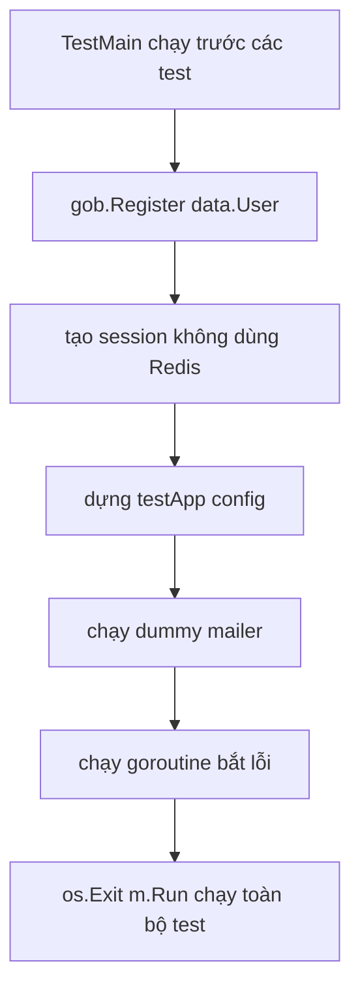

# 🛠️ Dựng môi trường test: setup_test.go và "cỗ máy" TestMain

> Nguồn: `079-Setting-up-our-tests.txt` · [Udemy](https://ua.udemy.com/course/working-with-concurrency-in-go-golang/learn/lecture/32293894)

Trước khi viết test thật, chúng ta hãy làm cho cuộc đời nhẹ nhàng hơn một chút bằng cách **dựng môi trường test**. Hồi đầu khóa, khi test các bài toán kinh điển như Dining Philosophers hay Sleeping Barber, mình không cần tới bước này. Nhưng đây là một **web application** — mà test web app thì phải "nhân bản" môi trường mà các thành phần của ứng dụng chạy trong đó, đặc biệt là với các handler. Các bạn yên tâm, nó đơn giản hơn tên gọi rất nhiều.

### 🤔 Vì sao web app cần môi trường test riêng?

Khi test một hàm thuần túy, mình chỉ cần gọi nó và kiểm tra kết quả. Nhưng handler của web app thì sống trong một hệ sinh thái: có **session**, có **logger**, có **WaitGroup**, có **channel của mailer**, có **error channel**... Thiếu bất kỳ mảnh nào, handler cũng chạy sai hoặc panic ngay. Vì vậy, thay vì lặp đi lặp lại việc dựng đống đó trong từng test, mình dựng **một lần** trong file setup, rồi mọi test dùng chung.

---

### 📄 Tạo `setup_test.go` với hàm TestMain

Trong thư mục `cmd/web`, mình tạo file mới với tên bắt buộc: **`setup_test.go`**. File này sẽ chạy **trước** các test thật và lo phần dựng cảnh. Nó nằm trong `package main`, và mình khai báo một biến `testApp` kiểu `config` — chính là "app" dành riêng cho test:

```go
var testApp config

func TestMain(m *testing.M) {
	gob.Register(data.User{})

	session := scs.New()

	testApp = config{
		session:   session,
		DB:        nil,
		infoLog:   infoLog,
		errorLog:  errorLog,
		Wait:      &sync.WaitGroup{},
		ErrorChan: make(chan error),
	}

	os.Exit(m.Run())
}
```

Vài điểm cần nhớ:

* **`TestMain`** là hàm đặc biệt của Go: nó chạy **trước** khi bộ test chạy, và chính nó là thứ **chạy test giúp mình**.
* `gob.Register(data.User{})` được đăng ký giống hệt trong `main.go` — vì `data.User` là **kiểu phi nguyên thủy duy nhất** mà mình nhét vào session.
* Session ở đây **không phải** session trong `main.go`, mà là session riêng cho `TestMain`. Mình **không dùng Redis** cho unit test — *Redis đã được test kỹ lưỡng rồi, chẳng việc gì phải lo về nó nữa!*
* `DB` để `nil` — mình chưa dùng database trong test, ít nhất là trong một thời gian.
* Log thì mình "bê" nguyên cách tạo trong `main.go` (nhớ import `log` và `os`).
* Field `Models` mình để đó, vì sắp tới `data` package sẽ được sửa cho dễ test.

---

### 📮 Dummy mailer: người đưa thư "rỗng ruột"

Test handler sẽ có lúc chạm tới chuyện gửi mail, nên mình cần một **dummy mailer (mailer giả)**. Nó chỉ đơn giản là ba channel:

```go
errorChan := make(chan error)
mailerChan := make(chan Message, 100)
mailerDoneChan := make(chan bool)

testApp.Mailer = Mail{
	Wait:       testApp.Wait,
	ErrorChan:  errorChan,
	MailerChan: mailerChan,
	DoneChan:   mailerDoneChan,
}
```

Mailer channel được đệm **buffer 100** cho thoải mái. Rồi mình cho dummy mailer chạy nền bằng một goroutine: nó cứ **tiêu thụ** message từ `MailerChan` (không làm gì với message cả), hứng lỗi từ `ErrorChan`, và thoát khi `DoneChan` có tín hiệu:

```go
go func() {
	select {
	case <-testApp.Mailer.MailerChan:
	case <-testApp.Mailer.ErrorChan:
	case <-testApp.Mailer.DoneChan:
		return
	}
}()
```

Còn một goroutine nữa để **lắng nghe lỗi**: chạy vòng lặp vô hạn, gặp lỗi thì ghi qua `errorLog`, và dừng khi `ErrorChanDone` phát tín hiệu:

```go
go func() {
	for {
		select {
		case err := <-testApp.ErrorChan:
			testApp.errorLog.Println(err)
		case <-testApp.ErrorChanDone:
			return
		}
	}
}()
```

*Đúng rồi, có lúc mình gõ nhầm tên field, rồi autocomplete cũng chẳng giúp được gì — chuyện thường ngày ở huyện ấy mà. Các bạn cứ để ý mấy cái tên channel là ổn.*



---

### 🏁 Kết thúc TestMain bằng `os.Exit(m.Run())`

Việc cuối cùng trong `TestMain` là **chạy test** — bằng cách gọi `os.Exit` với `m.Run()`:

```go
os.Exit(m.Run())
```

Sau khi môi trường được dựng xong, dòng này sẽ kích hoạt **toàn bộ** test của mình. Vậy là môi trường đã sẵn sàng — bài sau chúng ta viết test đầu tiên cho dự án nhé! 🚀

## Nguồn tham khảo

- [Package testing — pkg.go.dev](https://pkg.go.dev/testing)
- [Package encoding/gob — pkg.go.dev](https://pkg.go.dev/encoding/gob)
- [SCS: HTTP Session Management for Go — GitHub](https://github.com/alexedwards/scs)
