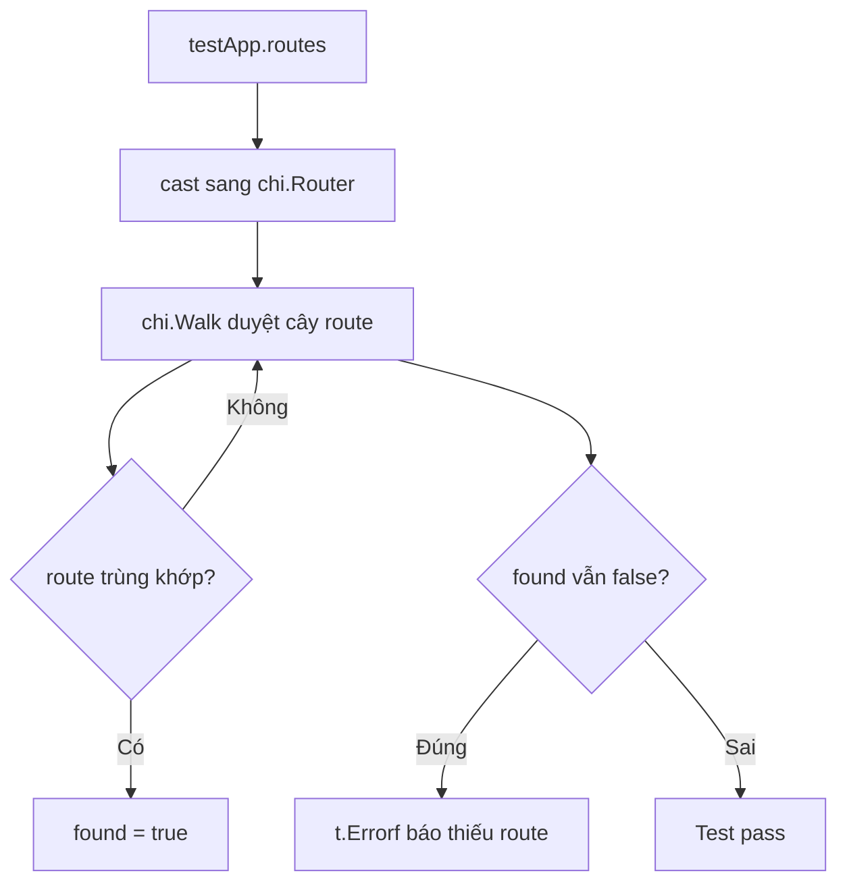

# 🧭 Test đầu tiên: Làm sao biết mọi route đã thật sự được đăng ký?

> Nguồn: `080-Testing-Routes.txt` · [Udemy](https://ua.udemy.com/course/working-with-concurrency-in-go-golang/learn/lecture/32293850)

Môi trường test đã xong, giờ là lúc viết **test thật sự đầu tiên** cho dự án Subscription Service. Trong bài này, mình không test nội dung của từng handler — thứ mình quan tâm là: **những route cần thiết đã thật sự được đăng ký trong dự án hay chưa**. Nghe đơn giản, nhưng đây là kiểu test cực kỳ hữu ích khi dự án phình to dần.

### 🎯 Test cái gì, và file test phải tên gì?

Mở `routes.go` các bạn sẽ thấy nó có vài hàm đăng ký route. Mình **không test nội dung** của các hàm đó, mà chỉ cần chắc chắn rằng tất cả các route mà dự án cần đều **tồn tại** trong cây route.

Trong thư mục `cmd/web`, mình tạo file mới tên là **`routes_test.go`**. Một điều bắt buộc phải nhớ: file test **phải kết thúc bằng `_test.go`** — nếu không, Go sẽ không bao giờ chạy nó, dù nội dung có đúng đến mấy. File này thuộc `package main`.

---

### 📋 Liệt kê "danh sách vàng" các route

Đầu tiên, mình khai báo một slice chứa tên của tất cả route cần kiểm tra:

```go
routes := []string{
	"/",
	"/login",
	"/logout",
	"/register",
	"/activate-account",
	"/members/plans",
	"/members/subscribe",
}
```

Trong đó có trang chủ, login, logout, register, route kích hoạt tài khoản (bắt đầu bằng `/activate`), route xem các gói và route đăng ký gói. Mình chỉ đang **tìm chuỗi ký tự** trong danh sách route được đăng ký, nên cách này sẽ chạy tốt — cứ chờ xem nhé.

---

### 🚶 Duyệt cây route bằng `chi.Walk`

Giờ đến phần thú vị. Hàm `testApp.routes()` trả về kiểu `http.Handler`, nhưng thứ được sản xuất thật ra là một **con trỏ `*chi.Mux`** — nó thỏa mãn interface `http.Handler`, nên mới trả về được như vậy. Mình sẽ ép kiểu nó về `chi.Router`:

```go
func Test_Routes_Exist(t *testing.T) {
	testRoutes := testApp.routes()
	chiRoutes := testRoutes.(chi.Router)

	for _, route := range routes {
		routeExists(t, chiRoutes, route)
	}
}
```

Công cụ chính là **`chi.Walk`** — hàm có sẵn trong package `chi`, giúp đi qua **toàn bộ** cây route. Mình viết thêm hàm `routeExists` để kiểm tra từng route một:

```go
func routeExists(t *testing.T, routes chi.Router, route string) {
	found := false

	_ = chi.Walk(routes, func(method string, foundRoute string, handler http.Handler, middlewares ...func(http.Handler) http.Handler) error {
		if route == foundRoute {
			found = true
		}
		return nil
	})

	if !found {
		t.Errorf("Did not find %s in registered routes", route)
	}
}
```

Cách hoạt động: khởi tạo `found = false`. Khi `chi.Walk` duyệt qua từng route, nếu tên route trùng với route đang tìm, mình bật cờ `found = true`. Sau khi duyệt hết cây mà cờ vẫn là `false` nghĩa là route đó **không tồn tại** — báo lỗi bằng `t.Errorf` ngay.



---

### 🐛 Chạy thử: bài học từ `/members/plans`

Mở terminal trong `cmd/web` và chạy:

```bash
go test -v .
```

Kết quả đầu tiên: **fail** với thông báo `Did not find /plans in registered routes`. Hóa ra mình đã sai — các route cần đăng nhập (plans, subscribe) đã được đặt dưới **prefix `/members`** ở section trước, nên phải sửa cả hai dòng thành `/members/plans` và `/members/subscribe`. Chạy lại — **pass!**

Để chắc chắn test thật sự có "răng", mình thử thêm một route không hề tồn tại, ví dụ `fish` — và đúng như dự đoán, test **fail** ngay. Vậy là test này làm chính xác việc nó phải làm.

*Chuyện gõ sai rồi phải sửa là chuyện bình thường — điều quan trọng là test đã chỉ ra chỗ sai giúp mình. Đó chính là lý do chúng ta viết test!*

Test đầu tiên đã xong một cách nhẹ nhàng. Bài tiếp theo, chúng ta sẽ test **renderer** — và các bạn sẽ thấy vì sao session lại là "mảnh ghép còn thiếu" trong các test render. Hẹn gặp lại! 🚀

## Nguồn tham khảo

- [chi.Walk — pkg.go.dev](https://pkg.go.dev/github.com/go-chi/chi/v5#Walk)
- [Package testing — pkg.go.dev](https://pkg.go.dev/testing)
