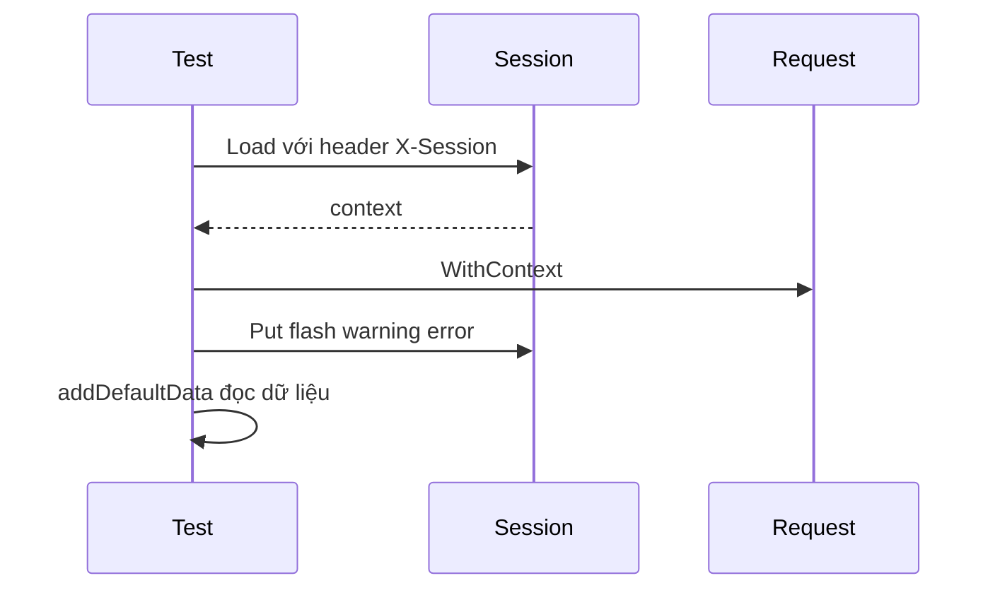

# 🎨 Test renderer: Bơm session vào request để trang render được

> Nguồn: `081-Testing-the-Renderer.txt` · [Udemy](https://ua.udemy.com/course/working-with-concurrency-in-go-golang/learn/lecture/32293882)

Thứ tiếp theo mình muốn test là `render.go`. Nhưng trước khi viết test, các bạn hãy để ý một chi tiết: trong hàm `addDefaultData`, mình đang truy cập **session** để tìm dữ liệu `user`. Viết test cho hàm này thì dễ thôi — vấn đề là nó **sẽ không chạy**, đơn giản vì test không có session. Hôm nay chúng ta sẽ giải quyết đúng chướng ngại đó.

### 🧩 Vì sao test `addDefaultData` lại không chạy được?

Trong `render.go`, khi tới phần thêm dữ liệu mặc định, mình kiểm tra xem trong session có giá trị `user` nào không: nếu có thì lấy ra, còn không thì gán một đối tượng user rỗng. Đó là lý do một test rất đơn giản như test `addDefaultData` vẫn **không hoạt động** nếu thiếu session.

Cách giải quyết: viết một hàm nhỏ để **bơm thông tin session vào request** trước khi test. Mình thêm nó vào cuối file `setup_test.go`:

```go
func getCtx(r *http.Request) context.Context {
	ctx, err := testApp.session.Load(r.Context(), r.Header.Get("X-Session"))
	if err != nil {
		log.Println(err)
	}

	return ctx
}
```

Hàm nhận một con trỏ `*http.Request`, trả về `context.Context`. Bên trong, mình gọi `Load` của session manager với context của request và **header tên `X-Session`** — có lỗi thì ghi log rồi vẫn trả context về. Từ đây, mình có cách đưa session **vào và ra** khỏi bất kỳ request nào.



---

### 📝 Test `addDefaultData`: flash, warning và error

Trong `cmd/web`, mình tạo file `render_test.go` (package main). Test đầu tiên:

```go
func TestConfig_AddDefaultData(t *testing.T) {
	r, _ := http.NewRequest("GET", "/some-url", nil)
	ctx := getCtx(r)
	r = r.WithContext(ctx)

	testApp.session.Put(ctx, "flash", "flash")
	testApp.session.Put(ctx, "warning", "warning")
	testApp.session.Put(ctx, "error", "error")

	td := testApp.addDefaultData(&templateData{}, r)

	if td.Flash != "flash" {
		t.Error("failed to get flash data")
	}
	if td.Warning != "warning" {
		t.Error("failed to get warning data")
	}
	if td.Error != "error" {
		t.Error("failed to get error data")
	}
}
```

Mình dựng request bằng `http.NewRequest`, lấy context bằng `getCtx`, rồi `r.WithContext(ctx)` để request "biết" session. Sau đó đặt thử ba giá trị `flash`, `warning`, `error` vào session, gọi `addDefaultData` với một `&templateData{}` rỗng và kiểm tra xem dữ liệu có được đọc ra đúng không.

Lần chạy đầu tiên test **fail** — vì mình gõ nhầm một giá trị khi so sánh (gõ theo kiểu "tay nhanh hơn mắt"). Sửa lại đúng giá trị `warning` là **pass** ngay. *Các bạn cứ bình tĩnh, gõ nhầm rồi sửa là chuyện bình thường của người viết test mà.*

---

### 🔒 Test `isAuthenticated` và test `render`

Tiếp theo là hàm `isAuthenticated`. Mình dựng request y như trên rồi thử hai trường hợp:

```go
func TestConfig_IsAuthenticated(t *testing.T) {
	r, _ := http.NewRequest("GET", "/some-url", nil)
	ctx := getCtx(r)
	r = r.WithContext(ctx)

	isAuth := testApp.isAuthenticated(r)

	if isAuth == true {
		t.Error("returns true for authenticated when it should be false")
	}

	testApp.session.Put(ctx, "userID", 1)

	isAuth = testApp.isAuthenticated(r)

	if !isAuth {
		t.Error("returns false when it should be true")
	}
}
```

Trường hợp đầu: session rỗng, hàm phải trả về `false`. Trường hợp hai: mình đặt `userID = 1` vào session — đúng thứ `isAuthenticated` tìm kiếm — hàm phải trả về `true`. Chạy `go test .` và **pass**.

Cuối cùng là chính hàm `render`. Nhớ lại: `render` dùng biến `pathToTemplates`, vốn trỏ tới thư mục templates ở gốc ứng dụng khi chạy production. Nhưng khi chạy test, mình không đứng ở gốc dự án mà đứng ngay tại thư mục chứa file test, nên phải **đổi giá trị biến này** thành `./templates`:

```go
func TestConfig_Render(t *testing.T) {
	pathToTemplates = "./templates"

	rr := httptest.NewRecorder()
	r, _ := http.NewRequest("GET", "/", nil)
	ctx := getCtx(r)
	r = r.WithContext(ctx)

	testApp.render(rr, r, "home.page.gohtml", &templateData{})

	if rr.Code != http.StatusOK {
		t.Error("failed to render page")
	}
}
```

Lần này mình cần cả **request** lẫn **response**: thay vì response thật, mình dùng `httptest.NewRecorder()` — thứ thỏa mãn yêu cầu của một response writer. Gọi `render` với template trang chủ và một `&templateData{}` rỗng, rồi kiểm tra mã trạng thái: khác `200` nghĩa là render thất bại. Kết quả: **pass!**

Tất nhiên các bạn có thể test thêm, ví dụ template không tồn tại, nhưng chừng này là đủ để bắt đầu. Giờ thì renderer đã có test — vấn đề lớn còn lại nằm ở `data` package: hiện tại muốn chạy unit test là **phải có database đang chạy**, và điều đó không ổn chút nào. May là cách sửa rất dễ, mình sẽ làm ngay trong bài tiếp theo! 🚀

## Nguồn tham khảo

- [Package net/http/httptest — pkg.go.dev](https://pkg.go.dev/net/http/httptest)
- [SCS: HTTP Session Management for Go — GitHub](https://github.com/alexedwards/scs)
