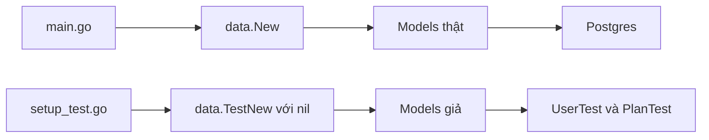

# 📦 Làm data package dễ test: Interfaces và bộ đôi model giả

> Nguồn: `082-Modifying-the-data-package-to-make-it-testable.txt` · [Udemy](https://ua.udemy.com/course/working-with-concurrency-in-go-golang/learn/lecture/32293906)

Lần này mình muốn sửa `data` package để việc viết unit test cho các trang hiển thị trở nên dễ dàng hơn. Vấn đề nằm ở chỗ: trong `main.go`, field `Models` được nạp bằng hàm `data.New` với một pool kết nối database. Trong `data`, chỉ có hai model thật sự "chạm" vào database là `User` và `Plan` — nghĩa là muốn chạy unit test, mình phải... bật database lên trước. Có thể dựng Docker image với version cố định, hoặc mở database local, nhưng đó không phải cách làm hay. *Tin vui: sửa chuyện này dễ ơi là dễ.*

### 🧩 `interfaces.go`: Định nghĩa "hợp đồng" cho User và Plan

Mình tạo file mới `interfaces.go` trong thư mục `data`, vẫn thuộc `package data`, và định nghĩa hai interface.

Đầu tiên là `UserInterface` — "hợp đồng" gồm toàn bộ phương thức mà type `User` đang có:

```go
type UserInterface interface {
	GetAll() ([]*User, error)
	GetByEmail(email string) (*User, error)
	GetOne(id int) (*User, error)
	Update() error
	Delete() error
	DeleteByID(id int) error
	Insert(user User) (int, error)
	ResetPassword(password string) error
	PasswordMatches(plainText string) (bool, error)
}
```

Rồi tới `PlanInterface` — gọn hơn một chút:

```go
type PlanInterface interface {
	GetAll() ([]*Plan, error)
	GetOne(id int) (*Plan, error)
	SubscribeUserToPlan(user User, plan Plan) error
	AmountForDisplay() string
}
```

Nhắc lại một chút về interface trong Go: **để thỏa mãn một interface, type chỉ cần implement đủ tất cả hàm mà interface đó khai báo** — không cần khai báo gì thêm. Nghĩa là type `User` hiện tại **tự động** thỏa mãn `UserInterface`, và `Plan` tự động thỏa mãn `PlanInterface`.

---

### 🔁 Chuyển `models.go` sang dùng interface

Giờ mình quay lại `models.go`, sửa hai field trong type `Models` để dùng interface thay vì type cụ thể:

```go
type Models struct {
	User UserInterface
	Plan PlanInterface
}
```

Ngay lập tức có hai lỗi biên dịch, kiểu như: *"không thể dùng giá trị `User` như `UserInterface` — method `Delete` có pointer receiver"*. Đây không phải lỗi ghê gớm gì: chỉ cần dùng **tham chiếu** (`&User{}`) thay vì giá trị trực tiếp là xong. Chỉ với thay đổi nhỏ đó, `data` package đã cho phép mình "cắm" vào những thứ thỏa mãn hai interface trên — kể cả những phiên bản **không hề nói chuyện với database**. Mọi thứ từ đây sẽ nhẹ nhàng hơn rất nhiều.

---

### 🧪 `test-models.go`: `TestNew` và type `UserTest`

Mình tạo tiếp file `test-models.go` (vẫn `package data`). Thay vì dùng hàm `New`, mình viết một hàm mới tên **`TestNew(dbPool *sql.DB) Models`**: nó nhận vào con trỏ `*sql.DB` (truyền `nil` thoải mái vì test đâu cần database), gán package-level variable `DB` bằng giá trị nhận được, rồi trả về `Models` chứa các model test.

Tiếp theo là tạo type `UserTest`: mình copy y nguyên khai báo type `User` từ `user.go`, dán sang `test-models.go` và đổi tên thành `UserTest` (nhớ import `time`). Rồi copy toàn bộ phương thức của `User`, đổi receiver từ `*User` sang `*UserTest`. Chỗ này có một phen "dở khóc dở cười": mình dùng replace-all của VS Code, ai ngờ nó "quét" luôn cả file `user.go`, phải làm ngược lại để cứu tình hình. *Các bạn thấy đấy, mình dùng VS Code không thường xuyên bằng GoLand nên đôi lúc hậu đậu vậy đó — may là mọi thứ đã ổn.*

Điều thú vị nhất: các hàm này **không được phép chạm database**. Nhiệm vụ duy nhất của chúng là trả về đúng kiểu dữ liệu. Mình "làm ngốc" từng hàm một, đơn giản nhất có thể:

```go
func (u *UserTest) GetAll() ([]*User, error) {
	var users []*User

	user := User{
		ID:        1,
		Email:     "admin@example.com",
		FirstName: "admin",
		LastName:  "admin",
		Password:  "abc",
		Active:    1,
		CreatedAt: time.Now(),
		UpdatedAt: time.Now(),
	}

	users = append(users, &user)

	return users, nil
}
```

Các hàm còn lại cũng theo tinh thần đó:

* `GetByEmail` — trả về một user giả với dữ liệu y hệt.
* `GetOne` — chỉ đơn giản gọi `GetByEmail("")` rồi trả kết quả về.
* `Update`, `Delete`, `DeleteByID`, `ResetPassword` — trả về `nil`, không báo lỗi.
* `Insert` — trả về `2, nil`.
* `PasswordMatches` — trả về `true, nil`.

Sau khi lưu file, Go tooling tự dọn giúp những import không còn dùng.

| | Model thật (`data.New`) | Model test (`data.TestNew`) |
|---|---|---|
| Database | Cần connection pool thật | `nil`, không cần database |
| Kiểu trả về | `User`, `Plan` | `UserTest`, `PlanTest` |
| Dùng cho | Ứng dụng production | Unit test |
| Hành vi | Query Postgres thật | Trả dữ liệu giả cố định |



---

### 🎯 Tự kiểm tra nhanh

**Câu 1:** Vì sao `data` package hiện tại khiến unit test khó viết?

<details>
<summary><b>Xem đáp án</b></summary>

**Đáp án:** Vì `User` và `Plan` kết nối trực tiếp database, muốn chạy unit test là phải có database đang chạy.

Giải thích: Dựng Docker hay database local trước mỗi lần test không phải cách làm tốt.

Tham chiếu: Đoạn mở bài.

</details>

**Câu 2:** Trong Go, một type cần gì để thỏa mãn một interface?

<details>
<summary><b>Xem đáp án</b></summary>

**Đáp án:** Implement đầy đủ tất cả phương thức mà interface khai báo.

Giải thích: Không cần khai báo "implements" tường minh như nhiều ngôn ngữ khác.

Tham chiếu: Mục interfaces.go.

</details>

**Câu 3:** Vì sao phải đổi `Models` sang dùng `UserInterface` và `PlanInterface`?

<details>
<summary><b>Xem đáp án</b></summary>

**Đáp án:** Để có thể thay model thật bằng model giả không nói chuyện với database.

Giải thích: Các model khác vẫn thỏa mãn interface nếu có đủ phương thức.

Tham chiếu: Mục Chuyển models.go sang dùng interface.

</details>

**Câu 4:** Vì sao phải viết `&User{}` thay vì `User{}` khi gán vào interface?

<details>
<summary><b>Xem đáp án</b></summary>

**Đáp án:** Vì các phương thức có pointer receiver — phải dùng tham chiếu thì type mới thỏa mãn interface.

Giải thích: Lỗi biên dịch sẽ chỉ ra ngay nếu dùng giá trị thay vì con trỏ.

Tham chiếu: Mục Chuyển models.go sang dùng interface.

</details>

**Câu 5:** Hàm `TestNew` nhận gì và trả gì?

<details>
<summary><b>Xem đáp án</b></summary>

**Đáp án:** Nhận `*sql.DB` (có thể truyền `nil`) và trả về `Models` chứa các model test như `UserTest`.

Giải thích: Nhờ vậy unit test chạy được mà không cần database nào cả.

Tham chiếu: Mục test-models.go.

</details>

Vậy là user test đã sẵn sàng, chỉ còn thiếu "nửa còn lại" — `PlanTest`. Bài sau, mình sẽ làm nốt phần plan và nối mọi thứ vào `setup_test.go` để dùng được trong các test sắp tới. Hẹn gặp lại các bạn! 🚀

## Nguồn tham khảo

- [Package database/sql — pkg.go.dev](https://pkg.go.dev/database/sql)
