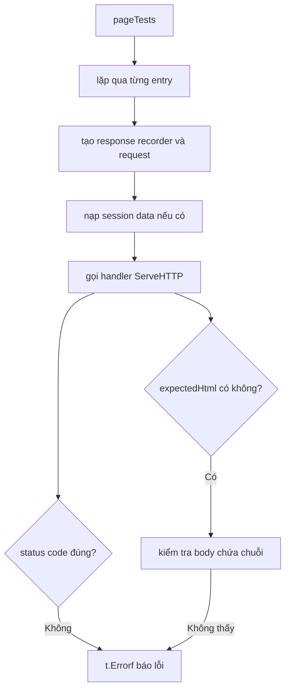

# 🧑🍳 Bắt đầu test handler: Trang chủ rồi tới table-driven test

> Nguồn: `084-Getting-started-testing-Handlers.txt` · [Udemy](https://ua.udemy.com/course/working-with-concurrency-in-go-golang/learn/lecture/32293852)

Các model đã được "ly dị" khỏi database, giờ là lúc viết test cho **handler** xem mọi thứ có đúng không. Mình cảnh báo trước cho các bạn đỡ bất ngờ: chúng ta **sẽ không đúng hết ngay từ lần đầu** đâu — nhưng may là sửa rất dễ. Bắt đầu với thứ đơn giản nhất: trang chủ.

### 🏠 Test đầu tiên: handler trang chủ

Trong `cmd/web`, mình tạo file **`handlers_test.go`**, `package main`, và viết một test duy nhất cho `homePage`:

```go
func TestConfig_Home(t *testing.T) {
	pathToTemplates = "./templates"

	rr := httptest.NewRecorder()
	req, _ := http.NewRequest("GET", "/", nil)
	ctx := getCtx(req)
	req = req.WithContext(ctx)

	handler := http.HandlerFunc(testApp.homePage)
	handler.ServeHTTP(rr, req)

	if rr.Code != http.StatusOK {
		t.Error("failed: expected 200 but got", rr.Code)
	}
}
```

Có vài điều cần chú ý:

* Handler `homePage` cần tìm `home.page.gohtml`, mà hàm `render` lại dùng biến `pathToTemplates` — nên **việc đầu tiên luôn là ghi đè biến này** thành `./templates`, vì thư mục templates nằm ngay cạnh file test của mình.
* Mình dùng `httptest.NewRecorder()` để thay thế response writer thật.
* Request là **GET** tới trang chủ, kèm session qua `getCtx` — đúng bộ khung mình đã dựng sẵn.
* Handler được bọc trong `http.HandlerFunc` rồi gọi `ServeHTTP`.

Chạy `go test -v .` — **pass**. Không có gì bất ngờ, vì trang chủ không hề đụng tới database. Nhưng đó mới chỉ là một trang; nếu cứ viết từng test một cho login, logout, register... thì lặp lại nhiều lắm.

---

### 🧾 Chuyển sang table-driven test

Các handler còn lại như login, logout, register đều theo **đúng một khuôn** như trang chủ, nên thay vì viết từng test riêng, mình gom chúng thành một **table test**. Mình tạo một slice các struct ẩn danh, mỗi phần tử mô tả một trang cần kiểm tra:

```go
pageTests := []struct {
	name               string
	url                string
	expectedStatusCode int
	handler            http.HandlerFunc
	sessionData        map[string]any
	expectedHtml       string
}{
	{
		name:               "home",
		url:                "/",
		expectedStatusCode: http.StatusOK,
		handler:            testApp.homePage,
	},
	// ... các trang khác thêm vào đây
}
```

Trong đó: `name` là tên test cho dễ nhìn, `url` để biết trang này ứng với route nào, `handler` là handler cần gọi, `sessionData` là dữ liệu cần đặt vào session (có trang yêu cầu), và `expectedHtml` là đoạn HTML mình mong thấy trong trang render ra.

Rồi mình đổi tên test cũ thành **`Test_Pages`** và viết vòng lặp:

```go
for _, e := range pageTests {
	rr := httptest.NewRecorder()
	req, _ := http.NewRequest("GET", e.url, nil)
	ctx := getCtx(req)
	req = req.WithContext(ctx)

	if len(e.sessionData) > 0 {
		for key, value := range e.sessionData {
			testApp.session.Put(ctx, key, value)
		}
	}

	e.handler.ServeHTTP(rr, req)

	if e.expectedStatusCode != rr.Code {
		t.Errorf("%s: failed: expected %d but got %d", e.name, e.expectedStatusCode, rr.Code)
	}

	if len(e.expectedHtml) > 0 {
		html := rr.Body.String()
		if !strings.Contains(html, e.expectedHtml) {
			t.Errorf("%s: failed: expected to find %s but did not", e.name, e.expectedHtml)
		}
	}
}
```

Lần chạy đầu tiên, test **fail** ngay ở dòng 40 — vì mình quên điền `handler` vào entry đầu tiên. *Lỗi này dễ thương thôi: thêm handler vào là xong.* Chạy lại — **pass** với một trang.



---

### ➕ Thêm trang login và trang logout

Biết khuôn đã chạy, mình thêm trang login: copy entry đầu, đổi `name` thành login page, `url` thành `/login`, handler thành `testApp.loginPage`. Rồi mở template `login.page.gohtml`, tìm một đoạn HTML chắc chắn xuất hiện (ví dụ tiêu đề trang), copy nó vào `expectedHtml` — dùng dấu backtick để khỏi vướng dấu ngoặc kép. Chạy test: **pass**.

Trang logout thì hơi khác một chút: nó **không render trang nào**, không redirect nội dung — handler chỉ đặt mã trạng thái `http.StatusSeeOther` rồi đưa người dùng về trang login. Nên entry này:

* `url` là `/logout`.
* `expectedStatusCode` là `http.StatusSeeOther`.
* `expectedHtml` không cần (bỏ trống).
* Đặc biệt: phải có **session data**, vì chỉ người đã đăng nhập mới logout được. Mình thêm `"userID": 1` và một `data.User{}` rỗng vào map.

Chạy `go test -v .` một lần nữa — mọi thứ **pass**. Đến đây các bạn có thể tự thêm bao nhiêu trang tùy thích.

---

### 📌 Điểm dừng và điều sắp tới

Mọi thứ đang rất khả quan, nhưng mình nói trước: khi bạn thêm một trang **thật sự tương tác với database**, sẽ có tình huống phát sinh trục trặc. Điều đáng chú ý: nguyên nhân **không nằm ở `test-models.go`** — mình đã nhân bản đầy đủ các phương thức của user và plan rồi. Vấn đề nằm ở **cách handler truy cập vào model**, và bài sau chúng ta sẽ gặp đúng tình huống đó cùng cách xử lý. Hẹn gặp lại các bạn! 🚀

## Nguồn tham khảo

- [Package net/http/httptest — pkg.go.dev](https://pkg.go.dev/net/http/httptest)
- [Package net/http — pkg.go.dev](https://pkg.go.dev/net/http)
