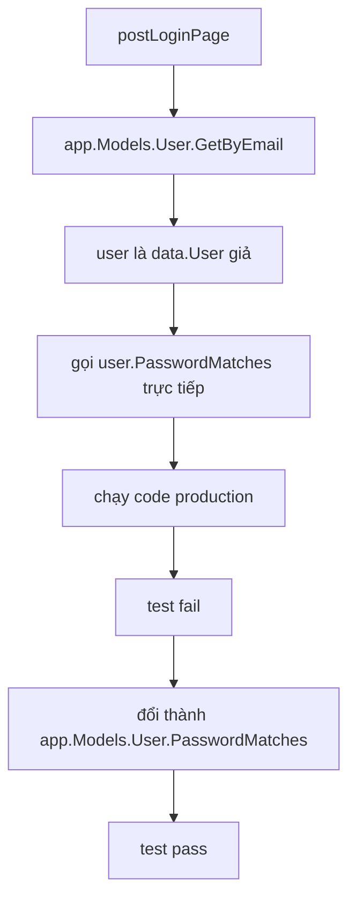

# 🔐 Test login handler: Từ lỗi bí ẩn tới go tool cover

> Nguồn: `085-Testing-the-Login-Handler.txt` · [Udemy](https://ua.udemy.com/course/working-with-concurrency-in-go-golang/learn/lecture/32359488)

Lần này mình muốn test hàm `postLoginPage` trong `handlers.go` — đúng cái hàm chạy khi ai đó điền username, password rồi bấm nút đăng nhập. Vì đây là một **POST request** nên test sẽ phải dựng dữ liệu form đàng hoàng. Và thú vị nhất là: test sẽ **pass**, nhưng khi kiểm tra kỹ hơn một chút thì nó **fail** — dẫn chúng ta tới một lỗi ẩn rất đáng học.

### 🎯 TestConfig_PostLoginPage: dựng một form POST

Mình viết hàm test riêng trong `handlers_test.go` (không dùng table test, để tiện minh họa cho các bạn). Việc đầu tiên vẫn là đặt `pathToTemplates = "./templates"` để hàm render tìm được template nếu cần.

Dữ liệu form được gói trong `url.Values{}` — kiểu dữ liệu đến từ package `url` — với hai cặp: `email` là `admin@example.com` (đóng vai username điền trong form), còn `password` thì mình gõ dài hơn một chút cho giống thật. Sau đó mình **encode** dữ liệu này bằng `postedData.Encode()` và bọc trong `strings.NewReader` để làm phần body của request:

```go
rr := httptest.NewRecorder()
req, _ := http.NewRequest("POST", "/login", strings.NewReader(postedData.Encode()))
ctx := getCtx(req)
req = req.WithContext(ctx)

handler := http.HandlerFunc(testApp.postLoginPage)
handler.ServeHTTP(rr, req)

if rr.Code != http.StatusSeeOther {
	t.Error("wrong code returned")
}
```

Request phải là **POST** (khác các test trước toàn GET), và handler được gọi qua `http.HandlerFunc` như thường lệ. Ở cuối `postLoginPage`, chương trình đặt mã trạng thái `http.StatusSeeOther`, nên test cũng kiểm tra đúng giá trị đó. Chạy `go test -v .` — **pass**, nghe rất khích lệ đúng không?

---

### 🔎 Khi test "khó tính" hơn: kiểm tra session

Mình thử làm một phép kiểm tra chặt chẽ hơn: sau khi login thành công, trong session **phải có** key `userID`. Thêm vào test:

```go
if !testApp.session.Exists(ctx, "userID") {
	t.Error("did not find userID in session")
}
```

Chạy lại — **fail**. Sẽ chẳng sao nếu mình không biết vì sao, mà đây chính là lúc bắt đầu "điều tra". Công cụ đắc lực nhất lúc này là **coverage** — và may quá, Go hỗ trợ cực dễ:

```bash
go test -coverprofile=coverage.out
go tool cover -html=coverage.out
```

Lệnh đầu chạy test (dù fail) và sinh ra file `coverage.out`. Lệnh sau mở trình duyệt hiển thị **code được phủ tới đâu**: phần nào **xanh** là đã chạy qua, phần nào **đỏ** là chưa hề chạy.

Với hàm `postLoginPage`, mình thấy: phần tạo session token chạy tốt, email và password lấy được, user lấy từ "database giả" cũng không lỗi. Nhưng đến bước kiểm tra mật khẩu thì... **có chuyện**: dòng gọi password match bị đỏ và trả lỗi. Lý do hóa ra rất hay: biến `user` mà handler nhận được là `*data.User` do model test trả về, nhưng khi mình gọi `user.PasswordMatches(...)` **trực tiếp trên biến đó**, chương trình lại chạy **phiên bản production** của phương thức — bản đi tìm hash trong database thật. Mà user giả thì chẳng có field nào được nạp, nên mật khẩu **không bao giờ khớp**.

---

### 🛠️ Sửa handler: luôn gọi qua `app.Models`

Cách sửa rất gọn: thay vì gọi method trên biến `user`, mình gọi nó **qua field `Models`** — tức là đi qua interface, để phiên bản của test model được dùng:

```go
validPassword, err := app.Models.User.PasswordMatches(password)
```

Chạy lại test — **pass** ngay. Vậy là mình rút ra quy tắc: trong `handlers.go`, bất cứ chỗ nào đang gọi phương thức **trực tiếp trên một biến kiểu model** (thay vì qua `app.Models.User` hay `app.Models.Plan`) đều phải sửa lại. Rà một vòng, mình phát hiện thêm hai chỗ:

* Hàm `postRegisterPage` — `u.Insert(u)` đổi thành `app.Models.User.Insert(u)`.
* Hàm `activateAccount` — `u.Update()` đổi thành `app.Models.User.Update(u)`.



---

### 🧩 Sửa data package cho khớp chữ ký mới

Đổi cách gọi rồi thì phải đổi cả "hợp đồng" cho khớp. Trong `data/interfaces.go`:

* Phương thức `Update` giờ nhận thêm tham số: `Update(user User) error`.
* Phương thức `Delete` mình **comment lại** luôn — vì chương trình chẳng dùng tới nó.

Kéo theo đó, phiên bản production trong `user.go` cũng phải nhận `User` và dùng thông tin của tham số truyền vào; còn `UserTest` trong `test-models.go` cũng cập nhật y hệt.

Chạy lại toàn bộ test: còn đúng một lỗi kiểu ở `handlers.go` dòng 151 — chỗ đó đang truyền `*data.User` vào nơi cần `data.User`, chỉ cần chỉnh lại con trỏ một chút là xong. Chạy lần cuối — **tất cả pass!**

---

### 🧠 Vậy có cách nào khác không?

Có chứ. Các bạn có thể tự hỏi: *"Gọi method trên biến `user` cho tiện hơn chứ, sao phải đi đường vòng?"* Cách mà các dự án chuyên nghiệp thường làm là **repository pattern** — tách hẳn lớp truy cập dữ liệu ra. Cách này triển khai cũng khá đơn giản, nhưng khóa này là về **concurrency**, không phải về repository patterns. Nếu các bạn tò mò, mình có trình bày kỹ trong một khóa khác của mình, tên đại loại là **"Building Modern Web Applications in Go"**. Còn với mục đích của chúng ta ở đây, cách làm vừa rồi là quá đủ.

Giờ là lúc tiến tới phần thú vị nhất: test một handler **có dùng concurrency**. Và mình hứa, chúng ta sẽ phát hiện thêm một hai vấn đề nữa — suy cho cùng, đó chính là lý do chúng ta viết test! Hẹn gặp lại các bạn! 🚀

## Nguồn tham khảo

- [go tool cover — pkg.go.dev](https://pkg.go.dev/cmd/cover)
- [Package net/http/httptest — pkg.go.dev](https://pkg.go.dev/net/http/httptest)
