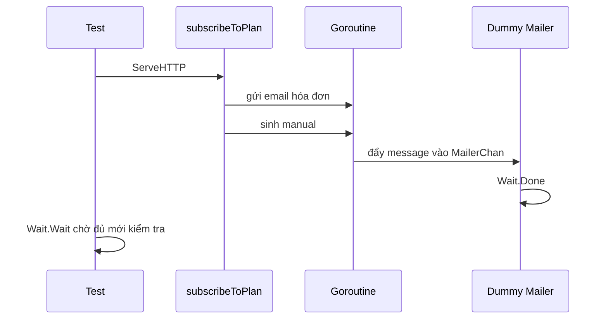

# 🌀 Test handler dùng concurrency: Wait.Wait() treo máy và hai lỗi ẩn trong dummy mailer

> Nguồn: `086-Testing-a-handler-that-uses-concurrency.txt` · [Udemy](https://ua.udemy.com/course/working-with-concurrency-in-go-golang/learn/lecture/32360524)

Đây là bài cuối cùng của section testing, và cũng là bài đáng chờ đợi nhất: chúng ta sẽ test **handler sử dụng concurrency nhiều nhất** — `subscribeToPlan`. Nhớ lại nhé, handler này bắn ra hai goroutine: một cái sinh hóa đơn và email hóa đơn, một cái sinh manual PDF. Hành trình hôm nay gồm hai màn: dọn hardcoded path trước khi test, và một phen `Wait.Wait()` treo máy đúng nghĩa — nhưng cuối cùng mọi thứ sẽ sáng tỏ. *Các bạn cứ theo mình từng bước.*

### 🧾 Dọn hardcoded path trước khi test

Điều đầu tiên mình nhận ra khi nhìn vào handler: có mấy **đường dẫn hardcode** sẽ gây rắc rối khi test. Trong handler có chỗ ghi thẳng `./temp`, và trong hàm `generateManual` cũng có một đường dẫn hardcode khác (`./pdf`). Khi chạy test, thư mục làm việc không phải gốc dự án, nên những đường dẫn đó sẽ "trỏ sai chỗ".

Giải pháp: đưa chúng thành **biến package-level** ở đầu file để có thể ghi đè khi test:

```go
var pathToManual = "./pdf"
var tempPath = "./temp"
```

Rồi trong handler và `generateManual`, mình thay các chuỗi cứng bằng `fmt.Sprintf` với `%s` — truyền `tempPath` hoặc `pathToManual` vào làm tham số. Xong phần code, mình vào `setup_test.go`, ngay trong `TestMain`, đặt lại giá trị cho hai biến này:

```go
tempPath = "./../../temp"
pathToManual = "./../../pdf"
```

Giải thích nhanh: thư mục làm việc hiện tại là `cmd/web`, đi lên hai cấp là gốc dự án — nơi có thư mục `pdf` và `temp`. *(Nếu muốn, các bạn cũng có thể "dời" luôn `pathToTemplates` vào đây và xóa mọi chỗ ghi đè trong test — tùy các bạn.)*

---

### 🧪 Viết test `subscribeToPlan`

Mình thêm test ở cuối `handlers_test.go`:

```go
func TestConfig_SubscribeToPlan(t *testing.T) {
	rr := httptest.NewRecorder()
	req, _ := http.NewRequest("GET", "/subscribe?id=1", nil)
	ctx := getCtx(req)
	req = req.WithContext(ctx)

	testApp.session.Put(ctx, "user", data.User{
		ID:        1,
		Email:     "admin@example.com",
		FirstName: "admin",
		LastName:  "user",
		Active:    1,
	})

	handler := http.HandlerFunc(testApp.subscribeToPlan)
	handler.ServeHTTP(rr, req)

	if rr.Code != http.StatusSeeOther {
		t.Errorf("expected status code of %d but got %d", http.StatusSeeOther, rr.Code)
	}
}
```

Hai điểm khác biệt so với các test handler trước:

1. **Lần này URL rất quan trọng** — mọi lần trước mình hay nói "URL gì cũng được", nhưng handler subscribe đọc **query parameter** `id` bằng `r.URL.Query().Get("id")`, nên request phải có `?id=1`.
2. Handler yêu cầu **có user trong session**, nên mình đặt sẵn một `data.User` với ID, email, tên và trạng thái active.

Và vì đây là handler có xử lý nền, mình cũng check mã trạng thái trả về là `http.StatusSeeOther` như mong đợi.

---

### ⏳ Wait.Wait() treo máy và hai lỗi ẩn trong dummy mailer

Các goroutine bên trong handler sẽ không kịp chạy xong nếu test cứ thế mà kết thúc. Tất nhiên mình nghĩ ngay tới việc dùng WaitGroup — và gọi:

```go
testApp.Wait.Wait()
```

Nghe rất hợp lý đúng không? Nhưng khi chạy `go test -v .`, test cứ chạy tới `TestConfig_SubscribeToPlan` rồi... **đứng im**. Nó sẽ đứng mãi như vậy cho tới khi mất điện, chứ chẳng bao giờ xong. Mình phải bấm `Ctrl+C` để thoát.

Lý do: `Wait` đang chờ bộ đếm về `0`, nhưng bộ đếm **không bao giờ về 0 được**. Trong handler, mỗi goroutine đều có cộng một và trừ một đầy đủ. Vấn đề nằm ở chỗ khác: helper **`sendEmail`** cũng cộng thêm một vào WaitGroup khi đẩy email vào `MailerChan` — và phần "trừ" tương ứng phải do **mailer worker** thực hiện. Trong môi trường test, dummy mailer của chúng ta tiêu thụ message... rồi thôi, **không gọi `Done()`**. Thêm nữa, dummy mailer từ bài dựng môi trường chỉ chạy đúng **một lần** rồi goroutine kết thúc, vì nó chưa được bọc trong vòng lặp. Hai lỗi, một hệ quả: WaitGroup mãi dương.

Quay lại `setup_test.go`, sửa goroutine dummy mailer thành:

```go
go func() {
	for {
		select {
		case <-testApp.Mailer.MailerChan:
			testApp.Wait.Done()
		case <-testApp.Mailer.ErrorChan:
		case <-testApp.Mailer.DoneChan:
			return
		}
	}
}()
```

Hai thay đổi:

* **Bọc `select` trong vòng `for`** — để goroutine sống mãi và xử lý nhiều email, thay vì gửi một cái rồi "chết".
* **Thêm `testApp.Wait.Done()`** khi nhận message — vì trong test mình không thực sự gửi email (có test chức năng email đâu), nhưng vẫn phải "trả lại phiếu" cho WaitGroup để bộ đếm về 0.



Chạy lại test: **pass!** Bạn sẽ để ý test dừng khoảng **5 giây** — đó là do mình cố tình cho routine sinh manual **giả lập một tác vụ tốn thời gian** bằng một khoảng pause, để giống thực tế hơn.

---

### 🏁 Chạy test với race detector

Vẫn chưa xong đâu — mình muốn **chắc chắn không có race condition** nào cả. Thế là thêm cờ `-race` và chạy lại:

```bash
go test -v -race .
```

Vẫn có khoảng dừng 5 giây như cũ, và lần này test chạy **lâu hơn** (chạy với race detector bao giờ cũng chậm hơn — chuyện bình thường), nhưng kết quả: **mọi thứ pass hết**.

---

### 🎯 Tự kiểm tra nhanh

**Câu 1:** Vì sao lần này URL trong request test lại quan trọng?

<details>
<summary><b>Xem đáp án</b></summary>

**Đáp án:** Vì handler đọc query parameter `id` bằng `r.URL.Query().Get("id")`, nên URL phải có `?id=1`.

Giải thích: Các test handler trước mình thường nói URL không quan trọng — nhưng trường hợp này thì có.

Tham chiếu: Mục Viết test subscribeToPlan.

</details>

**Câu 2:** Vì sao `testApp.Wait.Wait()` làm test treo mãi không xong?

<details>
<summary><b>Xem đáp án</b></summary>

**Đáp án:** Vì WaitGroup không bao giờ về 0 — dummy mailer không gọi `Done()` cho email mà nó tiêu thụ.

Giải thích: Helper `sendEmail` có cộng WaitGroup, và phần trừ nằm ở phía mailer worker.

Tham chiếu: Mục Wait.Wait() treo máy và hai lỗi ẩn trong dummy mailer.

</details>

**Câu 3:** Hai lỗi trong dummy mailer được phát hiện ở bài này là gì?

<details>
<summary><b>Xem đáp án</b></summary>

**Đáp án:** Thiếu vòng lặp `for` quanh `select` (goroutine chạy một lần rồi chết) và thiếu `testApp.Wait.Done()` khi nhận message.

Giải thích: Hai lỗi cộng lại khiến WaitGroup mãi dương.

Tham chiếu: Mục Wait.Wait() treo máy và hai lỗi ẩn trong dummy mailer.

</details>

**Câu 4:** Vì sao phải tách `tempPath` và `pathToManual` thành biến?

<details>
<summary><b>Xem đáp án</b></summary>

**Đáp án:** Vì khi test, thư mục làm việc khác gốc dự án — cần ghi đè đường dẫn cho đúng.

Giải thích: Biến cho phép `TestMain` trỏ tới thư mục thật ở gốc dự án.

Tham chiếu: Mục Dọn hardcoded path.

</details>

**Câu 5:** Chạy `go test -race` để làm gì và có gì khác so với bình thường?

<details>
<summary><b>Xem đáp án</b></summary>

**Đáp án:** Bật race detector để phát hiện data race; test sẽ chạy lâu hơn bình thường.

Giải thích: Đây là bước kiểm tra "tận gốc" cho code concurrency.

Tham chiếu: Mục Chạy test với race detector.

</details>

Vậy là chúng ta đã viết được những test cơ bản cho phần web, và quan trọng hơn — đã viết được test cho **code concurrency**. Tất nhiên mình không test từng ngóc ngách của ứng dụng, và đó cũng không phải mục đích. Mục đích của mình là trao cho các bạn **đủ công cụ** để tự viết test cho bất kỳ dự án nào của chính các bạn. Và đây cũng là bài cuối cùng của cả khóa học — cảm ơn các bạn đã đồng hành suốt chặng đường dài! Hẹn gặp lại ở những dự án tiếp theo nhé! 🚀

## Nguồn tham khảo

- [Data Race Detector — go.dev](https://go.dev/doc/articles/race_detector)
- [Package sync — WaitGroup](https://pkg.go.dev/sync#WaitGroup)
