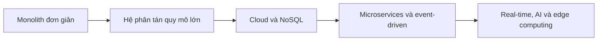

# 🕰️ 25 năm tiến hóa của System Design — từ monolith đến edge computing

> Nguồn: `004-The-Evolution-of-System-Design-Over-the-Last-25-Years.txt` · [Udemy](https://ua.udemy.com/course/mastering-system-design-from-basics-to-cracking-interviews/learn/lecture/49243909)

Muốn hiểu system design hiện đại, sẽ rất hữu ích nếu các bạn biết nó đã **tiến hóa như thế nào trong vài thập kỷ qua**. Nhiều pattern, công nghệ và best practice chúng ta dùng hôm nay ra đời không phải vì ai đó thích cái mới — mà vì **các kỹ sư gặp những bài toán scale mới và cần giải pháp tốt hơn**. Cùng mình nhìn lại hành trình đó.

---

### 🧱 Khởi đầu: monolith và một database

Vào **cuối thập niên 1990 và đầu thập niên 2000**, hầu hết ứng dụng đều khá đơn giản:

* Một **hệ thống monolith (khối đơn)** duy nhất kết nối tới **một database** duy nhất.
* Và thế là thường đã đủ dùng.
* **Lưu lượng nhỏ**, **kỳ vọng của người dùng thấp**, hệ thống hiếm khi cần vận hành trên phạm vi toàn cầu.

---

### 📈 Khi quy mô chạm giới hạn: kỷ nguyên hệ phân tán

Khi **social media, thương mại điện tử và mức độ phổ cập internet** tăng tốc, những kiến trúc đơn giản bắt đầu **chạm đến giới hạn của chúng**. Để xử lý lưu lượng ngày càng lớn và cải thiện hiệu năng, các hệ thống dần bổ sung:

* **Load balancing (cân bằng tải)** — phân phối traffic đều ra nhiều server.
* **Caching (bộ đệm)** — tăng tốc bằng cách lưu dữ liệu hay dùng ở nơi gần người dùng hơn.
* **CDN (mạng phân phối nội dung)** — đưa nội dung đến gần người dùng về mặt địa lý.
* **Database replication (nhân bản cơ sở dữ liệu)** — tăng khả năng chịu tải và độ sẵn sàng cho tầng dữ liệu.

Giai đoạn này đánh dấu **sự khởi đầu của các hệ phân tán quy mô lớn (large-scale distributed systems)** — mảnh đất mà system design hiện đại được xây dựng trên đó.

---

### ☁️ Cloud computing và sự trỗi dậy của NoSQL

Bước chuyển lớn tiếp theo đến cùng **cloud computing (điện toán đám mây)**:

* Thay vì **mua và quản lý server vật lý**, tổ chức có thể **cấp phát hạ tầng theo nhu cầu (provision on demand)**.
* Điều này **thay đổi mạnh cách hệ thống được thiết kế, triển khai và mở rộng**.

Song song đó, **NoSQL database** xuất hiện để giải những bài toán mà **cơ sở dữ liệu quan hệ truyền thống** gặp khó khăn ở quy mô cực lớn. Những giới hạn cũ không còn là ràng buộc duy nhất nữa — nhưng mọi lựa chọn mới đều kèm theo những đánh đổi mới, như mọi quyết định kiến trúc khác.

---

### 🧩 Microservices và kỷ nguyên hiện tại

Khi hệ thống tiếp tục lớn lên, các tổ chức bắt đầu **chia nhỏ monolith thành nhiều service nhỏ hơn**. Những mô hình trở nên phổ biến gồm:

* **Microservices (vi dịch vụ)** và **event-driven architecture (kiến trúc hướng sự kiện)**.
* **API gateways (cổng API)** và **messaging platforms (nền tảng truyền thông điệp)**.

Lý do rất thực tế: chúng cho phép các đội **mở rộng cả công nghệ lẫn nỗ lực phát triển** hiệu quả hơn.

Ngày nay, chúng ta đang vận hành trong **kỷ nguyên của trải nghiệm thời gian thực (real-time), ứng dụng được hỗ trợ bởi AI, nền tảng toàn cầu và edge computing (điện toán biên)**. Kiến trúc hiện đại ngày càng ưu tiên **độ trễ thấp (low latency)**, **elasticity (độ đàn hồi)**, **observability (khả năng quan sát)**, **bảo mật** và **khả năng phục hồi vận hành (operational resilience)**.

Điều quan trọng nhất cần nhận ra: **system design luôn tiến hóa không ngừng**. Công nghệ thay đổi, pattern thay đổi, quy mô thay đổi — nhưng **mục tiêu nền tảng vẫn vậy**: thiết kế những hệ thống đáp ứng yêu cầu kinh doanh, đồng thời vẫn **mở rộng được, đáng tin cậy và dễ bảo trì** khi lớn lên.

---

### 🎯 Tự kiểm tra nhanh

**Câu 1:** Kiến trúc phổ biến vào cuối thập niên 1990, đầu thập niên 2000 là gì?

<b>Xem đáp án</b>

**Đáp án:** Một hệ thống monolith duy nhất kết nối với một database duy nhất.

Giải thích: Lưu lượng còn nhỏ, kỳ vọng người dùng thấp và hệ thống ít khi cần vận hành toàn cầu.

Tham chiếu: Mục Khởi đầu: monolith và một database.

**Câu 2:** Khi traffic tăng, các hệ thống đã bổ sung những kỹ thuật nào?

<b>Xem đáp án</b>

**Đáp án:** Load balancing, caching, CDN và database replication.

Giải thích: Đây là những kỹ thuật giúp xử lý lưu lượng tăng và cải thiện hiệu năng.

Tham chiếu: Mục Khi quy mô chạm giới hạn: kỷ nguyên hệ phân tán.

**Câu 3:** Cloud computing thay đổi điều gì trong cách làm hệ thống?

<b>Xem đáp án</b>

**Đáp án:** Cho phép cấp phát hạ tầng theo nhu cầu thay vì mua và quản lý server vật lý.

Giải thích: Điều này thay đổi mạnh cách hệ thống được thiết kế, triển khai và mở rộng.

Tham chiếu: Mục Cloud computing và sự trỗi dậy của NoSQL.

**Câu 4:** Vì sao NoSQL database ra đời?

<b>Xem đáp án</b>

**Đáp án:** Để giải quyết những thách thức mà cơ sở dữ liệu quan hệ truyền thống gặp khó ở quy mô cực lớn.

Giải thích: Đây là một trong những bước chuyển quan trọng của kiến trúc phần mềm hiện đại.

Tham chiếu: Mục Cloud computing và sự trỗi dậy của NoSQL.

**Câu 5:** Điều gì vẫn giữ nguyên bất chấp mọi thay đổi qua các thời kỳ?

<b>Xem đáp án</b>

**Đáp án:** Mục tiêu nền tảng: đáp ứng yêu cầu kinh doanh trong khi vẫn scalable, reliable và maintainable.

Giải thích: Công nghệ, pattern và quy mô đổi thay, nhưng mục tiêu cốt lõi của system design thì không.

Tham chiếu: Mục Microservices và kỷ nguyên hiện tại.

---

Các bạn đã đi qua 25 năm tiến hóa chỉ trong vài phút: **monolith → hệ phân tán → cloud và NoSQL → microservices, event-driven → real-time, AI và edge computing**. Điểm đọng lại: công nghệ thay đổi không ngừng, nhưng tư duy về trade-off thì không. Ở bài tiếp theo, mình sẽ giúp các bạn nhìn rõ **cấu trúc của khóa học và vì sao các chủ đề được sắp xếp theo đúng thứ tự này**. Hẹn gặp lại! 🚀
