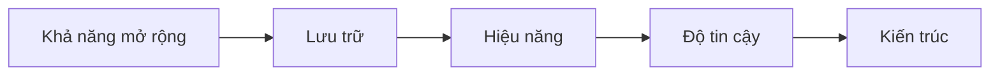

# 🗺️ Khóa học này được cấu trúc thế nào và vì sao lại theo thứ tự đó?

> Nguồn: `005-How-This-Course-is-Structured.txt` · [Udemy](https://ua.udemy.com/course/mastering-system-design-from-basics-to-cracking-interviews/learn/lecture/49243913)

Trước khi bước vào phần nội dung kỹ thuật, mình muốn dành vài phút để các bạn hiểu **khóa học này được tổ chức ra sao và vì sao các chủ đề lại được xếp theo đúng thứ tự này**. Hiểu được bản đồ, các bạn sẽ học nhẹ nhàng và chủ động hơn rất nhiều.

---

### 🧱 Vì sao phải xây kiến thức theo từng lớp?

System design là một chủ đề rộng, và **nhiều khái niệm phụ thuộc lẫn nhau**. Ví dụ:

* Rất khó hiểu **distributed databases (cơ sở dữ liệu phân tán)** nếu chưa nắm **scalability (khả năng mở rộng)**.
* Rất khó suy luận về **reliability (độ tin cậy)** nếu chưa hiểu **kiến trúc hệ thống** và **các mẫu giao tiếp (communication patterns)**.

Vì vậy, chúng ta sẽ **xây kiến thức một cách lũy tiến, từng lớp một**, thay vì nhảy thẳng vào những chủ đề phức tạp.

---

### 📚 Lộ trình chủ đề và sự liên kết giữa chúng

Khóa học bắt đầu với **các nền tảng của system design và những nguyên lý cốt lõi** ảnh hưởng đến mọi quyết định kiến trúc. Từ đó, chúng ta đi qua lần lượt:

* **Networking** và các **communication patterns**.
* Các kỹ thuật **scalability**.
* **Storage systems (hệ thống lưu trữ)**.
* **Tối ưu hiệu năng (performance optimization)**.
* **Reliability engineering (kỹ thuật độ tin cậy)**.
* **Security architecture (kiến trúc bảo mật)**.

Càng đi xa, các bạn sẽ càng thấy các chủ đề **liên kết với nhau**:

Scalability ảnh hưởng đến quyết định storage; storage ảnh hưởng đến performance; performance ảnh hưởng đến reliability; reliability ảnh hưởng đến architecture. **Chính khả năng nhìn thấy các mối liên kết này là điều phân biệt một kiến trúc sư với một developer chỉ tập trung vào từng thành phần riêng lẻ.**

---

### 🎯 Case study và framework — đích đến của khóa học

Khi nền tảng đã vững, chúng ta sẽ **gộp mọi thứ lại thành các case study thực tế**: phân tích cách những nền tảng quy mô lớn giải quyết các bài toán kỹ thuật phức tạp, và quan trọng hơn — **lý do đằng sau mỗi quyết định kiến trúc của họ**.

Song song đó, khóa học sẽ xây dựng một **framework có cấu trúc để tiếp cận bài toán system design**. Framework này giúp các bạn không chỉ thiết kế hệ thống thực tế tốt hơn, mà còn **truyền đạt suy nghĩ của mình rõ ràng** trong các buổi thảo luận kiến trúc và phỏng vấn.

Và mục tiêu cuối cùng thì rất rõ ràng: **không phải ghi nhớ công nghệ hay kiến trúc**, mà là phát triển khả năng **suy luận về hệ thống, đánh giá trade-off và ra quyết định đúng đắn — bất kể công nghệ nào xuất hiện**.

---

Vậy là các bạn đã nắm được bản đồ của khóa học: **nền tảng trước, liên kết sau, case study cuối cùng**. Ở bài tiếp theo, mình sẽ chia sẻ **cách học khóa này hiệu quả nhất** để các bạn tận dụng tối đa từng phần. Hẹn gặp lại! 🚀
