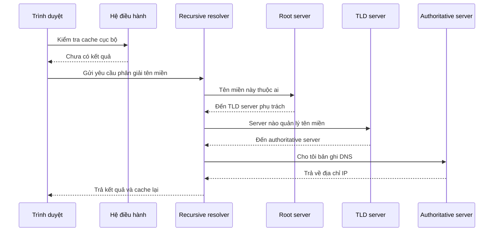

# 🗺️ DNS hoạt động thế nào — "danh bạ" của toàn bộ internet

> Nguồn: `009-How-DNS-Works.txt` · [Udemy](https://ua.udemy.com/course/mastering-system-design-from-basics-to-cracking-interviews/learn/lecture/49354263)

Mỗi lần người dùng gõ một tên miền, một chuỗi tương tác phân tán thú vị diễn ra phía sau hậu trường. Bài này mình sẽ mổ xẻ **DNS (Domain Name System)** — hệ thống phân cấp biến những cái tên thân thiện với con người thành địa chỉ IP, và là bước đầu tiên trong gần như mọi request trên internet.

---

### 🎯 DNS là gì và vì sao nó là hệ thống then chốt

**DNS** là một trong những hệ thống chúng ta dùng hằng ngày nhưng hiếm khi nghĩ tới. Hãy tưởng tượng nếu mỗi website bắt bạn nhớ địa chỉ IP thay vì tên miền — dùng internet sẽ cực kỳ bất tiện. DNS giải bài toán đó bằng cách đóng vai **danh bạ (directory service) của internet**, dịch những cái tên như `google.com` thành địa chỉ IP mà máy tính thực sự dùng để giao tiếp.

Điều khiến DNS đặc biệt quan trọng: nó **không chỉ cải thiện trải nghiệm sử dụng, mà còn giúp internet mở rộng**. Ứng dụng hiện đại chạy trên nhiều server, nhiều data center và nhiều cloud region, và các địa chỉ IP bên dưới có thể thay đổi theo thời gian. DNS cung cấp **một lớp trừu tượng ổn định**, cho phép người dùng tiếp tục dùng cùng một tên miền trong khi hạ tầng phía sau liên tục tiến hóa.

Với kiến trúc sư, hãy xem DNS là **bước đầu tiên trong gần như mọi request**: trước khi trình duyệt kết nối tới server, nó phải khám phá xem server nằm ở đâu. Không có DNS, web sẽ kém linh hoạt hơn, khó mở rộng hơn và khó vận hành ở quy mô toàn cầu hơn rất nhiều.

---

### 🧩 Các loại DNS server — một hệ thống phân cấp

Khi mới học, người ta hay nghĩ DNS là một dịch vụ đơn lẻ. Thực tế, DNS là **một hệ thống phân cấp phân tán**, mỗi loại server giữ một trách nhiệm riêng để cả hệ thống chịu được **hàng tỷ lượt tra cứu mỗi ngày**:

1. **Recursive resolver** — thành phần làm việc thay mặt người dùng. Nếu câu trả lời chưa có trong cache, resolver bắt đầu duyệt qua hệ thống phân cấp DNS.
2. **Root name server** — không biết câu trả lời cuối cùng, nhưng biết **tìm đúng TLD server** ở đâu.
3. **TLD server (Top-Level Domain)** — chỉ cho resolver tới **authoritative name server** chịu trách nhiệm cho tên miền đó.
4. **Authoritative name server** — **nguồn chân lý (source of truth)**: lưu các bản ghi DNS thật và trả về câu trả lời cuối cùng, ví dụ địa chỉ IP gắn với tên miền.

Điểm quan trọng về mặt kiến trúc: **không server nào cần biết mọi thứ**. Mỗi tầng chỉ biết đủ để chỉ request sang tầng kế tiếp. Mô hình **delegation (ủy quyền)** này là một lý do then chốt giúp DNS giữ được tính scalable, resilient và đỡ được toàn bộ internet.

---

### ⚡ DNS caching và bài toán TTL

DNS sẽ chậm khủng khiếp nếu mọi lượt tra cứu đều phải đi hết hệ thống phân cấp. Vì vậy, **caching là một trong những tối ưu hiệu năng quan trọng nhất** của hệ sinh thái DNS. Mỗi lượt tra cứu DNS thực chất là một network call — và network call thì cộng thêm **latency**. Nhờ cache các phản hồi trước đó, trình duyệt, hệ điều hành và recursive resolver thường trả lời được ngay mà không cần liên hệ server DNS phía trên. Điều này vừa giúp website tải nhanh hơn, vừa **giảm mạnh lượng traffic chạy qua hạ tầng DNS toàn cầu**.

Điều thú vị: cache tồn tại ở **nhiều tầng** — trình duyệt nhớ các tên miền vừa phân giải, hệ điều hành có cache riêng, và recursive resolver cache phản hồi cho cả một nhóm người dùng. Kết quả là rất nhiều request DNS **không bao giờ rời khỏi máy hoặc mạng cục bộ**.

Trade-off kiến trúc then chốt ở đây là **độ tươi mới (freshness) đánh đổi với hiệu năng**:

* Bản ghi DNS không nằm trong cache mãi mãi — chúng bị chi phối bởi **TTL (Time-to-Live — thời gian sống)**.
* **TTL dài** cải thiện hiệu năng và giảm tải hạ tầng, nhưng thay đổi DNS **lan truyền chậm hơn**.
* **TTL ngắn** cho người vận hành nhiều linh hoạt hơn khi migration, failover hoặc đổi cách định tuyến traffic, nhưng **tăng lượng truy vấn DNS**.

Khi hệ thống mở rộng toàn cầu, việc chọn TTL trở thành **quyết định vận hành**, không còn chỉ là một cấu hình DNS — nó ảnh hưởng trực tiếp tới hiệu năng, độ tin cậy và tốc độ các thay đổi hạ tầng có hiệu lực.

---

### 🔁 Quá trình phân giải tên miền diễn ra thế nào

Đây là lúc chúng ta đi từng bước qua những gì thực sự xảy ra khi người dùng nhập một tên miền vào trình duyệt. Hiểu luồng này cũng giải thích vì sao DNS được thiết kế như một **hệ thống phân cấp** thay vì một cơ sở dữ liệu tập trung.

1. Quá trình **luôn bắt đầu cục bộ**: trình duyệt kiểm tra xem nó đã biết câu trả lời chưa, rồi tới cache của hệ điều hành. Nếu IP đã có sẵn, request đi tiếp ngay mà **không cần tra cứu DNS bên ngoài**.
2. Nếu chưa có cache, request tới **recursive resolver** — hãy hình dung resolver như một "chuyên gia DNS" làm việc thay mặt client, có nhiệm vụ duyệt hệ thống phân cấp và tìm ra câu trả lời hiệu quả.
3. Resolver liên hệ **root server**, được chỉ tới **TLD server** phù hợp.
4. TLD server xác định **authoritative DNS server** chịu trách nhiệm cho tên miền.
5. Authoritative server trả về **bản ghi DNS được yêu cầu**, ví dụ địa chỉ IP của tên miền.
6. Resolver **cache phản hồi** rồi trả về cho client, giúp các request sau được trả lời nhanh hơn nhiều.

Điều đáng kinh ngạc: toàn bộ chuỗi này — có thể liên quan tới **nhiều hệ thống phân tán khắp internet** — thường hoàn tất chỉ trong **vài mili-giây**. Đó là ví dụ tuyệt vời cho thấy **caching, delegation và hierarchy** phối hợp để tạo nên một hệ thống vừa scalable toàn cầu, vừa có hiệu năng cao.

---

### 🌍 DNS trong hệ thống quy mô lớn

Ở quy mô internet, DNS không còn chỉ là hệ thống đặt tên — nó trở thành **một phần quan trọng của kiến trúc ứng dụng**. Rất nhiều quyết định về availability, performance và resilience mà người dùng cảm nhận thực ra **bắt đầu từ tầng DNS, trước khi request đầu tiên chạm tới ứng dụng**:

* **Phân phối traffic**: DNS có thể trả về các endpoint khác nhau dựa trên **địa lý, năng lực hệ thống hoặc routing policy**, thay vì dồn mọi người dùng về một server hay data center. Kết hợp với **anycast**, người dùng được tự động đưa tới hạ tầng DNS gần nhất còn hoạt động, giảm latency tra cứu và tăng độ tin cậy.
* **Disaster recovery**: nếu một data center không khả dụng, DNS có thể **chuyển hướng traffic sang region khỏe mạnh** hoặc môi trường dự phòng. Vì vậy, kế hoạch **failover (chuyển đổi dự phòng)** thường bắt đầu từ tầng DNS, trước khi các cơ chế phục hồi cấp ứng dụng vào cuộc.
* **Hỗ trợ CDN**: khi người dùng yêu cầu nội dung, DNS giúp xác định **edge location nào của CDN nên phục vụ**, để nội dung được gửi từ nơi gần nhất thay vì từ origin xa xôi.
* **Bảo mật**: vì nằm ở "cửa trước" của gần như mọi ứng dụng internet, DNS là **mục tiêu tấn công có giá trị cao**. Các mối đe dọa như **cache poisoning (đầu độc cache)** và **DDoS** có thể chặn truy cập dù ứng dụng vẫn khỏe mạnh. Kiến trúc hiện đại dùng các kỹ thuật như **DNSSEC**, **nhiều nhà cung cấp DNS dự phòng**, mạng anycast và lọc traffic để bảo vệ tầng quan trọng này.

*Điểm mấu chốt: trong hệ thống quy mô lớn, DNS không chỉ là dịch vụ tra cứu — nó là viên gạch nền tảng cho availability, performance, failover và security.*

---

### 🎯 Tự kiểm tra nhanh

**Câu 1:** DNS giải quyết bài toán gì, ngoài việc giúp người dùng dễ nhớ tên?

<b>Xem đáp án</b>

**Đáp án:** DNS giúp internet mở rộng — tạo lớp trừu tượng ổn định để tên miền không đổi trong khi hạ tầng bên dưới thay đổi.

Giải thích: Ứng dụng hiện đại chạy trên nhiều server, data center, region với IP có thể thay đổi.

Tham chiếu: Mục DNS là gì và vì sao nó là hệ thống then chốt.

**Câu 2:** Trong hệ thống phân cấp DNS, server nào là "nguồn chân lý"?

<b>Xem đáp án</b>

**Đáp án:** Authoritative name server — nơi lưu bản ghi DNS thật và trả về câu trả lời cuối cùng.

Giải thích: Root server chỉ biết đường tới TLD server; TLD server chỉ tới authoritative server.

Tham chiếu: Mục Các loại DNS server — một hệ thống phân cấp.

**Câu 3:** TTL dài và TTL ngắn đánh đổi điều gì?

<b>Xem đáp án</b>

**Đáp án:** TTL dài: hiệu năng tốt hơn, ít tải hạ tầng, nhưng thay đổi lan truyền chậm. TTL ngắn: linh hoạt hơn khi migration/failover, nhưng tăng lượng truy vấn DNS.

Giải thích: Đây là trade-off giữa độ tươi mới và hiệu năng — một quyết định vận hành.

Tham chiếu: Mục DNS caching và bài toán TTL.

**Câu 4:** Khi cache cục bộ không có kết quả, thành phần nào làm việc thay mặt người dùng để duyệt hệ thống phân cấp DNS?

<b>Xem đáp án</b>

**Đáp án:** Recursive resolver.

Giải thích: Resolver lần lượt hỏi root server, TLD server, rồi authoritative server, sau đó cache kết quả.

Tham chiếu: Mục Quá trình phân giải tên miền diễn ra thế nào.

**Câu 5:** DNS hỗ trợ disaster recovery như thế nào?

<b>Xem đáp án</b>

**Đáp án:** DNS có thể chuyển hướng traffic sang region khỏe mạnh hoặc môi trường dự phòng khi data center gặp sự cố.

Giải thích: Vì vậy kế hoạch failover thường bắt đầu từ tầng DNS, trước các cơ chế phục hồi cấp ứng dụng.

Tham chiếu: Mục DNS trong hệ thống quy mô lớn.

---

Vậy là chúng ta đã đi trọn hành trình DNS: hệ thống phân cấp gồm recursive resolver, root, TLD và authoritative server; vai trò của caching và TTL; và cách DNS trở thành công cụ kiến trúc cho load balancing, failover, CDN lẫn bảo mật. *Bài học dễ nhớ nhất: mỗi khi người dùng truy cập ứng dụng, DNS thường là hệ phân tán đầu tiên tham gia.*

Tiếp theo, chúng ta sẽ xây tiếp trên nền tảng này với **client-server model** — mô hình tương tác cơ bản vận hành website, API, dịch vụ cloud và gần như mọi hệ phân tán hiện đại. Hẹn gặp lại các bạn! 🚀
